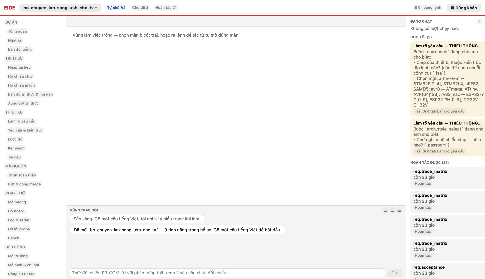
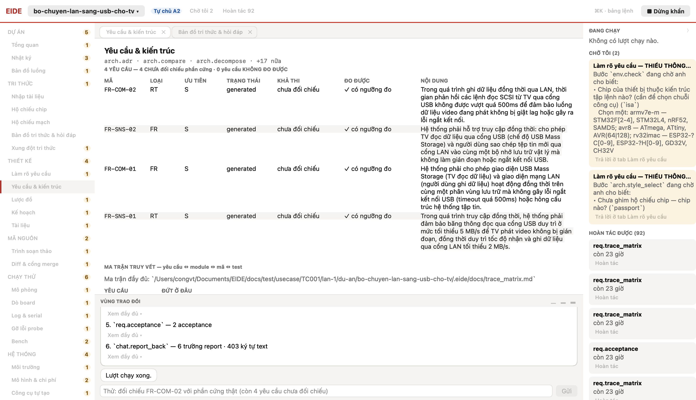
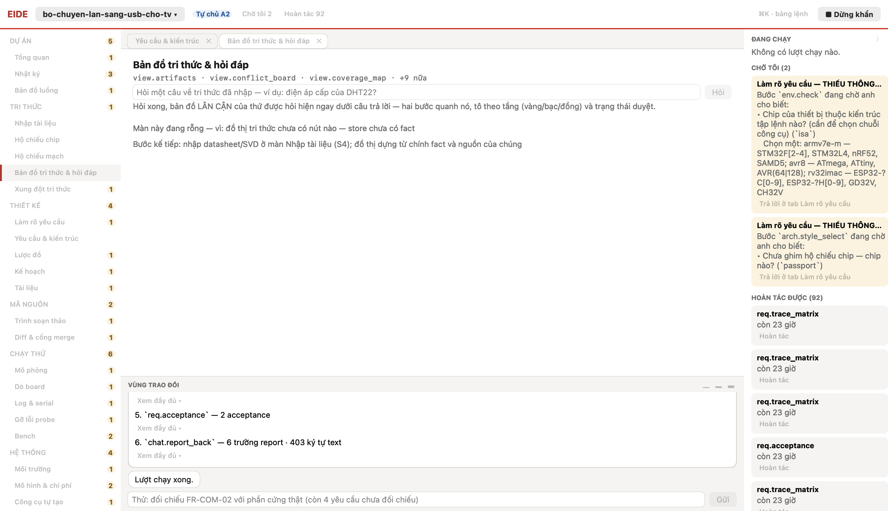

# Nhật ký phiên — kịch bản `kich-ban.kb`

Chạy qua ĐÚNG đường giao diện: gõ vào ô lệnh → bấm Gửi → `chat.send`. Mỗi bước
kèm một ảnh chụp cửa sổ thật.

## Bước 1

**Tôi (người dùng):** mở lại dự án — `bo-chuyen-lan-sang-usb-cho-tv`

**Tác tử trả lời** *(sau 0.4 s)*:

```
VÙNG TRAO ĐỔI  ▁ ▂ ▃ Sẵn sàng. Gõ một câu tiếng Việt; tôi nói lại ý hiểu trước khi làm.  Đã mở `bo-chuyen-lan-sang-usb-cho-tv` — 0 tính năng trong hồ sơ. Gõ một câu tiếng Việt để bắt đầu.   Thử: đối chiếu FR-COM-01 với phần cứng thật (còn 2 yêu cầu chưa đối chiếu) Gửi 
```



## Bước 2

**Tôi (người dùng):** TV đang đọc USB, mình vẫn copy phim mới vào qua LAN cùng lúc

**Tác tử trả lời** *(sau 56.4 s)*:

```
VÙNG TRAO ĐỔI  ▁ ▂ ▃ Sẵn sàng. Gõ một câu tiếng Việt; tôi nói lại ý hiểu trước khi làm.  Đã mở `bo-chuyen-lan-sang-usb-cho-tv` — 0 tính năng trong hồ sơ. Gõ một câu tiếng Việt để bắt đầu.  TV đang đọc USB, mình vẫn copy phim mới vào qua LAN cùng lúc  Đã nhận (ý hiểu: `req.analyze`) — đang làm. Tiến độ hiện ở thẻ Run, kết quả hiện ngay dưới đây khi xong.  TV đang đọc USB, mình vẫn copy phim mới vào qua LAN cùng lúc  bước 6/6  Mở chi tiết Dừng khẩn ✅ Xong 6/6 bước  → mở màn Yêu cầu & kiến trúc (tác tử đang chạy `req.elicit`)  → mở màn Bản đồ tri thức & hỏi đáp (tác tử đang chạy `view.artifacts`)  → mở màn Yêu cầu & kiến trúc (tác tử đang chạy `req.detect_conflict`)  → mở màn Bản đồ tri thức & hỏi đáp (tác tử đang chạy `view.artifacts`)  → mở màn Yêu cầu & kiến trúc (tác tử đang chạy `req.detect_conflict`)  → mở màn Bản đồ tri thức & hỏi đáp (tác tử đang chạy `view.artifacts`)  → mở màn Yêu cầu & kiến trúc (tác tử đang chạy `req.detect_conflict`)  → mở màn Bản đồ tri thức & hỏi đáp (tác tử đang chạy `view.artifacts`)  → mở màn Yêu cầu & kiến trúc (tác tử đang chạy `req.detect_conflict`)  → mở màn Bản đồ tri thức & hỏi đáp (tác tử đang chạy `view.artifacts`)  → mở màn Yêu cầu & kiến trúc (tác tử đang chạy `req.detect_conflict`)  → mở màn Bản đồ tri thức & hỏi đáp (tác tử đang chạy `view.artifacts`)  → mở màn Yêu cầu & kiến trúc (tác tử đang chạy `req.detect_conflict`)  → mở màn Bản đồ tri thức & hỏi đáp (tác tử đang chạy `view.artifacts`)  → mở màn Yêu cầu & kiến trúc (tác tử đang chạy `req.detect_conflict`)  → mở màn Bản đồ tri thức & hỏi đáp (tác tử đang chạy `view.artifacts`)  → mở màn Yêu cầu & kiến trúc (tác tử đang chạy `req.detect_conflict`)  → mở màn Bản đồ tri thức & hỏi đáp (tác tử đang chạy `view.artifacts`)  → mở màn Yêu cầu & kiến trúc (tác tử đang chạy `req.detect_conflict`)  → mở màn Bản đồ tri thức & hỏi đáp (tác tử đang chạy `view.artifacts`)  → mở màn Yêu cầu & kiến trúc (tác tử đang chạy `req.detect_conflict`)  → mở màn Bản đồ tri thức & hỏi đáp (tác tử đang chạy `view.artifacts`)  → mở màn Yêu cầu & kiến trúc (tác tử đang chạy `req.detect_conflict`)  → mở màn Bản đồ tri thức & hỏi đáp (tác tử đang chạy `view.artifacts`)  → mở màn Yêu cầu & kiến trúc (tác tử đang chạy `req.detect_conflict`)  → mở màn Bản đồ tri thức & hỏi đáp (tác tử đang chạy `view.artifacts`)  → mở màn Yêu cầu & kiến trúc (tác tử đang chạy `req.detect_conflict`)  → mở màn Bản đồ tri thức & hỏi đáp (tác tử đang chạy `view.artifacts`)  → mở màn Yêu cầu & kiến trúc (tác tử đang chạy `req.detect_conflict`)  → mở màn Bản đồ tri thức & hỏi đáp (tác tử đang chạy `view.artifacts`)  → mở màn Yêu cầu & kiến trúc (tác tử đang chạy `req.detect_conflict`)  → mở màn Bản đồ tri thức & hỏi đáp (tác tử đang chạy `view.artifacts`)  → mở màn Yêu cầu & kiến trúc (tác tử đang chạy `req.detect_conflict`)  → mở màn Bản đồ tri thức & hỏi đáp (tác tử đang chạy `view.artifacts`)  → mở màn Yêu cầu & kiến trúc (tác tử đang chạy `req.detect_conflict`)  → mở màn Bản đồ tri thức & hỏi đáp (tác tử đang chạy `view.artifacts`)  → mở màn Yêu cầu & kiến trúc (tác tử đang chạy `req.detect_conflict`)  → mở màn Bản đồ tri thức & hỏi đáp (tác tử đang chạy `view.artifacts`)  → mở màn Yêu cầu & kiến trúc (tác tử đang chạy `req.detect_conflict`)  → mở màn Bản đồ tri thức & hỏi đáp (tác tử đang chạy `view.artifacts`)  → mở màn Yêu cầu & kiến trúc (tác tử đang chạy `req.detect_conflict`)  → mở màn Bản đồ tri thức & hỏi đáp (tác tử đang chạy `view.artifacts`)  → mở màn Yêu cầu & kiến trúc (tác tử đang chạy `req.detect_conflict`)  → mở màn Bản đồ tri thức & hỏi đáp (tác tử đang chạy `view.artifacts`)  → mở màn Yêu cầu & kiến trúc (tác tử đang chạy `req.detect_conflict`)  → mở màn Bản đồ tri thức & hỏi đáp (tác tử đang chạy `view.artifacts`)  → mở màn Yêu cầu & kiến trúc (tác tử đang chạy `req.detect_conflict`)  → mở màn Bản đồ tri thức & hỏi đáp (tác tử đang chạy `view.artifacts`)  → mở màn Yêu cầu & kiến trúc (tác tử đang chạy `req.detect_conflict`)  → mở màn Bản đồ tri thức & hỏi đáp (tác tử đang chạy `view.artifacts`)  → mở màn Yêu cầu & kiến trúc (tác tử đang chạy `req.detect_conflict`)  → mở màn Bản đồ tri thức & hỏi đáp (tác tử đang chạy `view.artifacts`)  → mở màn Yêu cầu & kiến trúc (tác tử đang chạy `req.detect_conflict`)  → mở màn Bản đồ tri thức & hỏi đáp (tác tử đang chạy `view.artifacts`)  → mở màn Yêu cầu & kiến trúc (tác tử đang chạy `req.detect_conflict`)  → mở màn Bản đồ tri thức & hỏi đáp (tác tử đang chạy `view.artifacts`)  → mở màn Yêu cầu & kiến trúc (tác tử đang chạy `req.detect_conflict`)  → mở màn Bản đồ tri thức & hỏi đáp (tác tử đang chạy `view.artifacts`)  → mở màn Yêu cầu & kiến trúc (tác tử đang chạy `req.detect_conflict`)  → mở màn Bản đồ tri thức & hỏi đáp (tác tử đang chạy `view.artifacts`)  → mở màn Yêu cầu & kiến trúc (tác tử đang chạy `req.detect_conflict`)  → mở màn Bản đồ tri thức & hỏi đáp (tác tử đang chạy `view.artifacts`)  → mở màn Yêu cầu & kiến trúc (tác tử đang chạy `req.detect_conflict`)  → mở màn Bản đồ tri thức & hỏi đáp (tác tử đang chạy `view.artifacts`)  → mở màn Yêu cầu & kiến trúc (tác tử đang chạy `req.detect_conflict`)  → mở màn Bản đồ tri thức & hỏi đáp (tác tử đang chạy `view.artifacts`)  → mở màn Yêu cầu & kiến trúc (tác tử đang chạy `req.detect_conflict`)  → mở màn Bản đồ tri thức & hỏi đáp (tác tử đang chạy `view.artifacts`)  → mở màn Yêu cầu & kiến trúc (tác tử đang chạy `req.detect_conflict`)  → mở màn Bản đồ tri thức & hỏi đáp (tác tử đang chạy `view.artifacts`)  → mở màn Yêu cầu & kiến trúc (tác tử đang chạy `req.detect_conflict`)  → mở màn Bản đồ tri thức & hỏi đáp (tác tử đang chạy `view.artifacts`)  → mở màn Yêu cầu & kiến trúc (tác tử đang chạy `req.detect_conflict`)  → mở màn Bản đồ tri thức & hỏi đáp (tác tử đang chạy `view.artifacts`)  → mở màn Yêu cầu & kiến trúc (tác tử đang chạy `req.detect_conflict`)  → mở màn Bản đồ tri thức & hỏi đáp (tác tử đang chạy `view.artifacts`)  → mở màn Yêu cầu & kiến trúc (tác tử đang chạy `req.detect_conflict`)  → mở màn Bản đồ tri thức & hỏi đáp (tác tử đang chạy `view.artifacts`)  → mở màn Yêu cầu & kiến trúc (tác tử đang chạy `req.detect_conflict`)  → mở màn Bản đồ tri thức & hỏi đáp (tác tử đang chạy `view.artifacts`)  → mở màn Yêu cầu & kiến trúc (tác tử đang chạy `req.detect_conflict`)  → mở màn Bản đồ tri thức & hỏi đáp (tác tử đang chạy `view.artifacts`)  → mở màn Yêu cầu & kiến trúc (tác tử đang chạy `req.detect_conflict`)  → mở màn Bản đồ tri thức & hỏi đáp (tác tử đang chạy `view.artifacts`)  → mở màn Yêu cầu & kiến trúc (tác tử đang chạy `req.detect_conflict`)  → mở màn Bản đồ tri thức & hỏi đáp (tác tử đang chạy `view.artifacts`)  → mở màn Yêu cầu & kiến trúc (tác tử đang chạy `req.detect_conflict`)  → mở màn Bản đồ tri thức & hỏi đáp (tác tử đang chạy `view.artifacts`)  → mở màn Yêu cầu & kiến trúc (tác tử đang chạy `req.detect_conflict`)  → mở màn Bản đồ tri thức & hỏi đáp (tác tử đang chạy `view.artifacts`)  → mở màn Yêu cầu & kiến trúc (tác tử đang chạy `req.detect_conflict`)  → mở màn Bản đồ tri thức & hỏi đáp (tác tử đang chạy `view.artifacts`)  → mở màn Yêu cầu & kiến trúc (tác tử đang chạy `req.detect_conflict`)  → mở màn Bản đồ tri thức & hỏi đáp (tác tử đang chạy `view.artifacts`)  → mở màn Yêu cầu & kiến trúc (tác tử đang chạy `req.detect_conflict`)  → mở màn Bản đồ tri thức & hỏi đáp (tác tử đang chạy `view.artifacts`)  → mở màn Yêu cầu & kiến trúc (tác tử đang chạy `req.detect_conflict`)  → mở màn Bản đồ tri thức & hỏi đáp (tác tử đang chạy `view.artifacts`)  → mở màn Yêu cầu & kiến trúc (tác tử đang chạy `req.detect_conflict`)  → mở màn Bản đồ tri thức & hỏi đáp (tác tử đang chạy `view.artifacts`)  → mở màn Yêu cầu & kiến trúc (tác tử đang chạy `req.detect_conflict`)  → mở màn Bản đồ tri thức & hỏi đáp (tác tử đang chạy `view.artifacts`)  → mở màn Yêu cầu & kiến trúc (tác tử đang chạy `req.classify`)  → mở màn Bản đồ tri thức & hỏi đáp (tác tử đang chạy `view.artifacts`)  → mở màn Yêu cầu & kiến trúc (tác tử đang chạy `req.detect_conflict`)  → mở màn Bản đồ tri thức & hỏi đáp (tác tử đang chạy `view.artifacts`)  → mở màn Yêu cầu & kiến trúc (tác tử đang chạy `req.trace_matrix`)  → mở màn Bản đồ tri thức & hỏi đáp (tác tử đang chạy `view.artifacts`)  → mở màn Yêu cầu & kiến trúc (tác tử đang chạy `req.detect_conflict`)  → mở màn Bản đồ tri thức & hỏi đáp (tác tử đang chạy `view.artifacts`)  → mở màn Yêu cầu & kiến trúc (tác tử đang chạy `req.trace_matrix`)  → mở màn Bản đồ tri thức & hỏi đáp (tác tử đang chạy `view.artifacts`)  → mở màn Yêu cầu & kiến trúc (tác tử đang chạy `req.trace_matrix`)  → mở màn Bản đồ tri thức & hỏi đáp (tác tử đang chạy `view.artifacts`)  → mở màn Yêu cầu & kiến trúc (tác tử đang chạy `req.trace_matrix`)  → mở màn Bản đồ tri thức & hỏi đáp (tác tử đang chạy `view.artifacts`)  → mở màn Yêu cầu & kiến trúc (tác tử đang chạy `req.trace_matrix`)  → mở màn Bản đồ tri thức & hỏi đáp (tác tử đang chạy `view.artifacts`)  → mở màn Yêu cầu & kiến trúc (tác tử đang chạy `req.trace_matrix`)  → mở màn Bản đồ tri thức & hỏi đáp (tác tử đang chạy `view.artifacts`)  → mở màn Yêu cầu & kiến trúc (tác tử đang chạy `req.trace_matrix`)  → mở màn Bản đồ tri thức & hỏi đáp (tác tử đang chạy `view.artifacts`)  → mở màn Yêu cầu & kiến trúc (tác tử đang chạy `req.trace_matrix`)  → mở màn Bản đồ tri thức & hỏi đáp (tác tử đang chạy `view.artifacts`)  → mở màn Yêu cầu & kiến trúc (tác tử đang chạy `req.trace_matrix`)  → mở màn Bản đồ tri thức & hỏi đáp (tác tử đang chạy `view.artifacts`)  → mở màn Yêu cầu & kiến trúc (tác tử đang chạy `req.trace_matrix`)  → mở màn Bản đồ tri thức & hỏi đáp (tác tử đang chạy `view.artifacts`)  → mở màn Yêu cầu & kiến trúc (tác tử đang chạy `req.trace_matrix`)  → mở màn Bản đồ tri thức & hỏi đáp (tác tử đang chạy `view.artifacts`)  → mở màn Yêu cầu & kiến trúc (tác tử đang chạy `req.trace_matrix`)  → mở màn Bản đồ tri thức & hỏi đáp (tác tử đang chạy `view.artifacts`)  → mở màn Yêu cầu & kiến trúc (tác tử đang chạy `req.trace_matrix`)  → mở màn Bản đồ tri thức & hỏi đáp (tác tử đang chạy `view.artifacts`)  → mở màn Yêu cầu & kiến trúc (tác tử đang chạy `req.trace_matrix`)  → mở màn Bản đồ tri thức & hỏi đáp (tác tử đang chạy `view.artifacts`)  → mở màn Yêu cầu & kiến trúc (tác tử đang chạy `req.trace_matrix`)  → mở màn Bản đồ tri thức & hỏi đáp (tác tử đang chạy `view.artifacts`)  Ý HIỂU  ·  chat.restate  Tôi hiểu là req.analyze: TV đang đọc USB, mình vẫn copy phim mới vào qua LAN cùng lúc. Tôi sẽ req.elicit, req.classify, req.detect_conflict, req.prioritize và 2 bước nữa.  1. `req.elicit`  2. `req.classify`  3. `req.detect_conflict`  4. `req.prioritize`  5. `req.acceptance`  6. `chat.report_back`  Mức A2 — tác tử tự chạy, vẫn in ý hiểu (§2D.6). Sai thì bấm Dừng khẩn.  KẾT QUẢ TỪNG BƯỚC  1. `req.elicit` — 0 gaps · 1 raw  Xem đầy đủ ▾ {
  "gaps" : [
  ],
  "raw" : [
    {
      "kind_guess" : "FR",
      "locator" : {
      },
      "source" : "user_input",
      "text" : "TV đang đọc USB, mình vẫn copy phim mới vào qua LAN cùng lúc"
    }
  ]
}  2. `req.classify` — 2 codes_assigned · 2 reqset (FR-SNS-02, FR-COM-02)  Xem đầy đủ ▾ {
  "codes_assigned" : 2,
  "reqset" : [
    {
      "id" : "FR-SNS-02",
      "kind" : "FR",
      "locator" : {
      },
      "source" : "user_input",
      "status" : "generated",
      "text" : "Hệ thống phải hỗ trợ truy cập đồng thời: cho phép TV đọc dữ liệu qua cổng USB (chế độ USB Mass Storage) và người dùng sao chép tệp tin mới qua cổng LAN vào cùng một bộ nhớ lưu trữ vật lý mà không làm gián đoạn hoặc ngắt kết nối USB."
    },
    {
      "id" : "FR-COM-02",
      "kind" : "RT",
      "locator" : null,
      "source" : "lệnh",
      "status" : "generated",
      "text" : "Trong quá trình ghi dữ liệu đồng thời qua LAN, thời gian phản hồi các lệnh đọc SCSI từ TV qua cổng USB không được vượt quá 500ms để đảm bảo luồng dữ liệu video đang phát không bị giật lag hoặc gây ra lỗi ngắt kết nối."
    }
  ]
}  3. `req.detect_conflict` — 0 issues  Xem đầy đủ ▾ {
  "issues" : [
  ]
}  4. `req.prioritize` — 2 reqset (FR-COM-02, FR-SNS-02)  Xem đầy đủ ▾ {
  "reqset" : [
    {
      "acceptance" : [
      ],
      "feasibility" : null,
      "id" : "FR-COM-02",
      "kind" : "RT",
      "priority" : "S",
      "source" : "lệnh",
      "status" : "generated",
      "text" : "Trong quá trình ghi dữ liệu đồng thời qua LAN, thời gian phản hồi các lệnh đọc SCSI từ TV qua cổng USB không được vượt quá 500ms để đảm bảo luồng dữ liệu video đang phát không bị giật lag hoặc gây ra lỗi ngắt kết nối.",
      "trace" : [
      ]
    },
    {
      "acceptance" : [
      ],
      "feasibility" : null,
      "id" : "FR-SNS-02",
      "kind" : "FR",
      "priority" : "S",
      "source" : "user_input",
      "status" : "generated",
      "text" : "Hệ thống phải hỗ trợ truy cập đồng thời: cho phép TV đọc dữ liệu qua cổng USB (chế độ USB Mass Storage) và người dùng sao chép tệp tin mới qua cổng LAN vào cùng một bộ nhớ lưu trữ vật lý mà không làm gián đoạn hoặc ngắt kết nối USB.",
      "trace" : [
      ]
    }
  ]
}  5. `req.acceptance` — 2 acceptance  Xem đầy đủ ▾ {
  "acceptance" : [
    {
      "given" : "Hệ thống đang thực hiện ghi dữ liệu tệp tin mới qua cổng LAN vào bộ nhớ lưu trữ.",
      "observable" : "measurement",
      "req_id" : "FR-COM-02",
      "then" : "Hệ thống phải hoàn thành và trả về dữ liệu cho lệnh đọc SCSI với độ trễ không vượt quá 500ms.",
      "when" : "TV gửi lệnh đọc SCSI (SCSI Read) qua cổng USB để phát video."
    },
    {
      "given" : "TV đang kết nối ở chế độ USB Mass Storage và đang đọc dữ liệu liên tục từ bộ nhớ.",
      "observable" : "serial_pattern",
      "req_id" : "FR-SNS-02",
      "then" : "Quá trình sao chép qua LAN diễn ra bình thường và kết nối USB với TV không bị gián đoạn, reset hay ngắt kết nối.",
      "when" : "Người dùng bắt đầu sao chép một tệp tin mới qua cổng LAN vào cùng bộ nhớ lưu trữ vật lý đó."
    }
  ]
}  6. `chat.report_back` — 6 trường report · 403 ký tự text  Xem đầy đủ ▾ {
  "report" : {
    "cost" : 0.032923000000000001,
    "done" : [
      "project.open",
      "view.artifacts",
      "view.artifacts",
      "view.timeline",
      "project.status",
      "chat.parse_intent",
      "chat.ground",
      "chat.fill_defaults",
      "project.create",
      "search.reference_projects",
      "view.artifacts",
      "chat.orchestrate",
      "chat.restate",
      "project.status",
      "view.timeline",
      "view.artifacts",
      "view.artifacts",
      "view.artifacts",
      "view.artifacts",
      "view.artifacts",
      "view.artifacts",
      "view.timeline",
      "view.timeline",
      "view.timeline",
      "project.status",
      "view.artifacts",
      "project.status",
      "view.timeline",
      "project.status",
      "view.artifacts",
      "project.status",
      "view.timeline",
      "project.status",
      "view.artifacts",
      "project.status",
      "view.timeline",
      "project.status",
      "project.open",
      "view.artifacts",
      "view.artifacts",
      "view.timeline",
      "chat.parse_intent",
      "chat.ground",
      "chat.fill_defaults",
      "view.artifacts",
      "chat.orchestrate",
      "chat.restate",
      "view.kg_map",
      "view.artifacts",
      "view.artifacts",
      "view.artifacts",
      "view.artifacts",
      "view.artifacts",
      "view.artifacts",
      "view.artifacts",
      "view.artifacts",
      "view.timeline",
      "view.timeline",
      "view.timeline",
      "view.artifacts",
      "view.artifacts",
      "view.kg_map",
      "view.artifacts",
      "view.artifacts",
      "project.open",
      "view.artifacts",
      "view.artifacts",
      "view.timeline",
      "chat.parse_intent",
      "chat.ground",
      "chat.fill_defaults",
      "view.artifacts",
      "chat.orchestrate",
      "chat.restate",
      "view.kg_map",
      "view.artifacts",
      "view.artifacts",
      "view.artifacts",
      "view.artifacts",
      "view.artifacts",
      "view.artifacts",
      "view.artifacts",
      "view.artifacts",
      "view.timeline",
      "view.timeline",
      "view.timeline",
      "view.artifacts",
      "view.artifacts",
      "view.kg_map",
      "view.artifacts",
      "view.artifacts",
      "project.open",
      "view.artifacts",
      "view.artifacts",
      "view.timeline",
      "chat.parse_intent",
      "chat.ground",
      "chat.fill_defaults",
      "view.artifacts",
      "chat.orchestrate",
      "chat.restate",
      "view.kg_map",
      "view.artifacts",
      "view.artifacts",
      "view.artifacts",
      "view.artifacts",
      "view.artifacts",
      "view.artifacts",
      "view.artifacts",
      "view.artifacts",
      "view.timeline",
      "view.timeline",
      "view.timeline",
      "view.artifacts",
      "view.artifacts",
      "view.kg_map",
      "view.artifacts",
      "view.artifacts",
      "project.open",
      "view.artifacts",
      "view.artifacts",
      "view.timeline",
      "chat.parse_intent",
      "chat.ground",
      "chat.fill_defaults",
      "view.artifacts",
      "view.artifacts",
      "view.kg_map",
      "req.elicit",
      "view.artifacts",
      "view.artifacts",
      "view.kg_map",
      "req.classify",
      "req.detect_conflict",
      "req.prioritize",
      "view.artifacts",
      "view.artifacts",
      "view.kg_map",
      "req.detect_conflict",
      "req.trace_matrix",
      "view.artifacts",
      "view.artifacts",
      "view.kg_map",
      "req.detect_conflict",
      "req.trace_matrix",
      "view.artifacts",
      "view.artifacts",
      "view.kg_map",
      "req.detect_conflict",
      "req.trace_matrix",
      "view.artifacts",
      "view.artifacts",
      "view.kg_map",
      "req.detect_conflict",
      "req.trace_matrix",
      "view.artifacts",
      "view.artifacts",
      "view.kg_map",
      "req.detect_conflict",
      "req.trace_matrix",
      "view.artifacts",
      "view.artifacts",
      "view.kg_map",
      "req.detect_conflict",
      "req.trace_matrix",
      "view.artifacts",
      "view.artifacts",
      "view.kg_map",
      "req.detect_conflict",
      "req.trace_matrix",
      "view.artifacts",
      "view.artifacts",
      "view.kg_map",
      "req.detect_conflict",
      "req.trace_matrix",
      "view.artifacts",
      "view.artifacts",
      "view.kg_map",
      "req.detect_conflict",
      "req.trace_matrix",
      "view.artifacts",
      "view.artifacts",
      "view.kg_map",
      "req.detect_conflict",
      "req.trace_matrix",
      "view.artifacts",
      "view.artifacts",
      "view.kg_map",
      "req.detect_conflict",
      "req.trace_matrix",
      "view.artifacts",
      "view.artifacts",
      "view.kg_map",
      "req.detect_conflict",
      "req.trace_matrix",
      "view.artifacts",
      "view.artifacts",
      "view.kg_map",
      "req.detect_conflict",
      "req.trace_matrix",
      "view.artifacts",
      "view.artifacts",
      "view.kg_map",
      "req.detect_conflict",
      "req.acceptance",
      "chat.report_back",
      "chat.orchestrate",
      "chat.restate",
      "req.trace_matrix",
      "view.artifacts",
      "chat.report_back",
      "view.artifacts",
      "req.detect_conflict",
      "req.trace_matrix",
      "view.artifacts",
      "view.artifacts",
      "view.artifacts",
      "view.artifacts",
      "view.timeline",
      "view.timeline",
      "view.artifacts",
      "view.artifacts",
      "req.detect_conflict",
      "req.trace_matrix",
      "view.artifacts",
      "view.artifacts",
      "req.detect_conflict",
      "req.trace_matrix",
      "view.kg_map",
      "project.open",
      "view.artifacts",
      "view.artifacts",
      "view.timeline",
      "chat.parse_intent",
      "chat.ground",
      "chat.fill_defaults",
      "view.artifacts",
      "view.artifacts",
      "view.kg_map",
      "req.detect_conflict",
      "req.trace_matrix",
      "view.artifacts",
      "view.artifacts",
      "view.kg_map",
      "req.detect_conflict",
      "req.trace_matrix",
      "view.artifacts",
      "view.artifacts",
      "view.kg_map",
      "req.detect_conflict",
      "req.trace_matrix",
      "view.artifacts",
      "view.artifacts",
      "view.kg_map",
      "req.detect_conflict",
      "req.trace_matrix",
      "view.artifacts",
      "view.artifacts",
      "view.kg_map",
      "req.detect_conflict",
      "req.trace_matrix",
      "view.artifacts",
      "view.artifacts",
      "view.kg_map",
      "req.detect_conflict",
      "req.trace_matrix",
      "view.artifacts",
      "view.artifacts",
      "view.kg_map",
      "req.detect_conflict",
      "req.trace_matrix",
      "view.artifacts",
      "view.artifacts",
      "view.kg_map",
      "req.detect_conflict",
      "req.trace_matrix",
      "view.artifacts",
      "view.artifacts",
      "view.kg_map",
      "req.detect_conflict",
      "req.trace_matrix",
      "view.artifacts",
      "view.artifacts",
      "view.kg_map",
      "req.detect_conflict",
      "req.trace_matrix",
      "view.artifacts",
      "view.artifacts",
      "view.kg_map",
      "req.detect_conflict",
      "req.trace_matrix",
      "view.artifacts",
      "view.artifacts",
      "view.kg_map",
      "req.detect_conflict",
      "req.elicit",
      "req.trace_matrix",
      "view.artifacts",
      "view.artifacts",
      "view.kg_map",
      "req.detect_conflict",
      "req.trace_matrix",
      "view.artifacts",
      "view.artifacts",
      "view.kg_map",
      "req.detect_conflict",
      "req.trace_matrix",
      "view.artifacts",
      "view.artifacts",
      "view.kg_map",
      "req.detect_conflict",
      "req.trace_matrix",
      "view.artifacts",
      "view.artifacts",
      "view.kg_map",
      "req.detect_conflict",
      "req.trace_matrix",
      "view.artifacts",
      "view.artifacts",
      "view.kg_map",
      "req.detect_conflict",
      "req.trace_matrix",
      "view.artifacts",
      "view.artifacts",
      "view.kg_map",
      "req.detect_conflict",
      "req.trace_matrix",
      "view.artifacts",
      "view.artifacts",
      "view.kg_map",
      "req.detect_conflict",
      "req.trace_matrix",
      "view.artifacts",
      "view.artifacts",
      "view.kg_map",
      "req.detect_conflict",
      "req.trace_matrix",
      "view.artifacts",
      "view.artifacts",
      "view.kg_map",
      "req.detect_conflict",
      "req.trace_matrix",
      "view.artifacts",
      "view.artifacts",
      "view.kg_map",
      "req.detect_conflict",
      "req.trace_matrix",
      "view.artifacts",
      "view.artifacts",
      "view.kg_map",
      "req.detect_conflict",
      "req.trace_matrix",
      "view.artifacts",
      "view.artifacts",
      "view.kg_map",
      "req.detect_conflict",
      "req.trace_matrix",
      "view.artifacts",
      "view.artifacts",
      "view.kg_map",
      "req.detect_conflict",
      "req.trace_matrix",
      "view.artifacts",
      "view.artifacts",
      "view.kg_map",
      "req.detect_conflict",
      "req.trace_matrix",
      "view.artifacts",
      "view.artifacts",
      "view.kg_map",
      "req.detect_conflict",
      "req.trace_matrix",
      "view.artifacts",
      "view.artifacts",
      "view.kg_map",
      "req.detect_conflict",
      "req.trace_matrix",
      "view.artifacts",
      "view.artifacts",
      "view.kg_map",
      "req.detect_conflict",
      "req.trace_matrix",
      "view.artifacts",
      "view.artifacts",
      "view.kg_map",
      "req.detect_conflict",
      "req.trace_matrix",
      "view.artifacts",
      "view.artifacts",
      "view.kg_map",
      "req.detect_conflict",
      "req.trace_matrix",
      "view.artifacts",
      "view.artifacts",
      "view.kg_map",
      "req.detect_conflict",
      "req.trace_matrix",
      "view.artifacts",
      "view.artifacts",
      "view.kg_map",
      "req.detect_conflict",
      "req.trace_matrix",
      "view.artifacts",
      "view.artifacts",
      "view.kg_map",
      "req.detect_conflict",
      "req.trace_matrix",
      "view.artifacts",
      "view.artifacts",
      "view.kg_map",
      "req.detect_conflict",
      "req.trace_matrix",
      "view.artifacts",
      "view.artifacts",
      "view.kg_map",
      "req.detect_conflict",
      "req.trace_matrix",
      "view.artifacts",
      "view.artifacts",
      "view.kg_map",
      "req.detect_conflict",
      "req.trace_matrix",
      "view.artifacts",
      "view.artifacts",
      "view.kg_map",
      "req.detect_conflict",
      "req.trace_matrix",
      "view.artifacts",
      "view.artifacts",
      "view.kg_map",
      "req.detect_conflict",
      "req.trace_matrix",
      "view.artifacts",
      "view.artifacts",
      "view.kg_map",
      "req.detect_conflict",
      "req.trace_matrix",
      "view.artifacts",
      "view.artifacts",
      "view.kg_map",
      "req.detect_conflict",
      "req.trace_matrix",
      "view.artifacts",
      "view.artifacts",
      "view.kg_map",
      "req.detect_conflict",
      "req.trace_matrix",
      "view.artifacts",
      "view.artifacts",
      "view.kg_map",
      "req.detect_conflict",
      "req.trace_matrix",
      "view.artifacts",
      "view.artifacts",
      "view.kg_map",
      "req.detect_conflict",
      "req.trace_matrix",
      "view.artifacts",
      "view.artifacts",
      "view.kg_map",
      "req.detect_conflict",
      "req.trace_matrix",
      "view.artifacts",
      "view.artifacts",
      "view.kg_map",
      "req.detect_conflict",
      "req.trace_matrix",
      "view.artifacts",
      "view.artifacts",
      "view.kg_map",
      "req.detect_conflict",
      "req.trace_matrix",
      "view.artifacts",
      "view.artifacts",
      "view.kg_map",
      "req.detect_conflict",
      "req.trace_matrix",
      "view.artifacts",
      "view.artifacts",
      "view.kg_map",
      "req.detect_conflict",
      "req.trace_matrix",
      "view.artifacts",
      "view.artifacts",
      "view.kg_map",
      "req.detect_conflict",
      "req.trace_matrix",
      "view.artifacts",
      "req.classify",
      "req.detect_conflict",
      "req.prioritize",
      "view.artifacts",
      "view.kg_map",
      "req.detect_conflict",
      "view.artifacts",
      "view.kg_map",
      "req.trace_matrix",
      "view.artifacts",
      "view.artifacts",
      "view.kg_map",
      "req.detect_conflict",
      "view.artifacts",
      "view.artifacts",
      "view.kg_map",
      "req.trace_matrix",
      "req.detect_conflict",
      "view.artifacts",
      "view.artifacts",
      "view.kg_map",
      "req.trace_matrix",
      "req.detect_conflict",
      "view.artifacts",
      "view.artifacts",
      "view.kg_map",
      "req.trace_matrix",
      "req.detect_conflict",
      "view.artifacts",
      "view.artifacts",
      "view.kg_map",
      "req.trace_matrix",
      "req.detect_conflict",
      "view.artifacts",
      "view.artifacts",
      "view.kg_map",
      "req.trace_matrix",
      "req.detect_conflict",
      "view.artifacts",
      "view.artifacts",
      "view.kg_map",
      "req.trace_matrix",
      "req.detect_conflict",
      "view.artifacts",
      "view.artifacts",
      "view.kg_map",
      "req.trace_matrix",
      "req.detect_conflict",
      "view.artifacts",
      "view.artifacts",
      "view.kg_map",
      "req.trace_matrix",
      "req.detect_conflict",
      "view.artifacts",
      "view.artifacts",
      "view.kg_map",
      "req.trace_matrix",
      "req.detect_conflict",
      "view.artifacts",
      "view.artifacts",
      "view.kg_map",
      "req.trace_matrix",
      "req.detect_conflict",
      "view.artifacts",
      "view.artifacts",
      "view.kg_map",
      "req.trace_matrix",
      "req.detect_conflict",
      "view.artifacts",
      "view.artifacts",
      "view.kg_map",
      "req.trace_matrix",
      "req.detect_conflict",
      "view.artifacts",
      "view.artifacts",
      "view.kg_map",
      "req.trace_matrix",
      "req.detect_conflict",
      "view.artifacts",
      "view.artifacts",
      "view.kg_map",
      "req.trace_matrix",
      "req.detect_conflict",
      "req.acceptance"
    ],
    "ra" : [
    ],
    "run_id" : "r_3ba901c4f3f7",
    "undo" : [
      "4e26f6da42db",
      "877a0be1dad4",
      "34e530336a7b",
      "7b7e5af8cb45",
      "401fd1b26d41",
      "9dfc9bc743e6",
      "9c960732034e",
      "e43f200fdc10",
      "ea6c9c37e4c3",
      "4060dd7d4d84",
      "55f9fe759f5a",
      "2765bb68f360",
      "d2624922a15a",
      "8ba396e0da1c",
      "69dcff72e9c0",
      "7af15dfe0c35",
      "674803fa62a9",
      "ac5121250c60",
      "9c88b62d11d3",
      "6fd8012f693e",
      "dcbb4f3ac0d8",
      "657fdd5c4ca6",
      "b9a3c0126775",
      "ed61fd11a310",
      "5bcd9363bf95",
      "53533599f6ba",
      "40861ca24b3e",
      "a9f292edcb85",
      "69bb4e32fec9",
      "6e771304dab5",
      "5866952b4876",
      "fef5d4c3e7e5",
      "d617c57f8b14",
      "ea12d1f82f3f",
      "d1e77b7c3387",
      "0bbf73104a2f",
      "e788b8474af5",
      "24a901d2a664",
      "8d152e3e08b2",
      "66262ad55c92",
      "ca8a1397604a",
      "0aa3af20b84b",
      "737aae616a3f",
      "9b3623d71a57",
      "8d0d701438d6",
      "ca544df87e91",
      "c2392caa3f7b",
      "9b7dde019969",
      "d20be60a544e",
      "72f6726bd484",
      "dda69f8591ea",
      "7029338a4a7c",
      "6b2c5e7d8d3d",
      "d0c0136f49f9",
      "f4f0effa28d2",
      "4bb0ab8709c0",
      "fcd13aab076b",
      "f5a59ef772c6",
      "e8c468fe096c",
      "3fcfd778f218",
      "e7f4e0fa00e2",
      "2aca38cf7751",
      "44eae975e139",
      "029aad363e4a",
      "cb39ae78273d",
      "bb327568e041",
      "7f0f2d6bde68",
      "b5f622e09888",
      "f567bef16831",
      "3903fd48896e",
      "9f276229c33d",
      "73476743ffe6",
      "c3ac09bb8b59",
      "2aa713b12ef9",
      "33cf6af797ac",
      "24b7e3b389d0",
      "0a2d678e49b5",
      "06dd9ff40a91",
      "996f2b6cb31d",
      "1f39559e6775",
      "18de86c7d3b8",
      "f911cfc762d9",
      "6ad7d0f0f0fb",
      "880adee8968d",
      "2a36fca29b51",
      "582c6957ac7b",
      "e9ca65c43ce7",
      "1323d0d39959",
      "02a0a493e91b"
    ],
    "waiting" : [
    ]
  },
  "text" : "Đã làm 572 việc: project.open, view.artifacts, view.timeline, project.status, chat.parse_intent, chat.ground, chat.fill_defaults, project.create, search.reference_projects, chat.orchestrate, chat.restate, view.kg_map, req.elicit, req.classify, req.detect_conflict, req.prioritize, req.trace_matrix, req.acceptance, chat.report_back\nHoàn tác được 89 mục đến 2026-09-24T08:20.\nChi phí mô hình: 0.0329 USD."
}  Lượt chạy xong.  Đã làm 583 việc: project.open, view.artifacts, view.timeline, project.status, chat.parse_intent, chat.ground, chat.fill_defaults, project.create, search.reference_projects, chat.orchestrate, chat.restate, view.kg_map, req.elicit, req.classify, req.detect_conflict, req.prioritize, req.trace_matrix, req.acceptance, chat.report_back
→ `req.elicit` làm ra: 1 text; 0 gaps — xem ở màn Yêu cầu & kiến trúc.
→ `req.classify` làm ra: 2 Requirement (FR-SNS-02, FR-COM-02…); 2 codes_assigned — xem ở màn Yêu cầu & kiến trúc.
→ `req.detect_conflict` làm ra: 0 kind conflict|ambiguous|unmeasurable — xem ở màn Yêu cầu & kiến trúc.
→ `req.prioritize` làm ra: 2 reqset (FR-COM-02, FR-SNS-02…) — xem ở màn Yêu cầu & kiến trúc.
→ `req.acceptance` làm ra: 2 req_id — xem ở màn Yêu cầu & kiến trúc.
→ `chat.report_back` làm ra: 6 trường report; 403 ký tự text — xem ở màn mặc định.
Hoàn tác được 90 mục đến 2026-09-24T08:20.
Chi phí mô hình: 0.0329 USD.   Thử: đối chiếu FR-COM-02 với phần cứng thật (còn 4 yêu cầu chưa đối chiếu) Gửi 
```

**Màn đang mở — `Graph`:**

```
 Hỏi một câu về tri thức đã nhập — ví dụ: điện áp cấp của DHT22? Hỏi Hỏi xong, bản đồ LÂN CẬN của thứ được hỏi hiện ngay dưới câu trả lời — hai bước quanh nó, tô theo tầng (vàng/bạc/đồng) và trạng thái duyệt.  Màn này đang rỗng — vì: đồ thị tri thức chưa có nút nào — store chưa có fact  Bước kế tiếp: nhập datasheet/SVD ở màn Nhập tài liệu (S4); đồ thị dựng từ chính fact và nguồn của chúng  
```


## Bước 3

**Quét 2 tab tác tử đã mở:** ReqArch, Graph

### Tab `ReqArch`

```
Yêu cầu & kiến trúc  arch.adr · arch.compare · arch.decompose · +17 nữa  Vùng làm việc trống — chọn màn ở cột trái, hoặc ra lệnh để tác tử tự mở đúng màn.  4 YÊU CẦU — 4 CHƯA đối chiếu phần cứng · 0 yêu cầu KHÔNG ĐO ĐƯỢC  MÃ	LOẠI	ƯU TIÊN	TRẠNG THÁI	KHẢ THI	ĐO ĐƯỢC	NỘI DUNG
FR-COM-02	RT	S	generated	chưa đối chiếu	✓ có ngưỡng đo	Trong quá trình ghi dữ liệu đồng thời qua LAN, thời gian phản hồi các lệnh đọc SCSI từ TV qua cổng USB không được vượt quá 500ms để đảm bảo luồng dữ liệu video đang phát không bị giật lag hoặc gây ra lỗi ngắt kết nối.
FR-SNS-02	FR	S	generated	chưa đối chiếu	✓ có ngưỡng đo	Hệ thống phải hỗ trợ truy cập đồng thời: cho phép TV đọc dữ liệu qua cổng USB (chế độ USB Mass Storage) và người dùng sao chép tệp tin mới qua cổng LAN vào cùng một bộ nhớ lưu trữ vật lý mà không làm gián đoạn hoặc ngắt kết nối USB.
FR-COM-01	FR	S	generated	chưa đối chiếu	✓ có ngưỡng đo	Hệ thống phải cho phép giao diện USB Mass Storage (TV đọc dữ liệu) và giao diện mạng LAN (người dùng ghi dữ liệu) hoạt động đồng thời trên cùng một phân vùng lưu trữ mà không gây lỗi ngắt kết nối USB (timeout quá 500ms) hoặc hỏng cấu trúc hệ thống tập tin.
FR-SNS-01	RT	S	generated	chưa đối chiếu	✓ có ngưỡng đo	Trong quá trình truy cập đồng thời, hệ thống phải đảm bảo băng thông đọc qua cổng USB duy trì ở mức tối thiểu 5 MB/s để TV phát video không bị gián đoạn, đồng thời duy trì tốc độ nhận và ghi dữ liệu qua cổng LAN tối thiểu 2 MB/s.
  MA TRẬN TRUY VẾT — yêu cầu ↔ module ↔ mã ↔ test  Ma trận đầy đủ: `/Users/congvt/Documents/EIDE/docs/test/usecase/TC001/lan-1/du-an/bo-chuyen-lan-sang-usb-cho-tv/.eide/docs/trace_matrix.md`  YÊU CẦU	ĐỨT Ở ĐÂU
FR-COM-01	—
FR-COM-02	—
FR-SNS-01	—
FR-SNS-02	—
```



### Tab `Graph`

```
Bản đồ tri thức & hỏi đáp  view.artifacts · view.conflict_board · view.coverage_map · +9 nữa  Vùng làm việc trống — chọn màn ở cột trái, hoặc ra lệnh để tác tử tự mở đúng màn.   Hỏi một câu về tri thức đã nhập — ví dụ: điện áp cấp của DHT22? Hỏi Hỏi xong, bản đồ LÂN CẬN của thứ được hỏi hiện ngay dưới câu trả lời — hai bước quanh nó, tô theo tầng (vàng/bạc/đồng) và trạng thái duyệt.  Màn này đang rỗng — vì: đồ thị tri thức chưa có nút nào — store chưa có fact  Bước kế tiếp: nhập datasheet/SVD ở màn Nhập tài liệu (S4); đồ thị dựng từ chính fact và nguồn của chúng  
```



### Cột phải (cổng, hoàn tác, an toàn)

```
ĐANG CHẠY  Không có lượt chạy nào.  CHỜ TÔI (2)  Làm rõ yêu cầu — THIẾU THÔNG TIN  Bước `env.check` đang chờ anh cho biết:
• Chip của thiết bị thuộc kiến trúc tập lệnh nào? (cần để chọn chuỗi công cụ) (`isa`)
   Chọn một: armv7e-m — STM32F[2-4], STM32L4, nRF52, SAMD5; avr8 — ATmega, ATtiny, AVR(64|128); rv32imac — ESP32-?C[0-9], ESP32-?H[0-9], GD32V, CH32V  Trả lời ở tab Làm rõ yêu cầu Làm rõ yêu cầu — THIẾU THÔNG TIN  Bước `arch.style_select` đang chờ anh cho biết:
• Chưa ghim hộ chiếu chip — chip nào? (`passport`)  Trả lời ở tab Làm rõ yêu cầu HOÀN TÁC ĐƯỢC (92)  req.trace_matrix  còn 23 giờ  Hoàn tác req.trace_matrix  còn 23 giờ  Hoàn tác req.trace_matrix  còn 23 giờ  Hoàn tác req.acceptance  còn 23 giờ  Hoàn tác req.trace_matrix  còn 23 giờ  Hoàn tác req.trace_matrix  còn 23 giờ  Hoàn tác req.trace_matrix  còn 23 giờ  Hoàn tác req.trace_matrix  còn 23 giờ  Hoàn tác … và 84 mục nữa — xem màn Nhật ký.  ⟩ 
```

**Tác tử trả lời** *(sau 4.7 s)*:

```
VÙNG TRAO ĐỔI  ▁ ▂ ▃ Sẵn sàng. Gõ một câu tiếng Việt; tôi nói lại ý hiểu trước khi làm.  Đã mở `bo-chuyen-lan-sang-usb-cho-tv` — 0 tính năng trong hồ sơ. Gõ một câu tiếng Việt để bắt đầu.  TV đang đọc USB, mình vẫn copy phim mới vào qua LAN cùng lúc  Đã nhận (ý hiểu: `req.analyze`) — đang làm. Tiến độ hiện ở thẻ Run, kết quả hiện ngay dưới đây khi xong.  TV đang đọc USB, mình vẫn copy phim mới vào qua LAN cùng lúc  bước 6/6  Mở chi tiết Dừng khẩn ✅ Xong 6/6 bước  → mở màn Yêu cầu & kiến trúc (tác tử đang chạy `req.elicit`)  → mở màn Bản đồ tri thức & hỏi đáp (tác tử đang chạy `view.artifacts`)  → mở màn Yêu cầu & kiến trúc (tác tử đang chạy `req.detect_conflict`)  → mở màn Bản đồ tri thức & hỏi đáp (tác tử đang chạy `view.artifacts`)  → mở màn Yêu cầu & kiến trúc (tác tử đang chạy `req.detect_conflict`)  → mở màn Bản đồ tri thức & hỏi đáp (tác tử đang chạy `view.artifacts`)  → mở màn Yêu cầu & kiến trúc (tác tử đang chạy `req.detect_conflict`)  → mở màn Bản đồ tri thức & hỏi đáp (tác tử đang chạy `view.artifacts`)  → mở màn Yêu cầu & kiến trúc (tác tử đang chạy `req.detect_conflict`)  → mở màn Bản đồ tri thức & hỏi đáp (tác tử đang chạy `view.artifacts`)  → mở màn Yêu cầu & kiến trúc (tác tử đang chạy `req.detect_conflict`)  → mở màn Bản đồ tri thức & hỏi đáp (tác tử đang chạy `view.artifacts`)  → mở màn Yêu cầu & kiến trúc (tác tử đang chạy `req.detect_conflict`)  → mở màn Bản đồ tri thức & hỏi đáp (tác tử đang chạy `view.artifacts`)  → mở màn Yêu cầu & kiến trúc (tác tử đang chạy `req.detect_conflict`)  → mở màn Bản đồ tri thức & hỏi đáp (tác tử đang chạy `view.artifacts`)  → mở màn Yêu cầu & kiến trúc (tác tử đang chạy `req.detect_conflict`)  → mở màn Bản đồ tri thức & hỏi đáp (tác tử đang chạy `view.artifacts`)  → mở màn Yêu cầu & kiến trúc (tác tử đang chạy `req.detect_conflict`)  → mở màn Bản đồ tri thức & hỏi đáp (tác tử đang chạy `view.artifacts`)  → mở màn Yêu cầu & kiến trúc (tác tử đang chạy `req.detect_conflict`)  → mở màn Bản đồ tri thức & hỏi đáp (tác tử đang chạy `view.artifacts`)  → mở màn Yêu cầu & kiến trúc (tác tử đang chạy `req.detect_conflict`)  → mở màn Bản đồ tri thức & hỏi đáp (tác tử đang chạy `view.artifacts`)  → mở màn Yêu cầu & kiến trúc (tác tử đang chạy `req.detect_conflict`)  → mở màn Bản đồ tri thức & hỏi đáp (tác tử đang chạy `view.artifacts`)  → mở màn Yêu cầu & kiến trúc (tác tử đang chạy `req.detect_conflict`)  → mở màn Bản đồ tri thức & hỏi đáp (tác tử đang chạy `view.artifacts`)  → mở màn Yêu cầu & kiến trúc (tác tử đang chạy `req.detect_conflict`)  → mở màn Bản đồ tri thức & hỏi đáp (tác tử đang chạy `view.artifacts`)  → mở màn Yêu cầu & kiến trúc (tác tử đang chạy `req.detect_conflict`)  → mở màn Bản đồ tri thức & hỏi đáp (tác tử đang chạy `view.artifacts`)  → mở màn Yêu cầu & kiến trúc (tác tử đang chạy `req.detect_conflict`)  → mở màn Bản đồ tri thức & hỏi đáp (tác tử đang chạy `view.artifacts`)  → mở màn Yêu cầu & kiến trúc (tác tử đang chạy `req.detect_conflict`)  → mở màn Bản đồ tri thức & hỏi đáp (tác tử đang chạy `view.artifacts`)  → mở màn Yêu cầu & kiến trúc (tác tử đang chạy `req.detect_conflict`)  → mở màn Bản đồ tri thức & hỏi đáp (tác tử đang chạy `view.artifacts`)  → mở màn Yêu cầu & kiến trúc (tác tử đang chạy `req.detect_conflict`)  → mở màn Bản đồ tri thức & hỏi đáp (tác tử đang chạy `view.artifacts`)  → mở màn Yêu cầu & kiến trúc (tác tử đang chạy `req.detect_conflict`)  → mở màn Bản đồ tri thức & hỏi đáp (tác tử đang chạy `view.artifacts`)  → mở màn Yêu cầu & kiến trúc (tác tử đang chạy `req.detect_conflict`)  → mở màn Bản đồ tri thức & hỏi đáp (tác tử đang chạy `view.artifacts`)  → mở màn Yêu cầu & kiến trúc (tác tử đang chạy `req.detect_conflict`)  → mở màn Bản đồ tri thức & hỏi đáp (tác tử đang chạy `view.artifacts`)  → mở màn Yêu cầu & kiến trúc (tác tử đang chạy `req.detect_conflict`)  → mở màn Bản đồ tri thức & hỏi đáp (tác tử đang chạy `view.artifacts`)  → mở màn Yêu cầu & kiến trúc (tác tử đang chạy `req.detect_conflict`)  → mở màn Bản đồ tri thức & hỏi đáp (tác tử đang chạy `view.artifacts`)  → mở màn Yêu cầu & kiến trúc (tác tử đang chạy `req.detect_conflict`)  → mở màn Bản đồ tri thức & hỏi đáp (tác tử đang chạy `view.artifacts`)  → mở màn Yêu cầu & kiến trúc (tác tử đang chạy `req.detect_conflict`)  → mở màn Bản đồ tri thức & hỏi đáp (tác tử đang chạy `view.artifacts`)  → mở màn Yêu cầu & kiến trúc (tác tử đang chạy `req.detect_conflict`)  → mở màn Bản đồ tri thức & hỏi đáp (tác tử đang chạy `view.artifacts`)  → mở màn Yêu cầu & kiến trúc (tác tử đang chạy `req.detect_conflict`)  → mở màn Bản đồ tri thức & hỏi đáp (tác tử đang chạy `view.artifacts`)  → mở màn Yêu cầu & kiến trúc (tác tử đang chạy `req.detect_conflict`)  → mở màn Bản đồ tri thức & hỏi đáp (tác tử đang chạy `view.artifacts`)  → mở màn Yêu cầu & kiến trúc (tác tử đang chạy `req.detect_conflict`)  → mở màn Bản đồ tri thức & hỏi đáp (tác tử đang chạy `view.artifacts`)  → mở màn Yêu cầu & kiến trúc (tác tử đang chạy `req.detect_conflict`)  → mở màn Bản đồ tri thức & hỏi đáp (tác tử đang chạy `view.artifacts`)  → mở màn Yêu cầu & kiến trúc (tác tử đang chạy `req.detect_conflict`)  → mở màn Bản đồ tri thức & hỏi đáp (tác tử đang chạy `view.artifacts`)  → mở màn Yêu cầu & kiến trúc (tác tử đang chạy `req.detect_conflict`)  → mở màn Bản đồ tri thức & hỏi đáp (tác tử đang chạy `view.artifacts`)  → mở màn Yêu cầu & kiến trúc (tác tử đang chạy `req.detect_conflict`)  → mở màn Bản đồ tri thức & hỏi đáp (tác tử đang chạy `view.artifacts`)  → mở màn Yêu cầu & kiến trúc (tác tử đang chạy `req.detect_conflict`)  → mở màn Bản đồ tri thức & hỏi đáp (tác tử đang chạy `view.artifacts`)  → mở màn Yêu cầu & kiến trúc (tác tử đang chạy `req.detect_conflict`)  → mở màn Bản đồ tri thức & hỏi đáp (tác tử đang chạy `view.artifacts`)  → mở màn Yêu cầu & kiến trúc (tác tử đang chạy `req.detect_conflict`)  → mở màn Bản đồ tri thức & hỏi đáp (tác tử đang chạy `view.artifacts`)  → mở màn Yêu cầu & kiến trúc (tác tử đang chạy `req.detect_conflict`)  → mở màn Bản đồ tri thức & hỏi đáp (tác tử đang chạy `view.artifacts`)  → mở màn Yêu cầu & kiến trúc (tác tử đang chạy `req.detect_conflict`)  → mở màn Bản đồ tri thức & hỏi đáp (tác tử đang chạy `view.artifacts`)  → mở màn Yêu cầu & kiến trúc (tác tử đang chạy `req.detect_conflict`)  → mở màn Bản đồ tri thức & hỏi đáp (tác tử đang chạy `view.artifacts`)  → mở màn Yêu cầu & kiến trúc (tác tử đang chạy `req.detect_conflict`)  → mở màn Bản đồ tri thức & hỏi đáp (tác tử đang chạy `view.artifacts`)  → mở màn Yêu cầu & kiến trúc (tác tử đang chạy `req.detect_conflict`)  → mở màn Bản đồ tri thức & hỏi đáp (tác tử đang chạy `view.artifacts`)  → mở màn Yêu cầu & kiến trúc (tác tử đang chạy `req.detect_conflict`)  → mở màn Bản đồ tri thức & hỏi đáp (tác tử đang chạy `view.artifacts`)  → mở màn Yêu cầu & kiến trúc (tác tử đang chạy `req.detect_conflict`)  → mở màn Bản đồ tri thức & hỏi đáp (tác tử đang chạy `view.artifacts`)  → mở màn Yêu cầu & kiến trúc (tác tử đang chạy `req.detect_conflict`)  → mở màn Bản đồ tri thức & hỏi đáp (tác tử đang chạy `view.artifacts`)  → mở màn Yêu cầu & kiến trúc (tác tử đang chạy `req.detect_conflict`)  → mở màn Bản đồ tri thức & hỏi đáp (tác tử đang chạy `view.artifacts`)  → mở màn Yêu cầu & kiến trúc (tác tử đang chạy `req.detect_conflict`)  → mở màn Bản đồ tri thức & hỏi đáp (tác tử đang chạy `view.artifacts`)  → mở màn Yêu cầu & kiến trúc (tác tử đang chạy `req.detect_conflict`)  → mở màn Bản đồ tri thức & hỏi đáp (tác tử đang chạy `view.artifacts`)  → mở màn Yêu cầu & kiến trúc (tác tử đang chạy `req.detect_conflict`)  → mở màn Bản đồ tri thức & hỏi đáp (tác tử đang chạy `view.artifacts`)  → mở màn Yêu cầu & kiến trúc (tác tử đang chạy `req.detect_conflict`)  → mở màn Bản đồ tri thức & hỏi đáp (tác tử đang chạy `view.artifacts`)  → mở màn Yêu cầu & kiến trúc (tác tử đang chạy `req.classify`)  → mở màn Bản đồ tri thức & hỏi đáp (tác tử đang chạy `view.artifacts`)  → mở màn Yêu cầu & kiến trúc (tác tử đang chạy `req.detect_conflict`)  → mở màn Bản đồ tri thức & hỏi đáp (tác tử đang chạy `view.artifacts`)  → mở màn Yêu cầu & kiến trúc (tác tử đang chạy `req.trace_matrix`)  → mở màn Bản đồ tri thức & hỏi đáp (tác tử đang chạy `view.artifacts`)  → mở màn Yêu cầu & kiến trúc (tác tử đang chạy `req.detect_conflict`)  → mở màn Bản đồ tri thức & hỏi đáp (tác tử đang chạy `view.artifacts`)  → mở màn Yêu cầu & kiến trúc (tác tử đang chạy `req.trace_matrix`)  → mở màn Bản đồ tri thức & hỏi đáp (tác tử đang chạy `view.artifacts`)  → mở màn Yêu cầu & kiến trúc (tác tử đang chạy `req.trace_matrix`)  → mở màn Bản đồ tri thức & hỏi đáp (tác tử đang chạy `view.artifacts`)  → mở màn Yêu cầu & kiến trúc (tác tử đang chạy `req.trace_matrix`)  → mở màn Bản đồ tri thức & hỏi đáp (tác tử đang chạy `view.artifacts`)  → mở màn Yêu cầu & kiến trúc (tác tử đang chạy `req.trace_matrix`)  → mở màn Bản đồ tri thức & hỏi đáp (tác tử đang chạy `view.artifacts`)  → mở màn Yêu cầu & kiến trúc (tác tử đang chạy `req.trace_matrix`)  → mở màn Bản đồ tri thức & hỏi đáp (tác tử đang chạy `view.artifacts`)  → mở màn Yêu cầu & kiến trúc (tác tử đang chạy `req.trace_matrix`)  → mở màn Bản đồ tri thức & hỏi đáp (tác tử đang chạy `view.artifacts`)  → mở màn Yêu cầu & kiến trúc (tác tử đang chạy `req.trace_matrix`)  → mở màn Bản đồ tri thức & hỏi đáp (tác tử đang chạy `view.artifacts`)  → mở màn Yêu cầu & kiến trúc (tác tử đang chạy `req.trace_matrix`)  → mở màn Bản đồ tri thức & hỏi đáp (tác tử đang chạy `view.artifacts`)  → mở màn Yêu cầu & kiến trúc (tác tử đang chạy `req.trace_matrix`)  → mở màn Bản đồ tri thức & hỏi đáp (tác tử đang chạy `view.artifacts`)  → mở màn Yêu cầu & kiến trúc (tác tử đang chạy `req.trace_matrix`)  → mở màn Bản đồ tri thức & hỏi đáp (tác tử đang chạy `view.artifacts`)  → mở màn Yêu cầu & kiến trúc (tác tử đang chạy `req.trace_matrix`)  → mở màn Bản đồ tri thức & hỏi đáp (tác tử đang chạy `view.artifacts`)  → mở màn Yêu cầu & kiến trúc (tác tử đang chạy `req.trace_matrix`)  → mở màn Bản đồ tri thức & hỏi đáp (tác tử đang chạy `view.artifacts`)  → mở màn Yêu cầu & kiến trúc (tác tử đang chạy `req.trace_matrix`)  → mở màn Bản đồ tri thức & hỏi đáp (tác tử đang chạy `view.artifacts`)  → mở màn Yêu cầu & kiến trúc (tác tử đang chạy `req.trace_matrix`)  → mở màn Bản đồ tri thức & hỏi đáp (tác tử đang chạy `view.artifacts`)  Ý HIỂU  ·  chat.restate  Tôi hiểu là req.analyze: TV đang đọc USB, mình vẫn copy phim mới vào qua LAN cùng lúc. Tôi sẽ req.elicit, req.classify, req.detect_conflict, req.prioritize và 2 bước nữa.  1. `req.elicit`  2. `req.classify`  3. `req.detect_conflict`  4. `req.prioritize`  5. `req.acceptance`  6. `chat.report_back`  Mức A2 — tác tử tự chạy, vẫn in ý hiểu (§2D.6). Sai thì bấm Dừng khẩn.  KẾT QUẢ TỪNG BƯỚC  1. `req.elicit` — 0 gaps · 1 raw  Xem đầy đủ ▾ {
  "gaps" : [
  ],
  "raw" : [
    {
      "kind_guess" : "FR",
      "locator" : {
      },
      "source" : "user_input",
      "text" : "TV đang đọc USB, mình vẫn copy phim mới vào qua LAN cùng lúc"
    }
  ]
}  2. `req.classify` — 2 codes_assigned · 2 reqset (FR-SNS-02, FR-COM-02)  Xem đầy đủ ▾ {
  "codes_assigned" : 2,
  "reqset" : [
    {
      "id" : "FR-SNS-02",
      "kind" : "FR",
      "locator" : {
      },
      "source" : "user_input",
      "status" : "generated",
      "text" : "Hệ thống phải hỗ trợ truy cập đồng thời: cho phép TV đọc dữ liệu qua cổng USB (chế độ USB Mass Storage) và người dùng sao chép tệp tin mới qua cổng LAN vào cùng một bộ nhớ lưu trữ vật lý mà không làm gián đoạn hoặc ngắt kết nối USB."
    },
    {
      "id" : "FR-COM-02",
      "kind" : "RT",
      "locator" : null,
      "source" : "lệnh",
      "status" : "generated",
      "text" : "Trong quá trình ghi dữ liệu đồng thời qua LAN, thời gian phản hồi các lệnh đọc SCSI từ TV qua cổng USB không được vượt quá 500ms để đảm bảo luồng dữ liệu video đang phát không bị giật lag hoặc gây ra lỗi ngắt kết nối."
    }
  ]
}  3. `req.detect_conflict` — 0 issues  Xem đầy đủ ▾ {
  "issues" : [
  ]
}  4. `req.prioritize` — 2 reqset (FR-COM-02, FR-SNS-02)  Xem đầy đủ ▾ {
  "reqset" : [
    {
      "acceptance" : [
      ],
      "feasibility" : null,
      "id" : "FR-COM-02",
      "kind" : "RT",
      "priority" : "S",
      "source" : "lệnh",
      "status" : "generated",
      "text" : "Trong quá trình ghi dữ liệu đồng thời qua LAN, thời gian phản hồi các lệnh đọc SCSI từ TV qua cổng USB không được vượt quá 500ms để đảm bảo luồng dữ liệu video đang phát không bị giật lag hoặc gây ra lỗi ngắt kết nối.",
      "trace" : [
      ]
    },
    {
      "acceptance" : [
      ],
      "feasibility" : null,
      "id" : "FR-SNS-02",
      "kind" : "FR",
      "priority" : "S",
      "source" : "user_input",
      "status" : "generated",
      "text" : "Hệ thống phải hỗ trợ truy cập đồng thời: cho phép TV đọc dữ liệu qua cổng USB (chế độ USB Mass Storage) và người dùng sao chép tệp tin mới qua cổng LAN vào cùng một bộ nhớ lưu trữ vật lý mà không làm gián đoạn hoặc ngắt kết nối USB.",
      "trace" : [
      ]
    }
  ]
}  5. `req.acceptance` — 2 acceptance  Xem đầy đủ ▾ {
  "acceptance" : [
    {
      "given" : "Hệ thống đang thực hiện ghi dữ liệu tệp tin mới qua cổng LAN vào bộ nhớ lưu trữ.",
      "observable" : "measurement",
      "req_id" : "FR-COM-02",
      "then" : "Hệ thống phải hoàn thành và trả về dữ liệu cho lệnh đọc SCSI với độ trễ không vượt quá 500ms.",
      "when" : "TV gửi lệnh đọc SCSI (SCSI Read) qua cổng USB để phát video."
    },
    {
      "given" : "TV đang kết nối ở chế độ USB Mass Storage và đang đọc dữ liệu liên tục từ bộ nhớ.",
      "observable" : "serial_pattern",
      "req_id" : "FR-SNS-02",
      "then" : "Quá trình sao chép qua LAN diễn ra bình thường và kết nối USB với TV không bị gián đoạn, reset hay ngắt kết nối.",
      "when" : "Người dùng bắt đầu sao chép một tệp tin mới qua cổng LAN vào cùng bộ nhớ lưu trữ vật lý đó."
    }
  ]
}  6. `chat.report_back` — 6 trường report · 403 ký tự text  Xem đầy đủ ▾ {
  "report" : {
    "cost" : 0.032923000000000001,
    "done" : [
      "project.open",
      "view.artifacts",
      "view.artifacts",
      "view.timeline",
      "project.status",
      "chat.parse_intent",
      "chat.ground",
      "chat.fill_defaults",
      "project.create",
      "search.reference_projects",
      "view.artifacts",
      "chat.orchestrate",
      "chat.restate",
      "project.status",
      "view.timeline",
      "view.artifacts",
      "view.artifacts",
      "view.artifacts",
      "view.artifacts",
      "view.artifacts",
      "view.artifacts",
      "view.timeline",
      "view.timeline",
      "view.timeline",
      "project.status",
      "view.artifacts",
      "project.status",
      "view.timeline",
      "project.status",
      "view.artifacts",
      "project.status",
      "view.timeline",
      "project.status",
      "view.artifacts",
      "project.status",
      "view.timeline",
      "project.status",
      "project.open",
      "view.artifacts",
      "view.artifacts",
      "view.timeline",
      "chat.parse_intent",
      "chat.ground",
      "chat.fill_defaults",
      "view.artifacts",
      "chat.orchestrate",
      "chat.restate",
      "view.kg_map",
      "view.artifacts",
      "view.artifacts",
      "view.artifacts",
      "view.artifacts",
      "view.artifacts",
      "view.artifacts",
      "view.artifacts",
      "view.artifacts",
      "view.timeline",
      "view.timeline",
      "view.timeline",
      "view.artifacts",
      "view.artifacts",
      "view.kg_map",
      "view.artifacts",
      "view.artifacts",
      "project.open",
      "view.artifacts",
      "view.artifacts",
      "view.timeline",
      "chat.parse_intent",
      "chat.ground",
      "chat.fill_defaults",
      "view.artifacts",
      "chat.orchestrate",
      "chat.restate",
      "view.kg_map",
      "view.artifacts",
      "view.artifacts",
      "view.artifacts",
      "view.artifacts",
      "view.artifacts",
      "view.artifacts",
      "view.artifacts",
      "view.artifacts",
      "view.timeline",
      "view.timeline",
      "view.timeline",
      "view.artifacts",
      "view.artifacts",
      "view.kg_map",
      "view.artifacts",
      "view.artifacts",
      "project.open",
      "view.artifacts",
      "view.artifacts",
      "view.timeline",
      "chat.parse_intent",
      "chat.ground",
      "chat.fill_defaults",
      "view.artifacts",
      "chat.orchestrate",
      "chat.restate",
      "view.kg_map",
      "view.artifacts",
      "view.artifacts",
      "view.artifacts",
      "view.artifacts",
      "view.artifacts",
      "view.artifacts",
      "view.artifacts",
      "view.artifacts",
      "view.timeline",
      "view.timeline",
      "view.timeline",
      "view.artifacts",
      "view.artifacts",
      "view.kg_map",
      "view.artifacts",
      "view.artifacts",
      "project.open",
      "view.artifacts",
      "view.artifacts",
      "view.timeline",
      "chat.parse_intent",
      "chat.ground",
      "chat.fill_defaults",
      "view.artifacts",
      "view.artifacts",
      "view.kg_map",
      "req.elicit",
      "view.artifacts",
      "view.artifacts",
      "view.kg_map",
      "req.classify",
      "req.detect_conflict",
      "req.prioritize",
      "view.artifacts",
      "view.artifacts",
      "view.kg_map",
      "req.detect_conflict",
      "req.trace_matrix",
      "view.artifacts",
      "view.artifacts",
      "view.kg_map",
      "req.detect_conflict",
      "req.trace_matrix",
      "view.artifacts",
      "view.artifacts",
      "view.kg_map",
      "req.detect_conflict",
      "req.trace_matrix",
      "view.artifacts",
      "view.artifacts",
      "view.kg_map",
      "req.detect_conflict",
      "req.trace_matrix",
      "view.artifacts",
      "view.artifacts",
      "view.kg_map",
      "req.detect_conflict",
      "req.trace_matrix",
      "view.artifacts",
      "view.artifacts",
      "view.kg_map",
      "req.detect_conflict",
      "req.trace_matrix",
      "view.artifacts",
      "view.artifacts",
      "view.kg_map",
      "req.detect_conflict",
      "req.trace_matrix",
      "view.artifacts",
      "view.artifacts",
      "view.kg_map",
      "req.detect_conflict",
      "req.trace_matrix",
      "view.artifacts",
      "view.artifacts",
      "view.kg_map",
      "req.detect_conflict",
      "req.trace_matrix",
      "view.artifacts",
      "view.artifacts",
      "view.kg_map",
      "req.detect_conflict",
      "req.trace_matrix",
      "view.artifacts",
      "view.artifacts",
      "view.kg_map",
      "req.detect_conflict",
      "req.trace_matrix",
      "view.artifacts",
      "view.artifacts",
      "view.kg_map",
      "req.detect_conflict",
      "req.trace_matrix",
      "view.artifacts",
      "view.artifacts",
      "view.kg_map",
      "req.detect_conflict",
      "req.trace_matrix",
      "view.artifacts",
      "view.artifacts",
      "view.kg_map",
      "req.detect_conflict",
      "req.acceptance",
      "chat.report_back",
      "chat.orchestrate",
      "chat.restate",
      "req.trace_matrix",
      "view.artifacts",
      "chat.report_back",
      "view.artifacts",
      "req.detect_conflict",
      "req.trace_matrix",
      "view.artifacts",
      "view.artifacts",
      "view.artifacts",
      "view.artifacts",
      "view.timeline",
      "view.timeline",
      "view.artifacts",
      "view.artifacts",
      "req.detect_conflict",
      "req.trace_matrix",
      "view.artifacts",
      "view.artifacts",
      "req.detect_conflict",
      "req.trace_matrix",
      "view.kg_map",
      "project.open",
      "view.artifacts",
      "view.artifacts",
      "view.timeline",
      "chat.parse_intent",
      "chat.ground",
      "chat.fill_defaults",
      "view.artifacts",
      "view.artifacts",
      "view.kg_map",
      "req.detect_conflict",
      "req.trace_matrix",
      "view.artifacts",
      "view.artifacts",
      "view.kg_map",
      "req.detect_conflict",
      "req.trace_matrix",
      "view.artifacts",
      "view.artifacts",
      "view.kg_map",
      "req.detect_conflict",
      "req.trace_matrix",
      "view.artifacts",
      "view.artifacts",
      "view.kg_map",
      "req.detect_conflict",
      "req.trace_matrix",
      "view.artifacts",
      "view.artifacts",
      "view.kg_map",
      "req.detect_conflict",
      "req.trace_matrix",
      "view.artifacts",
      "view.artifacts",
      "view.kg_map",
      "req.detect_conflict",
      "req.trace_matrix",
      "view.artifacts",
      "view.artifacts",
      "view.kg_map",
      "req.detect_conflict",
      "req.trace_matrix",
      "view.artifacts",
      "view.artifacts",
      "view.kg_map",
      "req.detect_conflict",
      "req.trace_matrix",
      "view.artifacts",
      "view.artifacts",
      "view.kg_map",
      "req.detect_conflict",
      "req.trace_matrix",
      "view.artifacts",
      "view.artifacts",
      "view.kg_map",
      "req.detect_conflict",
      "req.trace_matrix",
      "view.artifacts",
      "view.artifacts",
      "view.kg_map",
      "req.detect_conflict",
      "req.trace_matrix",
      "view.artifacts",
      "view.artifacts",
      "view.kg_map",
      "req.detect_conflict",
      "req.elicit",
      "req.trace_matrix",
      "view.artifacts",
      "view.artifacts",
      "view.kg_map",
      "req.detect_conflict",
      "req.trace_matrix",
      "view.artifacts",
      "view.artifacts",
      "view.kg_map",
      "req.detect_conflict",
      "req.trace_matrix",
      "view.artifacts",
      "view.artifacts",
      "view.kg_map",
      "req.detect_conflict",
      "req.trace_matrix",
      "view.artifacts",
      "view.artifacts",
      "view.kg_map",
      "req.detect_conflict",
      "req.trace_matrix",
      "view.artifacts",
      "view.artifacts",
      "view.kg_map",
      "req.detect_conflict",
      "req.trace_matrix",
      "view.artifacts",
      "view.artifacts",
      "view.kg_map",
      "req.detect_conflict",
      "req.trace_matrix",
      "view.artifacts",
      "view.artifacts",
      "view.kg_map",
      "req.detect_conflict",
      "req.trace_matrix",
      "view.artifacts",
      "view.artifacts",
      "view.kg_map",
      "req.detect_conflict",
      "req.trace_matrix",
      "view.artifacts",
      "view.artifacts",
      "view.kg_map",
      "req.detect_conflict",
      "req.trace_matrix",
      "view.artifacts",
      "view.artifacts",
      "view.kg_map",
      "req.detect_conflict",
      "req.trace_matrix",
      "view.artifacts",
      "view.artifacts",
      "view.kg_map",
      "req.detect_conflict",
      "req.trace_matrix",
      "view.artifacts",
      "view.artifacts",
      "view.kg_map",
      "req.detect_conflict",
      "req.trace_matrix",
      "view.artifacts",
      "view.artifacts",
      "view.kg_map",
      "req.detect_conflict",
      "req.trace_matrix",
      "view.artifacts",
      "view.artifacts",
      "view.kg_map",
      "req.detect_conflict",
      "req.trace_matrix",
      "view.artifacts",
      "view.artifacts",
      "view.kg_map",
      "req.detect_conflict",
      "req.trace_matrix",
      "view.artifacts",
      "view.artifacts",
      "view.kg_map",
      "req.detect_conflict",
      "req.trace_matrix",
      "view.artifacts",
      "view.artifacts",
      "view.kg_map",
      "req.detect_conflict",
      "req.trace_matrix",
      "view.artifacts",
      "view.artifacts",
      "view.kg_map",
      "req.detect_conflict",
      "req.trace_matrix",
      "view.artifacts",
      "view.artifacts",
      "view.kg_map",
      "req.detect_conflict",
      "req.trace_matrix",
      "view.artifacts",
      "view.artifacts",
      "view.kg_map",
      "req.detect_conflict",
      "req.trace_matrix",
      "view.artifacts",
      "view.artifacts",
      "view.kg_map",
      "req.detect_conflict",
      "req.trace_matrix",
      "view.artifacts",
      "view.artifacts",
      "view.kg_map",
      "req.detect_conflict",
      "req.trace_matrix",
      "view.artifacts",
      "view.artifacts",
      "view.kg_map",
      "req.detect_conflict",
      "req.trace_matrix",
      "view.artifacts",
      "view.artifacts",
      "view.kg_map",
      "req.detect_conflict",
      "req.trace_matrix",
      "view.artifacts",
      "view.artifacts",
      "view.kg_map",
      "req.detect_conflict",
      "req.trace_matrix",
      "view.artifacts",
      "view.artifacts",
      "view.kg_map",
      "req.detect_conflict",
      "req.trace_matrix",
      "view.artifacts",
      "view.artifacts",
      "view.kg_map",
      "req.detect_conflict",
      "req.trace_matrix",
      "view.artifacts",
      "view.artifacts",
      "view.kg_map",
      "req.detect_conflict",
      "req.trace_matrix",
      "view.artifacts",
      "view.artifacts",
      "view.kg_map",
      "req.detect_conflict",
      "req.trace_matrix",
      "view.artifacts",
      "view.artifacts",
      "view.kg_map",
      "req.detect_conflict",
      "req.trace_matrix",
      "view.artifacts",
      "view.artifacts",
      "view.kg_map",
      "req.detect_conflict",
      "req.trace_matrix",
      "view.artifacts",
      "view.artifacts",
      "view.kg_map",
      "req.detect_conflict",
      "req.trace_matrix",
      "view.artifacts",
      "view.artifacts",
      "view.kg_map",
      "req.detect_conflict",
      "req.trace_matrix",
      "view.artifacts",
      "view.artifacts",
      "view.kg_map",
      "req.detect_conflict",
      "req.trace_matrix",
      "view.artifacts",
      "view.artifacts",
      "view.kg_map",
      "req.detect_conflict",
      "req.trace_matrix",
      "view.artifacts",
      "view.artifacts",
      "view.kg_map",
      "req.detect_conflict",
      "req.trace_matrix",
      "view.artifacts",
      "view.artifacts",
      "view.kg_map",
      "req.detect_conflict",
      "req.trace_matrix",
      "view.artifacts",
      "view.artifacts",
      "view.kg_map",
      "req.detect_conflict",
      "req.trace_matrix",
      "view.artifacts",
      "req.classify",
      "req.detect_conflict",
      "req.prioritize",
      "view.artifacts",
      "view.kg_map",
      "req.detect_conflict",
      "view.artifacts",
      "view.kg_map",
      "req.trace_matrix",
      "view.artifacts",
      "view.artifacts",
      "view.kg_map",
      "req.detect_conflict",
      "view.artifacts",
      "view.artifacts",
      "view.kg_map",
      "req.trace_matrix",
      "req.detect_conflict",
      "view.artifacts",
      "view.artifacts",
      "view.kg_map",
      "req.trace_matrix",
      "req.detect_conflict",
      "view.artifacts",
      "view.artifacts",
      "view.kg_map",
      "req.trace_matrix",
      "req.detect_conflict",
      "view.artifacts",
      "view.artifacts",
      "view.kg_map",
      "req.trace_matrix",
      "req.detect_conflict",
      "view.artifacts",
      "view.artifacts",
      "view.kg_map",
      "req.trace_matrix",
      "req.detect_conflict",
      "view.artifacts",
      "view.artifacts",
      "view.kg_map",
      "req.trace_matrix",
      "req.detect_conflict",
      "view.artifacts",
      "view.artifacts",
      "view.kg_map",
      "req.trace_matrix",
      "req.detect_conflict",
      "view.artifacts",
      "view.artifacts",
      "view.kg_map",
      "req.trace_matrix",
      "req.detect_conflict",
      "view.artifacts",
      "view.artifacts",
      "view.kg_map",
      "req.trace_matrix",
      "req.detect_conflict",
      "view.artifacts",
      "view.artifacts",
      "view.kg_map",
      "req.trace_matrix",
      "req.detect_conflict",
      "view.artifacts",
      "view.artifacts",
      "view.kg_map",
      "req.trace_matrix",
      "req.detect_conflict",
      "view.artifacts",
      "view.artifacts",
      "view.kg_map",
      "req.trace_matrix",
      "req.detect_conflict",
      "view.artifacts",
      "view.artifacts",
      "view.kg_map",
      "req.trace_matrix",
      "req.detect_conflict",
      "view.artifacts",
      "view.artifacts",
      "view.kg_map",
      "req.trace_matrix",
      "req.detect_conflict",
      "req.acceptance"
    ],
    "ra" : [
    ],
    "run_id" : "r_3ba901c4f3f7",
    "undo" : [
      "4e26f6da42db",
      "877a0be1dad4",
      "34e530336a7b",
      "7b7e5af8cb45",
      "401fd1b26d41",
      "9dfc9bc743e6",
      "9c960732034e",
      "e43f200fdc10",
      "ea6c9c37e4c3",
      "4060dd7d4d84",
      "55f9fe759f5a",
      "2765bb68f360",
      "d2624922a15a",
      "8ba396e0da1c",
      "69dcff72e9c0",
      "7af15dfe0c35",
      "674803fa62a9",
      "ac5121250c60",
      "9c88b62d11d3",
      "6fd8012f693e",
      "dcbb4f3ac0d8",
      "657fdd5c4ca6",
      "b9a3c0126775",
      "ed61fd11a310",
      "5bcd9363bf95",
      "53533599f6ba",
      "40861ca24b3e",
      "a9f292edcb85",
      "69bb4e32fec9",
      "6e771304dab5",
      "5866952b4876",
      "fef5d4c3e7e5",
      "d617c57f8b14",
      "ea12d1f82f3f",
      "d1e77b7c3387",
      "0bbf73104a2f",
      "e788b8474af5",
      "24a901d2a664",
      "8d152e3e08b2",
      "66262ad55c92",
      "ca8a1397604a",
      "0aa3af20b84b",
      "737aae616a3f",
      "9b3623d71a57",
      "8d0d701438d6",
      "ca544df87e91",
      "c2392caa3f7b",
      "9b7dde019969",
      "d20be60a544e",
      "72f6726bd484",
      "dda69f8591ea",
      "7029338a4a7c",
      "6b2c5e7d8d3d",
      "d0c0136f49f9",
      "f4f0effa28d2",
      "4bb0ab8709c0",
      "fcd13aab076b",
      "f5a59ef772c6",
      "e8c468fe096c",
      "3fcfd778f218",
      "e7f4e0fa00e2",
      "2aca38cf7751",
      "44eae975e139",
      "029aad363e4a",
      "cb39ae78273d",
      "bb327568e041",
      "7f0f2d6bde68",
      "b5f622e09888",
      "f567bef16831",
      "3903fd48896e",
      "9f276229c33d",
      "73476743ffe6",
      "c3ac09bb8b59",
      "2aa713b12ef9",
      "33cf6af797ac",
      "24b7e3b389d0",
      "0a2d678e49b5",
      "06dd9ff40a91",
      "996f2b6cb31d",
      "1f39559e6775",
      "18de86c7d3b8",
      "f911cfc762d9",
      "6ad7d0f0f0fb",
      "880adee8968d",
      "2a36fca29b51",
      "582c6957ac7b",
      "e9ca65c43ce7",
      "1323d0d39959",
      "02a0a493e91b"
    ],
    "waiting" : [
    ]
  },
  "text" : "Đã làm 572 việc: project.open, view.artifacts, view.timeline, project.status, chat.parse_intent, chat.ground, chat.fill_defaults, project.create, search.reference_projects, chat.orchestrate, chat.restate, view.kg_map, req.elicit, req.classify, req.detect_conflict, req.prioritize, req.trace_matrix, req.acceptance, chat.report_back\nHoàn tác được 89 mục đến 2026-09-24T08:20.\nChi phí mô hình: 0.0329 USD."
}  Lượt chạy xong.  Đã làm 583 việc: project.open, view.artifacts, view.timeline, project.status, chat.parse_intent, chat.ground, chat.fill_defaults, project.create, search.reference_projects, chat.orchestrate, chat.restate, view.kg_map, req.elicit, req.classify, req.detect_conflict, req.prioritize, req.trace_matrix, req.acceptance, chat.report_back
→ `req.elicit` làm ra: 1 text; 0 gaps — xem ở màn Yêu cầu & kiến trúc.
→ `req.classify` làm ra: 2 Requirement (FR-SNS-02, FR-COM-02…); 2 codes_assigned — xem ở màn Yêu cầu & kiến trúc.
→ `req.detect_conflict` làm ra: 0 kind conflict|ambiguous|unmeasurable — xem ở màn Yêu cầu & kiến trúc.
→ `req.prioritize` làm ra: 2 reqset (FR-COM-02, FR-SNS-02…) — xem ở màn Yêu cầu & kiến trúc.
→ `req.acceptance` làm ra: 2 req_id — xem ở màn Yêu cầu & kiến trúc.
→ `chat.report_back` làm ra: 6 trường report; 403 ký tự text — xem ở màn mặc định.
Hoàn tác được 90 mục đến 2026-09-24T08:20.
Chi phí mô hình: 0.0329 USD.   Thử: đối chiếu FR-COM-02 với phần cứng thật (còn 4 yêu cầu chưa đối chiếu) Gửi 
```

**Màn đang mở — `Graph`:**

```
 Hỏi một câu về tri thức đã nhập — ví dụ: điện áp cấp của DHT22? Hỏi Hỏi xong, bản đồ LÂN CẬN của thứ được hỏi hiện ngay dưới câu trả lời — hai bước quanh nó, tô theo tầng (vàng/bạc/đồng) và trạng thái duyệt.  Màn này đang rỗng — vì: đồ thị tri thức chưa có nút nào — store chưa có fact  Bước kế tiếp: nhập datasheet/SVD ở màn Nhập tài liệu (S4); đồ thị dựng từ chính fact và nguồn của chúng  
```


---

Hết kịch bản — 3 bước. Ảnh và nhật ký trong `/Users/congvt/Documents/EIDE/docs/test/usecase/TC003/lan-2`.