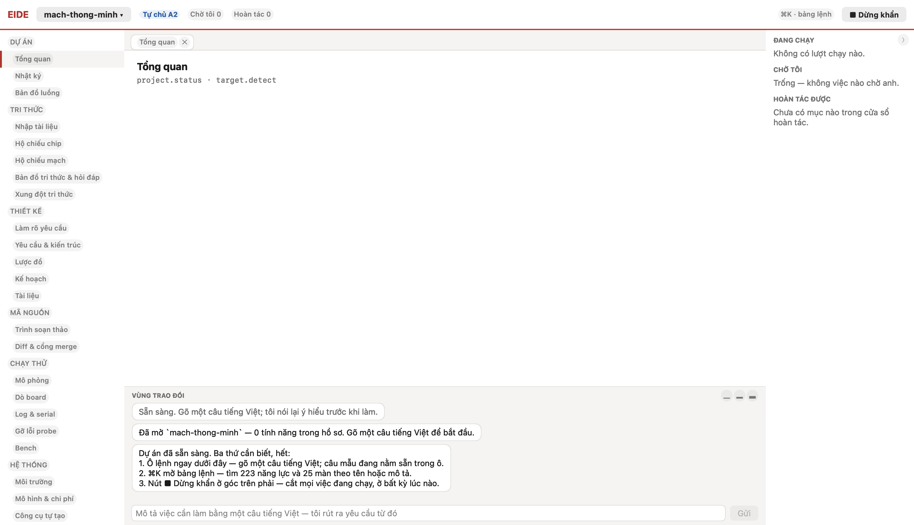
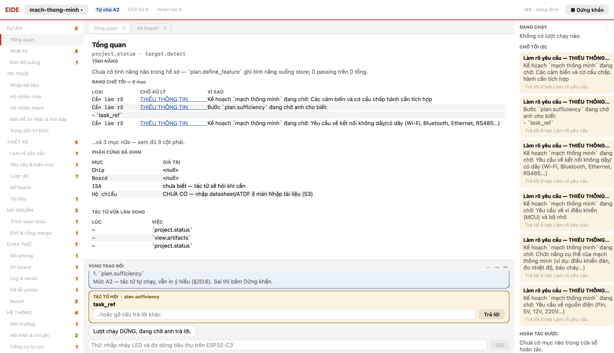
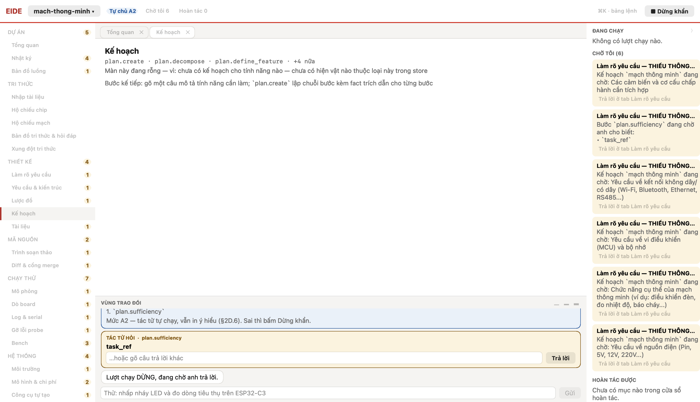

# Nhật ký phiên — kịch bản `kich-ban.kb`

Chạy qua ĐÚNG đường giao diện: gõ vào ô lệnh → bấm Gửi → `chat.send`. Mỗi bước
kèm một ảnh chụp cửa sổ thật.

## Bước 1

**Tôi (người dùng):** tạo dự án — “mạch thông minh”

**Tác tử trả lời** *(sau 0.8 s)*:

```
VÙNG TRAO ĐỔI  ▁ ▂ ▃ Sẵn sàng. Gõ một câu tiếng Việt; tôi nói lại ý hiểu trước khi làm.  Đã mở `mach-thong-minh` — 0 tính năng trong hồ sơ. Gõ một câu tiếng Việt để bắt đầu.  Dự án đã sẵn sàng. Ba thứ cần biết, hết:
1. Ô lệnh ngay dưới đây — gõ một câu tiếng Việt; câu mẫu đang nằm sẵn trong ô.
2. ⌘K mở bảng lệnh — tìm 223 năng lực và 25 màn theo tên hoặc mô tả.
3. Nút ■ Dừng khẩn ở góc trên phải — cắt mọi việc đang chạy, ở bất kỳ lúc nào.   Mô tả việc cần làm bằng một câu tiếng Việt — tôi rút ra yêu cầu từ đó Gửi 
```

**Màn đang mở — `Main`:**

```
(màn trống)
```



## Bước 2

**Tôi (người dùng):** Làm cho mình cái mạch thông minh

**Tác tử trả lời** *(sau 26.5 s)*:

```
VÙNG TRAO ĐỔI  ▁ ▂ ▃ Sẵn sàng. Gõ một câu tiếng Việt; tôi nói lại ý hiểu trước khi làm.  Đã mở `mach-thong-minh` — 0 tính năng trong hồ sơ. Gõ một câu tiếng Việt để bắt đầu.  Dự án đã sẵn sàng. Ba thứ cần biết, hết:
1. Ô lệnh ngay dưới đây — gõ một câu tiếng Việt; câu mẫu đang nằm sẵn trong ô.
2. ⌘K mở bảng lệnh — tìm 223 năng lực và 25 màn theo tên hoặc mô tả.
3. Nút ■ Dừng khẩn ở góc trên phải — cắt mọi việc đang chạy, ở bất kỳ lúc nào.  Làm cho mình cái mạch thông minh  Đã nhận (ý hiểu: `unknown`) — đang làm. Tiến độ hiện ở thẻ Run, kết quả hiện ngay dưới đây khi xong.  Làm cho mình cái mạch thông minh  bước 1/4  Mở chi tiết Dừng khẩn ⏸ DỪNG, đang chờ anh — xong 0/4 bước, 1 bước cần anh trả lời  → mở màn Kế hoạch (tác tử đang chạy `plan.sufficiency`)  Ý HIỂU  ·  chat.restate  Tôi hiểu là unknown: mạch thông minh. Tôi sẽ plan.sufficiency.  1. `plan.sufficiency`  Mức A2 — tác tử tự chạy, vẫn in ý hiểu (§2D.6). Sai thì bấm Dừng khẩn.  TÁC TỬ HỎI  ·  plan.sufficiency  task_ref   …hoặc gõ câu trả lời khác Trả lời Lượt chạy DỪNG, đang chờ anh trả lời.   Thử: nhấp nháy LED và đo dòng tiêu thụ trên ESP32-C3 Gửi 
```

**Màn đang mở — `PlanDiff`:**

```
Màn này đang rỗng — vì: chưa có kế hoạch cho tính năng nào — chưa có hiện vật nào thuộc loại này trong store  Bước kế tiếp: gõ một câu mô tả tính năng cần làm; `plan.create` lập chuỗi bước kèm fact trích dẫn cho từng bước  
```


## Bước 3

**Quét 2 tab tác tử đã mở:** Main, PlanDiff

### Tab `Main`

```
Tổng quan  project.status · target.detect  Vùng làm việc trống — chọn màn ở cột trái, hoặc ra lệnh để tác tử tự mở đúng màn.  TÍNH NĂNG  Chưa có tính năng nào trong hồ sơ — `plan.define_feature` ghi tính năng xuống store; 0 passing trên 0 tổng.  ĐANG CHỜ TÔI — 6 mục  LOẠI	CHỖ XỬ LÝ	VÌ SAO
Cần làm rõ	THIẾU THÔNG TIN	Kế hoạch `mạch thông minh` đang chờ: Các cảm biến và cơ cấu chấp hành cần tích hợp
Cần làm rõ	THIẾU THÔNG TIN	Bước `plan.sufficiency` đang chờ anh cho biết:
• `task_ref`
Cần làm rõ	THIẾU THÔNG TIN	Kế hoạch `mạch thông minh` đang chờ: Yêu cầu về kết nối không dây/có dây (Wi-Fi, Bluetooth, Ethernet, RS485...)
 …và 3 mục nữa — xem đủ ở cột phải.  PHẦN CỨNG ĐÃ GHIM  MỤC	GIÁ TRỊ
Chip	<null>
Board	<null>
ISA	chưa biết — tác tử sẽ hỏi khi cần
Hộ chiếu	CHƯA CÓ — nhập datasheet/ATDF ở màn Nhập tài liệu (S3)
  TÁC TỬ VỪA LÀM XONG  LÚC	VIỆC
—	`project.status`
—	`view.artifacts`
—	`project.status`
  PHIÊN LÀM VIỆC  MỤC	GIÁ TRỊ
Phiên	s_3e9cd03cdc7b
Mở lúc	23/09 08:24:23
Tự chủ hiệu lực	A2
Dừng khẩn	tắt
Lượt trao đổi	2
Mục hoàn tác	0
Chưa có dữ liệu	permits, board (DEV-110)
  NGÂN SÁCH MÔ HÌNH  MỤC	GIÁ TRỊ
Hôm nay	0.0075 USD
Hạn ngày	5.00 USD
Số lời gọi	2
```



### Tab `PlanDiff`

```
Kế hoạch  plan.create · plan.decompose · plan.define_feature · +4 nữa  Vùng làm việc trống — chọn màn ở cột trái, hoặc ra lệnh để tác tử tự mở đúng màn.  Màn này đang rỗng — vì: chưa có kế hoạch cho tính năng nào — chưa có hiện vật nào thuộc loại này trong store  Bước kế tiếp: gõ một câu mô tả tính năng cần làm; `plan.create` lập chuỗi bước kèm fact trích dẫn cho từng bước  
```


### Cột phải (cổng, hoàn tác, an toàn)

```
ĐANG CHẠY  Không có lượt chạy nào.  CHỜ TÔI (6)  Làm rõ yêu cầu — THIẾU THÔNG TIN  Kế hoạch `mạch thông minh` đang chờ: Các cảm biến và cơ cấu chấp hành cần tích hợp  Trả lời ở tab Làm rõ yêu cầu Làm rõ yêu cầu — THIẾU THÔNG TIN  Bước `plan.sufficiency` đang chờ anh cho biết:
• `task_ref`  Trả lời ở tab Làm rõ yêu cầu Làm rõ yêu cầu — THIẾU THÔNG TIN  Kế hoạch `mạch thông minh` đang chờ: Yêu cầu về kết nối không dây/có dây (Wi-Fi, Bluetooth, Ethernet, RS485...)  Trả lời ở tab Làm rõ yêu cầu Làm rõ yêu cầu — THIẾU THÔNG TIN  Kế hoạch `mạch thông minh` đang chờ: Yêu cầu về vi điều khiển (MCU) và bộ nhớ  Trả lời ở tab Làm rõ yêu cầu Làm rõ yêu cầu — THIẾU THÔNG TIN  Kế hoạch `mạch thông minh` đang chờ: Chức năng cụ thể của mạch thông minh (ví dụ: điều khiển đèn, đo nhiệt độ, báo cháy...)  Trả lời ở tab Làm rõ yêu cầu Làm rõ yêu cầu — THIẾU THÔNG TIN  Kế hoạch `mạch thông minh` đang chờ: Yêu cầu về nguồn điện (Pin, 5V, 12V, 220V...)  Trả lời ở tab Làm rõ yêu cầu HOÀN TÁC ĐƯỢC  Chưa có mục nào trong cửa sổ hoàn tác.  ⟩ 
```

**Tác tử trả lời** *(sau 4.6 s)*:

```
VÙNG TRAO ĐỔI  ▁ ▂ ▃ Sẵn sàng. Gõ một câu tiếng Việt; tôi nói lại ý hiểu trước khi làm.  Đã mở `mach-thong-minh` — 0 tính năng trong hồ sơ. Gõ một câu tiếng Việt để bắt đầu.  Dự án đã sẵn sàng. Ba thứ cần biết, hết:
1. Ô lệnh ngay dưới đây — gõ một câu tiếng Việt; câu mẫu đang nằm sẵn trong ô.
2. ⌘K mở bảng lệnh — tìm 223 năng lực và 25 màn theo tên hoặc mô tả.
3. Nút ■ Dừng khẩn ở góc trên phải — cắt mọi việc đang chạy, ở bất kỳ lúc nào.  Làm cho mình cái mạch thông minh  Đã nhận (ý hiểu: `unknown`) — đang làm. Tiến độ hiện ở thẻ Run, kết quả hiện ngay dưới đây khi xong.  Làm cho mình cái mạch thông minh  bước 1/4  Mở chi tiết Dừng khẩn ⏸ DỪNG, đang chờ anh — xong 0/4 bước, 1 bước cần anh trả lời  → mở màn Kế hoạch (tác tử đang chạy `plan.sufficiency`)  Ý HIỂU  ·  chat.restate  Tôi hiểu là unknown: mạch thông minh. Tôi sẽ plan.sufficiency.  1. `plan.sufficiency`  Mức A2 — tác tử tự chạy, vẫn in ý hiểu (§2D.6). Sai thì bấm Dừng khẩn.  TÁC TỬ HỎI  ·  plan.sufficiency  task_ref   …hoặc gõ câu trả lời khác Trả lời Lượt chạy DỪNG, đang chờ anh trả lời.   Thử: nhấp nháy LED và đo dòng tiêu thụ trên ESP32-C3 Gửi 
```

**Màn đang mở — `PlanDiff`:**

```
Màn này đang rỗng — vì: chưa có kế hoạch cho tính năng nào — chưa có hiện vật nào thuộc loại này trong store  Bước kế tiếp: gõ một câu mô tả tính năng cần làm; `plan.create` lập chuỗi bước kèm fact trích dẫn cho từng bước  
```



---

Hết kịch bản — 3 bước. Ảnh và nhật ký trong `/Users/congvt/Documents/EIDE/docs/test/usecase/TC004/lan-2`.