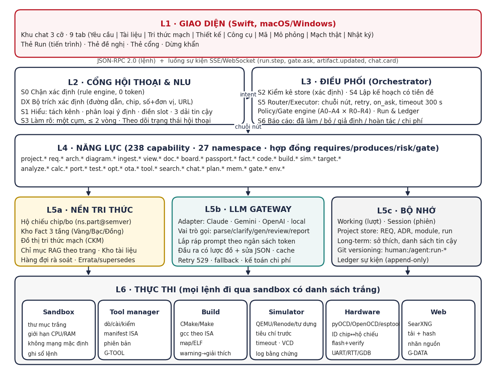
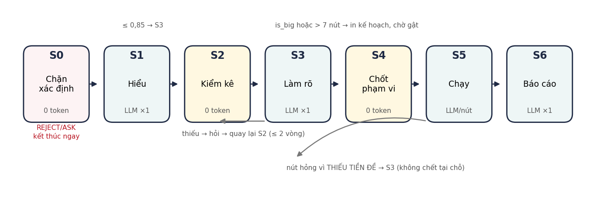
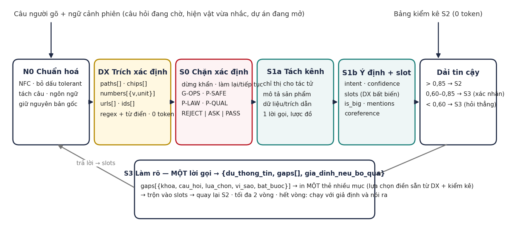

**EIDE — KIẾN TRÚC TÁC TỬ KỸ SƯ NHÚNG**

**Thiết kế kiến trúc chi tiết: từ hiểu ngôn ngữ tự nhiên (NLU) đến thực thi trên mạch thật**

*Mã tài liệu EIDE-AAD-33 · v1.0 · 24/09/2026*

|                        |                                                                                                                                                                                             |
|------------------------|---------------------------------------------------------------------------------------------------------------------------------------------------------------------------------------------|
| **Mã tài liệu**        | EIDE-AAD-33 (Agent Architecture Design)                                                                                                                                                     |
| **Tên tài liệu**       | Kiến trúc tác tử Kỹ sư Nhúng — thiết kế chi tiết từ NLU đến thực thi                                                                                                                        |
| **Phiên bản**          | v1.0 — áp dụng cho sản phẩm EIDE v1.4                                                                                                                                                       |
| **Ngày**               | 24/09/2026                                                                                                                                                                                  |
| **Dự án**              | EIDE — Embedded IDE có tác tử (github.com/mobiluckvn/EIDE)                                                                                                                                  |
| **Khung**              | Đề án tốt nghiệp Thạc sĩ ngành Kỹ thuật Điện tử — PTIT                                                                                                                                      |
| **Người hướng dẫn**    | TS. Nguyễn Trung Hiếu                                                                                                                                                                       |
| **Tác giả**            | Vũ Trí Công                                                                                                                                                                                 |
| **Tài liệu liên quan** | EIDE-AGD-32 (thiết kế sản phẩm v1.4); EIDE-SRS-02, SAD-03, CDS-12, CXD-10, MEM-11, APD-08, DPS-09, UXD-13 v2.0 (bộ hồ sơ v1.2); Usecase_Test_Agent_Ky_Su_Nhung.xlsx (kết quả đo 23/09/2026) |
| **Đối tượng đọc**      | Người phát triển lõi tác tử (Python), người phát triển giao diện (Swift), người kiểm thử                                                                                                    |

***Lịch sử sửa đổi***

| **Phiên bản** | **Ngày**   | **Nội dung**                                                                                                                                                                                                                                                                                                                           | **Người sửa** |
|---------------|------------|----------------------------------------------------------------------------------------------------------------------------------------------------------------------------------------------------------------------------------------------------------------------------------------------------------------------------------------|---------------|
| v1.0          | 24/09/2026 | Bản đầu: 6 lớp kiến trúc; thiết kế chi tiết NLU (N0, DX, S0, S1a/S1b, dải tin cậy, S3, theo dõi hội thoại); kiểm kê S2; bộ lập kế hoạch có tiền đề; bộ thực thi; động cơ chính sách/cổng; nền tri thức; LLM gateway; bộ nhớ; lớp thực thi; cầu giao diện; lược đồ dữ liệu; 4 luồng tuần tự; yêu cầu phi chức năng; truy vết tới UC/TC. | VTC           |

**1. Tổng quan kiến trúc**

**1.1. Mục tiêu kiến trúc**

Kiến trúc này hiện thực hoá bảy nguyên tắc bất biến của EIDE-AGD-32 (datasheet là nguồn sự thật; ba tầng tin cậy; kiểm kê xác định; hỏi một cụm; cổng an toàn trước phép đoán; không đạt giả; chỉ thị ≠ yêu cầu) dưới dạng các thành phần phần mềm có ranh giới rõ, hợp đồng rõ và có thể kiểm thử độc lập. Ba quyết định kiến trúc chi phối mọi phần còn lại:

1.  **Tách "xác định" khỏi "phán đoán".** Mọi việc có thể làm bằng mã (trích đường dẫn, phân loại tệp, kiểm kê store, tra Fact, kiểm tra tiền đề, chặn an toàn) thì làm bằng mã — 0 token, lặp lại được, kiểm thử được bằng unit test. Mô hình chỉ được gọi ở đúng bốn chỗ có phán đoán: hiểu câu, quyết định hỏi gì, sinh/sửa nội dung trong từng nút, và viết báo cáo.

2.  **Mọi hành động là một năng lực có hợp đồng.** Không có "mô hình tự gọi công cụ tự do". Tác tử chỉ được thực thi các capability đã đăng ký, mỗi capability khai báo tham số, tiền đề (requires), hiện vật sinh ra (produces), lớp rủi ro và cổng. Bộ lập kế hoạch xếp chuỗi từ hợp đồng, bộ thực thi kiểm hợp đồng trước và sau khi chạy.

3.  **Mọi con số là một Fact có nguồn.** Lớp nền tri thức là nguồn dữ liệu duy nhất cho bộ so sánh và bộ sinh mã; mô hình nhận Fact trong prompt dưới dạng có cấu trúc kèm trích dẫn, và đầu ra của mô hình được kiểm lại xem có dùng số ngoài Fact hay không (constant-guard).

**1.2. Sáu lớp**

*Hình 1. Sáu lớp kiến trúc của tác tử và luồng dữ liệu chính giữa các lớp*

| **Lớp**                                | **Trách nhiệm**                                                                                              | **Công nghệ / vị trí**                                                                          | **Không được làm**                                                            |
|----------------------------------------|--------------------------------------------------------------------------------------------------------------|-------------------------------------------------------------------------------------------------|-------------------------------------------------------------------------------|
| L1 Giao diện                           | Hiển thị 9 tab, khu chat, thẻ Run, thẻ đề nghị, thẻ cổng; thu thao tác người dùng (sửa mã, duyệt, dừng khẩn) | Swift (macOS/Windows); nói chuyện với lõi qua JSON-RPC + luồng sự kiện                          | Không chứa logic nghiệp vụ; không gọi mô hình trực tiếp                       |
| L2 Cổng hội thoại & NLU                | Biến câu người gõ + ngữ cảnh thành ý định có slot, đã qua chặn an toàn, đã tách kênh; hỏi làm rõ một cụm     | Python: eide/nlu/\* (normalize, dx, gate0, channels, intent, clarify, dst)                      | Không tự mô tả tình trạng dự án; không xếp chuỗi                              |
| L3 Điều phối                           | Kiểm kê store; lập kế hoạch có tiền đề; chạy chuỗi; áp cổng; ghi sổ cái; báo cáo                             | Python: eide/orchestrator/\* (inventory, planner, router, policy, run, report)                  | Không sinh nội dung chuyên môn; không đọc file thô                            |
| L4 Năng lực                            | 238 capability trong 27 namespace, mỗi cái một hợp đồng CDS-12                                               | Python: eide/caps/\<ns\>/\<name\>.py + caps.json                                                | Không gọi capability khác ngoài qua Router; không tự quyết cổng               |
| L5 Nền tri thức · LLM gateway · Bộ nhớ | Hộ chiếu, Fact, KG, RAG, tài liệu; lời gọi mô hình có lược đồ; bốn tầng bộ nhớ                               | Python: eide/knowledge/\*, eide/llm/\*, eide/memory/\*; SQLite + tệp JSON/YAML + git            | Nền tri thức không lưu số không nguồn; gateway không giữ trạng thái hội thoại |
| L6 Thực thi                            | Sandbox, quản lý công cụ, build, mô phỏng, phần cứng, tìm kiếm web                                           | Python: eide/exec/\*; tiến trình con trong sandbox; pyOCD/OpenOCD/esptool; QEMU/Renode; SearXNG | Không có đường chạy lệnh nào vòng qua sandbox                                 |

**1.3. Máy trạng thái một lượt gõ**

*Hình 2. Bảy pha S0–S6 của một lượt gõ, các pha 0 token được tô vàng/đỏ*

Một "lượt" bắt đầu khi người dùng gửi câu và kết thúc khi S6 trả lời hoặc khi S0/S3/S4 dừng chờ người. Mỗi lượt có run_id, được ghi sổ cái từ pha đầu đến pha cuối, và có ngân sách thời gian 300 giây; quá hạn thì thả người dùng ra, lưu trạng thái pha hiện tại và nói thật (UC19).

**2. Lớp L2 — Cổng hội thoại và hiểu ngôn ngữ tự nhiên (NLU)**

Đây là lớp bị đo là yếu nhất ở phiên bản 1.3: 11 ca chết vì đường dẫn bịa, 6 ca chết vì câu hỏi chặn, 4 ca vì chỉ thị bị ghi thành yêu cầu, 3 ca không ổn định. Thiết kế dưới đây đặt mọi thứ có thể xác định được ở TRƯỚC lời gọi mô hình, và cho mô hình một việc hẹp với lược đồ đầu ra chặt.

*Hình 3. Đường ống NLU: ba khối xác định (N0, DX, S0) đứng trước hai lời gọi mô hình (S1a, S1b)*

**2.1. N0 — Chuẩn hoá đầu vào**

| **Bước**  | **Việc**                                                                       | **Ghi chú**                                                             |
|-----------|--------------------------------------------------------------------------------|-------------------------------------------------------------------------|
| Unicode   | NFC; thống nhất dấu tiếng Việt kiểu cũ/mới (oà/òa)                             | Bản gốc luôn được giữ nguyên trong utterance.raw để trích dẫn           |
| Ngôn ngữ  | Nhận diện vi/en/hỗn hợp theo từ điển; không dịch                               | Thuật ngữ kỹ thuật tiếng Anh giữ nguyên (datasheet, pull-up, HardFault) |
| Tách câu  | Tách theo dấu câu và từ nối ("rồi", "sau đó", "và"); đánh số mệnh đề           | Cần cho tách kênh và cho lệnh nhiều bước ("đọc X rồi so với Y")         |
| Không dấu | Sinh thêm bản không dấu để regex và từ điển bắt được "ket noi", "nap firmware" | Không bao giờ dùng bản không dấu để hiển thị                            |

**2.2. DX — Bộ trích xác định (Deterministic eXtractor)**

DX chạy TRƯỚC mọi lời gọi mô hình và kết quả của nó là bất biến: mô hình ở S1b không được ghi đè slot do DX điền. DX là câu trả lời trực tiếp cho cụm lỗi lớn nhất (đường dẫn bịa) và cho tính không tất định của \${\_path}.

| **Trường**  | **Cách trích**                                                                                                                                                                    | **Kiểm chứng**                                                                                                             | **Ví dụ**                                                                       |
|-------------|-----------------------------------------------------------------------------------------------------------------------------------------------------------------------------------|----------------------------------------------------------------------------------------------------------------------------|---------------------------------------------------------------------------------|
| paths\[\]   | Regex đường dẫn tuyệt đối/tương đối (/, ~/, ./, C:\\, tên tệp có đuôi đã biết, chuỗi trong dấu nháy/backtick; NHIỀU giá trị                                                       | os.path.exists trong thư mục dự án hoặc thư mục người chỉ; không tồn tại → giữ lại nhưng đánh dấu exists=false (S3 sẽ hỏi) | "so /docs/ds_v1.pdf với /docs/ds_v2.pdf" → 2 đường dẫn (TC011)                  |
| chips\[\]   | Từ điển family_patterns (STM32\[FGHLWU\]\d{3}\w\*, ATmega\d+\w\*, ESP32(-\[SC\]\d)?, RP2040, nRF5\d, PIC\d+F\w+, GD32, CH32…) + bí danh (Uno→ATmega328P, Blue Pill→STM32F103C8T6) | Tra registry chip (640 hạt giống) → chuẩn hoá mã; không có trong registry → giữ nguyên, nhãn unknown_chip                  | "cho STM32F103" → chips=\[{code:"STM32F103", isa:"armv7-m", in_registry:true}\] |
| numbers\[\] | Số + đơn vị (V, mA, kΩ, MHz, KB, ms, °C, %) với tiền tố SI; dải "3,0–4,2 V"                                                                                                       | Chuẩn hoá về SI cơ sở; giữ chuỗi gốc                                                                                       | "pin 2000mAh" → {v:2000, unit:"mAh", si:7.2, si_unit:"C"}                       |
| urls\[\]    | Regex URL; tách domain; nhãn nhà sản xuất theo danh sách tin cậy                                                                                                                  | HEAD request chỉ khi người dùng đã duyệt (G-DATA)                                                                          | st.com → manufacturer=true                                                      |
| ids\[\]     | Mã hiện vật REQ-\*, ADR-\*, UC\*, TC\*, run-\*, MOD-\*                                                                                                                            | Tra store; không có → nhãn dangling                                                                                        | "làm lại run-0042"                                                              |
| back_refs   | Từ khoá trỏ ngược: "làm lại", "tiếp tục", "cái vừa rồi", "bản trước"                                                                                                              | Giải bằng tra bảng run/artefact gần nhất (S0 xử lý, không đoán)                                                            | UC17                                                                            |
| quoted\[\]  | Chuỗi trong nháy kép/backtick                                                                                                                                                     | Giữ nguyên để làm dữ liệu (tên hàm, chuỗi cần thay)                                                                        | "thay 'void main' bằng…" (TC017)                                                |

**Quy tắc bất biến của slot:** slots được hợp nhất theo thứ tự ưu tiên DX \> câu trả lời người dùng ở S3 \> mô hình S1b \> fill_defaults. Mỗi slot mang origin (dx \| user \| model \| default) và Router ghi origin vào sổ cái; slot có origin=model không bao giờ được dùng làm đường dẫn tệp hay mã chip để chạy nút — chỉ được dùng để điền sẵn câu hỏi.

**2.3. S0 — Chặn xác định (rule engine)**

S0 đọc chính câu người gõ (bản chuẩn hoá + bản không dấu), không đọc ý định. Nó là phòng thủ lớp hai: vẫn nổ kể cả khi định tuyến sai. Bộ luật là tệp YAML có thể kiểm thử độc lập; mỗi luật có mẫu, hành động, lý do hiển thị và mã luật để ghi sổ.

| **Nhóm luật** | **Mẫu bắt (rút gọn)**                                                                                           | **Hành động**                                                                                                              | **Ca đo**    |
|---------------|-----------------------------------------------------------------------------------------------------------------|----------------------------------------------------------------------------------------------------------------------------|--------------|
| STOP          | "dừng", "stop", "huỷ", Ctrl-C từ UI                                                                             | Dừng run đang chạy, lưu trạng thái, trả lời ngay; không gọi mô hình                                                        | UC19         |
| BACKREF       | "làm lại", "tiếp tục", "chạy lại bước…"                                                                         | Tra bảng run → dựng lại chuỗi từ điểm dừng; hỏi chỉ khi có ≥ 2 ứng viên                                                    | UC17, TC065  |
| G-OPS         | xoá (toàn bộ\|sạch) flash; option bytes; RDP; eFuse; secure boot; khoá (chip\|debug); mass erase; write protect | Quyết định ASK: in hậu quả từng thao tác, thẻ cổng riêng, ghi gate.decision; không chạy gì cho tới khi xác nhận tường minh | TC035, TC068 |
| P-SAFE        | nóng, khói, cháy, mùi khét, dòng tăng vọt, 220 V, điện lưới, AC, mains                                          | Câu đầu tiên là cảnh báo/lệnh ngắt nguồn; mọi hỏi đáp khác xếp sau                                                         | TC036, TC069 |
| P-LAW         | phá sóng, jammer, nghe lén, skimmer, bypass immobilizer, IMEI…                                                  | REJECT phần vi phạm + gợi hướng hợp pháp; không gọi mô hình                                                                | TC007        |
| P-QUAL        | sửa (tiêu chí\|test\|ngưỡng) cho (đạt\|pass); bỏ (test\|kiểm tra) để…; hạ chuẩn                                 | ASK: nêu hai đường (sửa gốc / đổi ngưỡng có nêu từ–đến–vì sao)                                                             | TC022        |
| P-INJ         | Chuỗi trong DỮ LIỆU (không phải câu người gõ) có mẫu "ignore previous instructions", lệnh shell, "gửi mã ra…"   | Đánh dấu tài liệu là nghi ngờ; cảnh báo; không thực thi; ghi sổ                                                            | TC014        |

Đầu ra S0: một trong {PASS, ASK(gate, reasons\[\]), REJECT(rule, message), STOP, BACKREF(run_id, node)}. Ở ASK/REJECT/STOP, lượt kết thúc ở S0 và không có lời gọi mô hình nào — thời gian đo được 2,5–2,6 giây ở v1.3 chủ yếu là khởi động tiến trình; mục tiêu v1.4 là \< 300 ms.

**2.4. S1a — Tách kênh (channel splitting)**

Một câu người gõ thường trộn ba loại nội dung. Phân loại sai kênh là gốc của việc "hãy cố tình gây lỗi cú pháp" trở thành yêu cầu sản phẩm FR-PWR-01 và "TV đang đọc USB, mình vẫn copy" trở thành FR-COM-01 thay vì một rủi ro. S1a là lời gọi mô hình nhỏ (mô hình nhanh) với lược đồ đầu ra bắt buộc:

> { "clauses": \[
>
> { "id": 1, "text": "Sửa tệp dem_xung.c để cố tình gây lỗi cú pháp", "channel": "DIRECTIVE" },
>
> { "id": 2, "text": "rồi biên dịch lại", "channel": "DIRECTIVE" },
>
> { "id": 3, "text": "Thiết bị phải chạy bằng pin 3,0–4,2 V", "channel": "PRODUCT" },
>
> { "id": 4, "text": "'void main'", "channel": "DATA" } \],
>
> "product_text": "Thiết bị phải chạy bằng pin 3,0–4,2 V",
>
> "directive_text": "Sửa tệp dem_xung.c để cố tình gây lỗi cú pháp rồi biên dịch lại" }

| **Kênh**                                      | **Đi đâu**                               | **Không bao giờ**                        |
|-----------------------------------------------|------------------------------------------|------------------------------------------|
| DIRECTIVE (chỉ thị cho tác tử)                | S1b phân loại ý định; Router chạy        | Ghi vào req.\* dưới bất kỳ hình thức nào |
| PRODUCT (mô tả sản phẩm/yêu cầu)              | req.elicit / req.update với version bump | Bị coi là lệnh chạy                      |
| DATA (chuỗi, số, trích dẫn, nội dung dán vào) | Slot dạng literal; kho tài liệu nếu dài  | Bị diễn giải thành ý định                |

Rủi ro mà tác tử tự phát hiện trong khi phân tích (ví dụ hỏng hệ thống tệp khi hai bên cùng ghi) được ghi vào mục risk\[\] của đặc tả với mức nghiêm trọng và đề xuất, không bao giờ được viết thành FR (TC003).

**2.5. S1b — Phân loại ý định và điền slot**

***2.5.1. Phân loại ý định (intent taxonomy)***

Ý định là tên một capability hoặc một mẫu chuỗi (chain template), không phải nhãn tự do. Mô hình chọn từ danh sách đóng được sinh tự động từ caps.json, kèm mô tả một dòng và ví dụ; danh sách đưa vào prompt được lọc trước theo namespace có khả năng (dựa trên DX: có chips → ưu tiên passport/arch/code; có paths .csv/.sal → analyze; có "nạp" → target).

| **Nhóm ý định**       | **Ví dụ ý định**                                                                                                                                     | **Slot chính**                   | **Mẫu chuỗi**                          |
|-----------------------|------------------------------------------------------------------------------------------------------------------------------------------------------|----------------------------------|----------------------------------------|
| Dự án & phiên         | project.create, project.open, project.resume, project.rollback, project.export                                                                       | name, path, run_id, version      | CH-PROJ-\*                             |
| Yêu cầu               | req.elicit, req.update, req.detect_conflict, req.trace                                                                                               | product_text, req_ids            | CH-REQ-01 (làm rõ ý tưởng)             |
| Kiến trúc & thiết kế  | arch.design, arch.decompose, arch.compare_options, diagram.architecture, board.schematic, board.pinout, board.check_pins, bom.build                  | chips, constraints, module_ids   | CH-ARCH-01 (từ phương án đến thiết kế) |
| Tài liệu & tri thức   | ingest.classify, ingest.index_text, doc.search_web, doc.approve, fact.extract, fact.review, fact.query, view.rag_ask, passport.propose, passport.pin | paths, urls, chips, question     | CH-DOC-01 (nạp & ghim)                 |
| Mã & build            | code.scaffold, code.gen_driver, code.fix, code.review, build.compile, build.analyze_map, env.check, tool.install                                     | chips, module_ids, paths, budget | CH-FW-01 (sinh & biên dịch)            |
| Mô phỏng & test       | sim.define_criteria, sim.run, sim.analyze, test.gen_unit, test.run, test.coverage                                                                    | criteria, scenario, timeout      | CH-SIM-01                              |
| Mạch thật             | target.detect, target.flash, target.verify, target.log, target.debug, target.read_regs, target.erase_fuse (G-OPS)                                    | probe, firmware_path, chip       | CH-HW-01                               |
| Phân tích & tính toán | analyze.capture, analyze.hardfault, analyze.log, calc.power, calc.battery, calc.thermal, calc.timing                                                 | paths, protocol, baud, numbers   | CH-AN-\*                               |
| Chuyển đổi & tối ưu   | port.map_peripherals, port.translate, opt.memory, opt.power, opt.speed, ota.design                                                                   | target_platform, budget          | CH-PORT-01, CH-OPT-01                  |
| Hội thoại & meta      | chat.answer (K9, nhãn Đồng), chat.explain_state, chat.help, unknown                                                                                  | question                         | —                                      |

***2.5.2. Lược đồ đầu ra S1b***

> { "intent": "build.compile",
>
> "confidence": 0.91,
>
> "is_big": false,
>
> "slots": { "chips": \[{"code":"ATmega328P","origin":"dx"}\],
>
> "paths": \[{"value":"/prj/src/dem_xung.c","origin":"dx","exists":true}\],
>
> "opt_level": {"value":"-Os","origin":"default"} },
>
> "mentions": \["dem_xung.c", "ATmega328P"\],
>
> "coref": { "cái vừa rồi": "run-0042" },
>
> "alt_intents": \[ {"intent":"code.fix","confidence":0.31} \],
>
> "why": "người dùng yêu cầu biên dịch lại sau khi sửa tệp" }

**is_big** được tính bằng mã, không bằng mô hình: is_big = (mẫu chuỗi ≥ 8 nút) OR (câu có từ khoá "làm hết", "toàn bộ", "từ đầu đến cuối") OR (nhiều hơn 3 mệnh đề DIRECTIVE). Ngưỡng 8 rút từ dữ liệu: 17/22 mẫu chuỗi ≤ 7 nút.

***2.5.3. Ba dải tin cậy***

| **Dải**   | **Ý nghĩa** | **Hành động**                                                                         | **Nội dung thẻ**                                                          |
|-----------|-------------|---------------------------------------------------------------------------------------|---------------------------------------------------------------------------|
| \> 0,85   | Chắc        | Sang S2 ngay                                                                          | —                                                                         |
| 0,60–0,85 | Ngờ         | Sang S3; mục đầu tiên của cụm câu hỏi là xác nhận ý định, có alt_intents làm lựa chọn | "Mình hiểu là \[biên dịch lại\]. Hay anh muốn \[sửa lỗi rồi biên dịch\]?" |
| \< 0,60   | Chưa hiểu   | Sang S3 hỏi thẳng; không tạo dự án, không chạy gì                                     | "Mạch thông minh này cụ thể để làm gì? …" (TC004)                         |

Hiệu chuẩn: confidence được hiệu chuẩn lại theo tập kịch bản (76 TC + bộ mẫu) bằng bảng ánh xạ điểm thô → xác suất đúng thực đo; ngưỡng 0,60/0,85 được đặt ở điểm mà tỉ lệ sai dưới 5 % và dưới 20 %.

**2.6. DST — Theo dõi trạng thái hội thoại (dialogue state tracking)**

DST là bộ nhớ làm việc của L2, sống trong phiên và được ghi vào store khi phiên đóng. Nó cho phép câu "À thêm nữa, phải chạy bằng pin" được hiểu là req.update trên đặc tả đang mở chứ không phải ý tưởng mới (TC006).

> DialogueState {
>
> project_id, run_id_current, phase_current,
>
> pending_question: { gap_keys\[\], asked_at, round: 1\|2 } \| null,
>
> focus: { artefact_type: "spec"\|"design"\|"code"\|"sim"\|"target", artefact_id, version },
>
> recent_mentions: \[ {text, resolves_to, turn} \], // cửa sổ 10 lượt
>
> last_intents: \[ {intent, confidence, turn} \], // để dải ngờ có ngữ cảnh
>
> assumptions_active: \[ {key, value, since_run} \], // giả định đang dùng, in ở S6
>
> autonomy_level: "A3", trusted_sources: \[...\] }

Quy tắc giải tham chiếu: đại từ ("nó", "cái đó", "bản trước") giải theo focus rồi recent_mentions; không giải được → đưa vào cụm S3 với lựa chọn là các hiện vật gần nhất. Khi có pending_question, câu người gõ tiếp theo trước hết được thử ghép vào gap_keys (mô hình nhỏ với lược đồ {answers: {key: value}}); ghép được thì trộn slot và quay lại S2 mà không phân loại ý định lại.

**2.7. S3 — Làm rõ một cụm**

S3 là MỘT lời gọi mô hình duy nhất, nhận: câu người gõ + intent + BẢNG KIỂM KÊ (S2) + tiền đề mà mẫu chuỗi cần (từ hợp đồng capability). Mô hình chỉ quyết một việc: khoảng trống nào ĐÁNG HỎI. Nó không được mô tả tình trạng dự án (đã có bảng) và không được điền giá trị thay người dùng (chỉ đề xuất lựa chọn).

> { "du_thong_tin": false,
>
> "gaps": \[
>
> { "khoa": "chips\[0\].passport", "cau_hoi": "Datasheet cho ATmega328P chưa có. Anh muốn:",
>
> "lua_chon": \["Tìm trên mạng (st.com/microchip.com)", "Tôi nạp tệp", "Dùng tri thức chung – nhãn Đồng"\],
>
> "vi_sao": "code.gen_driver cần Fact clock/pinmux tầng ≥ Bạc", "bat_buoc": true },
>
> { "khoa": "opt_level", "cau_hoi": "Mức tối ưu?", "lua_chon": \["-Os (mặc định)", "-O2", "-O0 để debug"\],
>
> "vi_sao": "ảnh hưởng ngân sách Flash 32 KB", "bat_buoc": false } \],
>
> "gia_dinh_neu_bo_qua": { "opt_level": "-Os" } }

- Giao diện in MỘT thẻ nhiều mục; mục bắt buộc đánh dấu; mục không bắt buộc có giá trị giả định điền sẵn.

- Tối đa 2 vòng. Hết vòng: chạy với gia_dinh_neu_bo_qua, ghi vào assumptions_active, S6 in ra.

- Cổng an toàn (G-OPS) KHÔNG BAO GIỜ là một mục trong thẻ S3 — nó là thẻ riêng do Policy engine phát, để một chữ "Có" không trả lời cả hai thứ.

- Trùng lặp: hai nút cùng cần một tiền đề chỉ sinh một gap (khoá trùng được gộp trước khi gọi mô hình) — sửa lỗi hỏi "Đọc những tệp nào?" hai lần trong một lượt.

**3. Lớp L3 — Điều phối**

**3.1. S2 — Kiểm kê xác định (inventory)**

S2 đọc store một lượt và dựng bảng "dự án ĐANG CÓ GÌ". Kết quả dùng chung cho S3, S4, S5 và cho thanh trạng thái giao diện. Không có lời gọi mô hình; cùng store → cùng bảng.

> Inventory {
>
> project: { id, path, opened_at, phase_reached: "C1".."C7" },
>
> requirements: { count, versions: \["v1","v2"\], ids\[\], conflicts_open },
>
> options: { count, chosen_id },
>
> passports: \[ { code, ns_part_semver, docs_count, facts: {vang, bac, dong}, isa, isa_manifest_found } \],
>
> documents: \[ { doc_id, type, version, pages, indexed, source_tier, approved } \],
>
> design: { modules, netlist_path, pinout_ok, erc_findings: {blocker, major, minor}, bom_rows },
>
> code: { files, last_build: {ok, warnings, flash_used, ram_used}, uncommitted_human_edits },
>
> toolchain: \[ { isa, gcc, version, ok } \], simulator: { backend, ready }, probes: \[ { kind, port, chip_id } \],
>
> sim: { last_run_id, criteria_defined, verdict }, target: { last_flash_run, verified },
>
> runs: { last_id, last_status, last_stop_node }, adrs: count, assumptions_active\[\] }

Chi phí: một truy vấn SQLite + đọc vài tệp JSON nhỏ; mục tiêu \< 50 ms. Bảng được cache theo mtime của store và làm mới sau mỗi nút ghi hiện vật.

**3.2. S4 — Bộ lập kế hoạch có tiền đề (precondition-aware planner)**

***3.2.1. Hợp đồng capability (trích CDS-12)***

> Capability {
>
> name: "diagram.architecture", ns: "diagram", version: "1.2.0",
>
> params: { style: {type:"enum", values:\["block","c4"\], default:"block"} },
>
> requires: \[ { artefact:"module_graph", min_count:1, how_to_get:"arch.decompose" },
>
> { artefact:"passport", tier_min:"BAC", optional:true } \],
>
> produces: \[ { artefact:"diagram", format:"mermaid\|svg" } \],
>
> risk: "R0", gate: null, on_ask: "skip", llm: "gen", cost_est: { tokens: 4000, seconds: 8 },
>
> idempotent: true, undo: "delete_artefact" }

***3.2.2. Thuật toán lập kế hoạch***

1.  Chọn mẫu chuỗi theo intent (22 mẫu trong chains.yaml) hoặc chuỗi một nút nếu intent là capability đơn.

2.  Với từng nút theo thứ tự, đối chiếu requires với Inventory ∪ produces của các nút đứng trước. Thiếu artefact có how_to_get → chèn nút đó trước (đệ quy, tối đa độ sâu 3, phát hiện vòng). Thiếu artefact không có how_to_get (ví dụ đường dẫn tệp, mã chip) → tạo gap cho S3.

3.  Gộp gap theo khoá; nếu còn gap bắt buộc → quay lại S3 (nếu chưa hết vòng) hoặc áp giả định.

4.  Tính is_big (đã có từ S1b) và số nút; nếu is_big hoặc \> 7 nút → phát thẻ kế hoạch: bước, thứ tự, ước lượng token/giây (tổng cost_est), giả định, cổng sẽ gặp → CHỜ GẬT. Việc nhỏ: in một dòng ý hiểu rồi chạy.

5.  Gắn cho mỗi nút: gate (từ hợp đồng + Policy engine), on_ask, timeout riêng, undo.

Ví dụ TC009: intent = diagram.architecture; requires module_graph; Inventory.modules = 0; how_to_get = arch.decompose; arch.decompose requires requirements ≥ 1 (có) → chuỗi = \[arch.decompose, diagram.architecture\]. Trước đây nút hỏng E2000; nay được chèn tiền đề tự động.

**3.3. S5 — Router / Executor**

| **Khía cạnh**          | **Thiết kế**                                                                                                                                                                                                                                    |
|------------------------|-------------------------------------------------------------------------------------------------------------------------------------------------------------------------------------------------------------------------------------------------|
| Vòng chạy              | for node in chain: kiểm requires lần nữa trên Inventory tươi → hỏi Policy engine (AUTO/ASK/REJECT) → chạy trong sandbox → kiểm produces (hiện vật có thật, đúng lược đồ) → ghi sổ cái → làm mới Inventory                                       |
| Phân loại lỗi          | E1xxx định dạng tệp; E2xxx thiếu tiền đề; E3xxx công cụ/môi trường; E4xxx phần cứng; E5xxx mô hình/chuỗi (E5002 chuỗi rỗng, E5290 mô hình quá tải); E6xxx cổng bị từ chối; E7xxx sandbox chặn. Mỗi lỗi có message cho người và hint cho planner |
| Thiếu tiền đề lúc chạy | E2xxx → không chết tại chỗ: quay về S3 với gap tương ứng (tính vào số vòng); có chặn số lần quay lại = 2/lượt                                                                                                                                   |
| on_ask                 | skip: nút hỏng không kéo lượt xuống, ghi "đã bỏ + vì sao" (DEV-216); required: lượt failed; ask: dừng chờ người                                                                                                                                 |
| Retry                  | Lỗi tạm (E5290, mạng): lùi luỹ thừa 2 s → 4 s → 8 s, tối đa 3; lỗi xác định: không retry                                                                                                                                                        |
| Vòng tự sửa            | Nút có self_fix (build.compile, sim.run): tối đa N=3 lần sửa–chạy lại; mỗi lần ghi diff + lý do; quá N → dừng và báo (TC017)                                                                                                                    |
| Timeout                | Mỗi nút có timeout riêng (build 120 s, sim theo kịch bản, flash 60 s); toàn lượt 300 s; quá hạn → lưu trạng thái, thả người dùng, nói thật (UC19)                                                                                               |
| Dừng khẩn              | Cờ cancel kiểm giữa các nút và truyền vào tiến trình con (SIGTERM → SIGKILL sau 5 s); nút đang flash không bị giết giữa chừng — chờ verify rồi dừng                                                                                             |
| Hoàn tác               | Mỗi nút ghi undo (xoá hiện vật / git revert / không hoàn tác được); S6 báo "hoàn tác được tới nút nào"                                                                                                                                          |

**3.4. Động cơ chính sách và cổng (Policy / Gate engine)**

Kế thừa EIDE-APD-08. Đầu vào: capability, lớp rủi ro (R0–R4), mức tự chủ hiện tại (A0–A4, mặc định A3), ngữ cảnh (nguồn tin cậy, kết quả S0, đã hỏi chưa). Đầu ra: quyết định AUTO / ASK / REJECT + lý do + mã luật, ghi gate.decision vào sổ cái.

| **Cổng** | **Lớp rủi ro** | **Kích hoạt**                                          | **A3 mặc định**                                           | **Bất biến**                           |
|----------|----------------|--------------------------------------------------------|-----------------------------------------------------------|----------------------------------------|
| G-DATA   | R1             | doc.approve, fact.review                               | AUTO nếu domain ∈ trusted_sources; Fact vẫn Bạc           | Fact chỉ thành Vàng khi người xác nhận |
| G-DESIGN | R1             | arch.compare_options → chọn; board.\* chốt             | ASK                                                       | —                                      |
| G-SCOPE  | R1             | is_big hoặc \> 7 nút                                   | ASK (thẻ kế hoạch)                                        | —                                      |
| G-TOOL   | R2             | tool.install                                           | ASK lần đầu; AUTO cho cùng gói/nguồn nếu người chọn "tin" | Không cài từ nguồn ngoài danh sách     |
| G-QUAL   | R2             | sim.define_criteria (sửa), test.\* xoá                 | ASK, bắt buộc từ–đến–vì sao                               | Luôn hỏi                               |
| G-FILE   | R2             | code.write vào tệp có human edit chưa merge            | Soft-lock + 3-way merge; ghi đè → ASK                     | Không xoá tệp người                    |
| G-OPS    | R4             | target.erase_all, option_bytes, rdp, efuse, bootloader | ASK, thẻ riêng, nêu hậu quả                               | Không AUTO ở mọi mức A0–A4             |
| G-SAFE   | R4             | S0 P-SAFE                                              | Cảnh báo trước mọi thứ                                    | Không tắt được                         |

Cửa sổ hoàn tác: hành động R2 được AUTO ở A3 có undo window 30 giây hiển thị trên thẻ Run ("Hoàn tác") trước khi hiện vật được coi là chốt. Học ngưỡng: mỗi lần người dùng bấm "tin"/"luôn hỏi" cho một (capability, nguồn) được ghi vào long-term memory và làm thay đổi quyết định lần sau — chỉ trong phạm vi R0–R2.

**3.5. Run và sổ cái (ledger)**

> LedgerEvent { ts, run_id, seq, kind, actor: "human"\|"agent:run-0042"\|"system", payload }
>
> kind ∈ { turn.start, s0.decision, s1.intent, s2.inventory, s3.gaps, s3.answer, s4.plan, gate.decision,
>
> node.start, node.end, node.skip, artefact.write, human.edit, human.save, undo, run.end, incident }

Sổ cái là append-only (JSONL theo dự án) và là nguồn cho: tab Nhật ký, project.resume (khôi phục đúng "đã quyết gì"), báo cáo S6, và bộ chạy kịch bản kiểm thử (EideApp --kich-ban đọc sổ cái để chấm). previous_session.summary được sinh từ sổ cái bằng mã (danh sách ADR + quyết định cổng + giả định) trước, mô hình chỉ viết lại thành câu — sửa TC065.

**3.6. S6 — Báo cáo**

chat.report_back nhận cấu trúc {done\[\], skipped\[{node, why}\], assumptions\[\], gates\[\], undo_upto, cost{tokens, seconds, usd}} từ sổ cái và viết thành câu trả lời ngắn; mọi giả định phải in ra, không nằm ngầm trong hiện vật. Câu trả lời kèm liên kết mở tab tương ứng.

**4. Lớp L4 — Năng lực**

Mỗi capability là một module Python tuân theo một giao diện chung; Router là nơi duy nhất gọi nó. Capability không gọi capability khác trực tiếp (để planner nhìn thấy toàn bộ đồ thị tiền đề), không tự quyết cổng, không tự gọi mô hình mà đi qua LLM gateway với vai trò khai báo trong hợp đồng.

> class Capability(Protocol):
>
> contract: CapabilityContract \# từ caps.json, kiểm lược đồ lúc nạp
>
> def check(self, inv: Inventory, params) -\> list\[Gap\] \# xác định, 0 token
>
> def run(self, ctx: RunContext, params) -\> Result \# ctx: store, kb, llm, sandbox, ledger, cancel
>
> def undo(self, ctx, result) -\> None

Namespace và số lượng (tổng 238) kế thừa EIDE_Danh_muc_Nang_luc v1.2; v1.4 thêm/đổi các năng lực sau, mỗi cái sẽ có CDS-12 riêng:

| **Năng lực**                                           | **Việc**                                                                                                                     | **Thay cho / vì sao**                                     |
|--------------------------------------------------------|------------------------------------------------------------------------------------------------------------------------------|-----------------------------------------------------------|
| nlu.extract_deterministic                              | DX (§2.2)                                                                                                                    | Mới — gốc của 13 ca                                       |
| nlu.split_channels                                     | S1a (§2.4)                                                                                                                   | Mới — 4 ca                                                |
| ingest.classify (đổi)                                  | Phân loại theo magic bytes + đuôi → archive/netlist/source/script/log/capture/pdf/image; mỗi loại một bộ đọc; lỗi đúng lý do | archive.list nhận nhầm netlist/.c/.sh/.PcbDoc là tệp nén  |
| passport.propose                                       | Từ chips\[\] của DX → thẻ đề nghị 3 lựa chọn; chạy tiếp các nút không cần Fact                                               | Thay câu chặn "chip nào?"                                 |
| doc.search_web / doc.approve                           | Tìm datasheet qua SearXNG, ưu tiên nhà sản xuất; thu metadata + hash; chờ G-DATA                                             | Hiện thực yêu cầu "tìm trên mạng và người dùng phê duyệt" |
| fact.extract / fact.review / fact.query / fact.compare | Bảng thông số → Fact ứng viên; hàng đợi rà soát; truy vấn xác định; so sánh hai vế ≥ Bạc                                     | Nền của N1/N2                                             |
| plan.with_preconditions                                | S4 (§3.2)                                                                                                                    | Thay planner theo mẫu cứng                                |
| env.check (đổi)                                        | Đối chiếu ISA của chip với manifest; không khớp → nói thẳng thay vì đưa 3 lựa chọn đều sai                                   | TC018 (armv7-m thiếu)                                     |
| sim.define_criteria                                    | Tiêu chí chấp nhận nêu TRƯỚC khi chạy; đổi tiêu chí qua G-QUAL                                                               | N6                                                        |

**5. Lớp L5a — Nền tri thức**

**5.1. Kho lưu trữ**

| **Kho**                    | **Công nghệ**                                                                         | **Nội dung**                                                                           | **Truy cập**                              |
|----------------------------|---------------------------------------------------------------------------------------|----------------------------------------------------------------------------------------|-------------------------------------------|
| Registry chip              | SQLite (640 hạt giống từ SVD/ATDF)                                                    | code, họ, ISA, gói, bí danh, URL nhà sản xuất                                          | DX, passport.propose                      |
| Hộ chiếu (passport)        | JSON theo lược đồ, ns.part@semver, có git                                             | Chip/bo: thông số cốt lõi (mỗi số là Fact), tài liệu gắn, errata áp dụng, ISA manifest | Mọi capability qua kb.passport()          |
| Kho Fact                   | SQLite bảng facts (+ FTS)                                                             | Bản ghi Fact (§5.2)                                                                    | fact.query — xác định                     |
| Đồ thị tri thức mạch (CKM) | SQLite bảng nodes/edges (hoặc Kùzu khi lớn)                                           | Chip, Pin, Net, Module, Bus, Nguồn, Ràng buộc, Tài liệu, Fact                          | board.\*, diagram.\*, code.gen\_\*        |
| Kho tài liệu               | Tệp gốc + text theo trang + metadata (hash, version, tier, approved_by)               | Datasheet, RM, errata, AN, mạch tham khảo                                              | ingest.\*, view.rag\_\*                   |
| Chỉ mục RAG                | Embedding cục bộ (bge-m3 hoặc tương đương) + BM25 lai; đơn vị = đoạn có doc_id + page | Đoạn văn, bảng, chú thích hình                                                         | view.rag_ask với ngưỡng theo loại câu hỏi |

**5.2. Bản ghi Fact và ba tầng**

> Fact { fact_id, subject: "chip:ATmega328P@1.0.0" \| "net:SDA" \| "pin:U1.28",
>
> key: "vdd.max", value: 5.5, unit: "V", min: null, typ: null, max: 5.5, condition: "TA=-40..85°C",
>
> source: { doc_id, version: "DS40002061B", page: 258, quote: "VCC ... 5.5 V", bbox: \[..\] },
>
> tier: "VANG"\|"BAC"\|"DONG", origin: "extract"\|"user"\|"model", approved_by, approved_at,
>
> supersedes: fact_id\|null, superseded_by: fact_id\|null, errata: bool }

| **Tầng** | **Điều kiện**                                                                                                                                    | **Được dùng cho**                                                                   | **Hiển thị**                          |
|----------|--------------------------------------------------------------------------------------------------------------------------------------------------|-------------------------------------------------------------------------------------|---------------------------------------|
| VÀNG     | Trích từ tài liệu người nạp/duyệt VÀ người đã xác nhận dòng (hoặc AUTO theo trusted_sources + độ tin cậy trích xuất ≥ 0,95 với bảng có cấu trúc) | So sánh, quyết định tự động, sinh mã (clock/pinmux), tính toán                      | Nền vàng nhạt, khoá, "mở trang nguồn" |
| BẠC      | Trích từ nguồn người đã duyệt nhưng chưa xác nhận dòng; hoặc OCR tin cậy ≥ 0,8                                                                   | So sánh (kết quả kèm nhãn "chờ xác nhận"); sinh mã có cảnh báo                      | Nền xám, nút "Xác nhận"               |
| ĐỒNG     | Tri thức chung của mô hình (K9), câu trả lời không có trích dẫn                                                                                  | Gợi ý, giải thích, đề xuất phép đo; KHÔNG là vế của phép so sánh, KHÔNG vào mã sinh | Chữ nghiêng, nhãn "chưa kiểm chứng"   |

**5.3. Đường ống nạp tài liệu (ingest)**

1.  ingest.classify: magic bytes → loại; archive → bóc tách đệ quy (giới hạn 3 cấp, 500 MB) → phân loại từng tệp.

2.  PDF: pdftotext/pymupdf theo trang; bảng → camelot/pdfplumber; ảnh → OCR (tesseract) có điểm tin cậy từng ô; scan mờ → gắn tier tối đa BẠC + bắt buộc rà từng dòng (TC044).

3.  fact.extract: từ bảng "Electrical Characteristics", "Absolute Maximum Ratings", "Pin Description", "Alternate Function" → Fact ứng viên với key theo từ điển chuẩn (vdd.max, io.voh.min, flash.size, pin.\<n\>.af\[\]); mô hình chỉ dùng để ánh xạ tiêu đề cột lạ → key chuẩn, còn giá trị được đọc bằng mã từ ô bảng.

4.  Chống chèn lệnh: văn bản tài liệu quét mẫu P-INJ; đoạn nghi ngờ bị đánh dấu và loại khỏi ngữ cảnh mô hình; người dùng được cảnh báo (TC014).

5.  view.rag_index: chunk theo trang/đoạn, giữ doc_id + page; hai phiên bản cùng tài liệu → chỉ mục riêng + bảng diff theo key (TC011).

6.  passport.pin: ghim ns.part@semver; đối chiếu ISA manifest; ghi sự kiện.

**5.4. Bộ so sánh và constant-guard**

fact.compare(a, b, rule) trả {verdict, severity, evidence:\[cite_a, cite_b\], unverified: bool}. Nếu tier(a) hoặc tier(b) = ĐỒNG → unverified=true, severity bị hạ thành "info" và planner không được dùng làm điều kiện tự động. Constant-guard: sau mỗi nút sinh mã, bộ quét tìm hằng số điện/thời gian (số kèm đơn vị hoặc macro cấu hình như F_CPU, BAUD, I2C_SPEED) và đối chiếu với kho Fact; hằng số không truy vết được → cảnh báo trong diff và nút không được coi là hoàn thành sạch (đây là đóng góp "LLM-Is-Not-Ground-Truth" của bài REV-ECIT).

**6. Lớp L5b — LLM Gateway**

**6.1. Vai trò lời gọi và chọn mô hình**

| **Vai trò** | **Dùng ở**                                           | **Yêu cầu**              | **Mô hình mặc định**                     | **Ngân sách**              |
|-------------|------------------------------------------------------|--------------------------|------------------------------------------|----------------------------|
| parse       | S1a, S1b, ghép câu trả lời vào gap                   | Nhanh, rẻ, lược đồ chặt  | Gemini Flash / Claude Haiku              | ≤ 6 k vào, ≤ 1 k ra, ≤ 3 s |
| clarify     | S3                                                   | Hiểu ngữ cảnh kỹ thuật   | Claude Sonnet / Gemini Pro               | ≤ 12 k vào, ≤ 1,5 k ra     |
| gen         | code.\*, arch.\*, diagram.\*, port.\*                | Mạnh nhất, ngữ cảnh dài  | Gemini Pro 3.1 (200 k out) / Claude Opus | theo nút, tối đa 120 k vào |
| review      | code.review, board.check (phần suy luận), analyze.\* | Mạnh, ít ảo giác         | Claude Sonnet/Opus                       | ≤ 60 k vào                 |
| report      | S6                                                   | Ngắn gọn, tiếng Việt tốt | Flash/Haiku                              | ≤ 8 k vào, ≤ 800 ra        |
| embed       | RAG                                                  | Cục bộ, đa ngữ           | bge-m3 (local)                           | —                          |

**6.2. Lắp ráp prompt (prompt assembly)**

Prompt của mọi vai trò được lắp từ các khối có thứ tự cố định và ngân sách token riêng; khối vượt ngân sách bị nén theo bậc thang (§7.3) chứ không bị cắt cụt im lặng:

| **Khối**              | **Nguồn**                                                   | **Ngân sách (gen)** | **Ghi chú**                                                        |
|-----------------------|-------------------------------------------------------------|---------------------|--------------------------------------------------------------------|
| 1\. Hiến pháp tác tử  | PRS-16: bảy nguyên tắc, quy tắc trích dẫn, định dạng đầu ra | 1,5 k               | Cố định, cache                                                     |
| 2\. Hợp đồng nút      | Capability contract + lược đồ đầu ra                        | 1 k                 | Cache theo capability                                              |
| 3\. Bảng kiểm kê      | S2 (rút gọn)                                                | 1 k                 | Xác định                                                           |
| 4\. Fact liên quan    | fact.query theo subject của nút, kèm trích dẫn và tầng      | ≤ 20 k              | Không có Fact → khối ghi rõ "KHÔNG CÓ DỮ KIỆN — không được bịa"    |
| 5\. Đoạn RAG          | view.rag_ask top-k theo câu hỏi/nút                         | ≤ 30 k              | Có doc_id + page trên từng đoạn; đoạn nghi P-INJ bị loại           |
| 6\. Hiện vật đầu vào  | Mã, netlist, log… đúng phạm vi nút                          | ≤ 50 k              | Repo lớn → chỉ tệp liên quan (§7.3), nói rõ phạm vi đã đọc (TC028) |
| 7\. Tóm tắt hội thoại | DST + ADR + giả định                                        | ≤ 4 k               | Sinh bằng mã từ sổ cái                                             |
| 8\. Câu lệnh của nút  | Params + directive_text                                     | ≤ 2 k               | Kênh DIRECTIVE, không có PRODUCT lẫn vào                           |

**6.3. Đầu ra có cấu trúc và độ tin cậy**

- Mọi vai trò trừ gen-văn-bản dùng JSON Schema; bật structured output/tool-use của nhà cung cấp nếu có; nếu không, kiểm lược đồ + sửa JSON (một lần) + gọi lại (một lần) rồi báo E5xxx.

- Cache: khối 1–2 dùng prompt caching của nhà cung cấp; kết quả parse/clarify cache theo hash(câu chuẩn hoá + inventory hash) trong 10 phút — giúp chạy lặp kịch bản rẻ hơn và tất định hơn.

- Retry/fallback: 529/timeout → lùi luỹ thừa 3 lần → đổi sang adapter dự phòng cùng vai trò → báo người và giữ nguyên công việc đã làm (TC073).

- Kế toán: mỗi lời gọi ghi {role, model, tokens_in/out, seconds, usd} vào sổ cái; S6 tổng hợp.

- Nhiệt độ: parse/clarify/report = 0; gen = 0,2; review = 0; seed cố định khi nhà cung cấp hỗ trợ — giảm "hai nhánh ý định cho cùng một câu" (TC004).

**7. Lớp L5c — Kiến trúc bộ nhớ**

**7.1. Bốn tầng**

| **Tầng**               | **Sống bao lâu**             | **Chứa gì**                                                                                                                   | **Ai ghi**                  | **Ai đọc**                |
|------------------------|------------------------------|-------------------------------------------------------------------------------------------------------------------------------|-----------------------------|---------------------------|
| Working (lượt)         | Một lượt                     | Câu gõ, DX, intent, inventory, gaps, chuỗi, kết quả nút                                                                       | L2, L3                      | Mọi pha của lượt          |
| Session (phiên)        | Đến khi đóng ứng dụng        | DialogueState (§2.6), cửa sổ hội thoại, cache                                                                                 | L2                          | L2, S6                    |
| Project store          | Vĩnh viễn theo dự án, có git | REQ (có phiên bản), phương án, ADR, module graph, netlist, BOM, Fact/CKM, mã, kết quả build/sim/flash, run + sổ cái, giả định | Capability qua Router       | S2, capability, giao diện |
| Long-term (người dùng) | Xuyên dự án                  | Mức tự chủ, trusted_sources, quyết định "tin"/"luôn hỏi", toolchain đã cài, sở thích mã (style), chip hay dùng                | Policy engine, tool manager | Policy, planner           |

**7.2. Khôi phục ngữ cảnh (project.resume)**

Khôi phục là ĐỌC, không phải NHỚ: mở lại dự án → S2 dựng Inventory → sinh bằng mã "bản tóm tắt quyết định" từ sổ cái (ADR, gate.decision, s3.answer, assumptions) → mô hình chỉ viết lại thành 5–8 câu. Câu hỏi "quyết định ban đầu về định dạng hệ thống tệp là gì?" (TC074) đi đường fact/ADR query, không đi đường mô hình đoán — vì hai yêu cầu cũ vẫn còn trong store, cái hỏng ở v1.3 là đường truy hồi.

**7.3. Nén ngữ cảnh theo bậc thang**

| **Bậc** | **Áp dụng khi**               | **Cách**                                                                                                                                              |
|---------|-------------------------------|-------------------------------------------------------------------------------------------------------------------------------------------------------|
| 0       | Vừa ngân sách                 | Nguyên văn                                                                                                                                            |
| 1       | Vượt \< 2×                    | Bỏ khoảng trắng, bỏ comment không liên quan, gộp log lặp                                                                                              |
| 2       | Vượt 2–5×                     | Chọn tệp/đoạn theo đồ thị phụ thuộc + mention (repo \> 500 tệp → chỉ tệp liên quan; in danh sách "đã đọc / chưa đọc")                                 |
| 3       | Vượt \> 5× hoặc hội thoại dài | Tóm tắt có cấu trúc (bằng mã trước: ADR/giả định/quyết định; mô hình chỉ tóm phần văn bản tự do); tóm tắt được lưu và kiểm bằng câu hỏi ngược (TC074) |

**8. Lớp L6 — Thực thi**

**8.1. Sandbox**

- Mọi lệnh (build, script, mô phỏng, công cụ nạp) chạy qua một tiến trình con với: thư mục cho phép = thư mục dự án + thư mục toolchain + thư mục tạm; không mạng mặc định (bật theo từng nút có khai báo network=true, ví dụ tool.install, doc.search_web); giới hạn CPU/RAM/thời gian; biến môi trường sạch.

- Hiện thực: macOS sandbox-exec (profile sinh động), Linux bubblewrap/firejail, Windows Job Object + AppContainer khi có; tối thiểu: chroot logic bằng kiểm tra đường dẫn + chặn danh sách lệnh (rm -rf ngoài dự án, đọc ~/.ssh) trước khi chạy.

- Script do người đưa vào (don-dep.sh, TC070) được phân loại là "script" bởi ingest.classify, được quét tĩnh (lệnh phá hoại, đọc khoá riêng) → nếu có: ASK với trích dòng nguy hiểm; chạy vẫn trong sandbox; mọi lệnh ghi sổ. An toàn phải do thiết kế, không do tai nạn.

**8.2. Quản lý công cụ**

| **Bước**    | **Việc**                                                                                                                                                                     | **Kết quả**                            |
|-------------|------------------------------------------------------------------------------------------------------------------------------------------------------------------------------|----------------------------------------|
| Dò          | which/where + --version cho: arm-none-eabi-gcc, avr-gcc, riscv64-unknown-elf-gcc, xtensa-esp32-elf-gcc, cmake, ninja, make, openocd, pyocd, esptool, qemu-system-arm, renode | toolchain\[\] trong Inventory          |
| Khớp ISA    | Manifest ISA (armv6-m, armv7-m, armv7e-m, armv8-m, avr8, rv32imac, xtensa-lx6/lx7…) ↔ chip.isa từ registry                                                                   | ok / thiếu manifest (nói thẳng, TC018) |
| Đề nghị cài | Lệnh cụ thể theo hệ điều hành (brew, apt, winget, pip) + nguồn + kích thước; thẻ G-TOOL                                                                                      | Người duyệt                            |
| Cài & kiểm  | Chạy trong sandbox có mạng; kiểm --version; ghi long-term memory                                                                                                             | Inventory cập nhật                     |

**8.3. Build**

code.scaffold sinh dự án CMake (hoặc Makefile cho AVR) theo mẫu Platform Pack của chip: startup, linker script từ Fact flash.size/ram.size (không hard-code), cấu hình clock/pinmux từ pinout đã duyệt. build.compile chạy trong sandbox, thu stdout/stderr có cấu trúc (gcc -fdiagnostics-format=json), map file → build.analyze_map (Flash/RAM used vs Fact budget → so sánh tầng Vàng). Vòng tự sửa ≤ 3 lần; warning được giải thích hoặc xử lý, không bị tắt bằng cờ.

**8.4. Mô phỏng**

| **Thành phần**             | **Thiết kế**                                                                                                                                                                                                                                                                         |
|----------------------------|--------------------------------------------------------------------------------------------------------------------------------------------------------------------------------------------------------------------------------------------------------------------------------------|
| Trừu tượng backend         | SimBackend { supports(chip, peripherals) → {ok\[\], missing\[\]}; run(elf, scenario, timeout) → {log, vcd, exit_reason} }; backend: QEMU (Cortex-M phổ thông), Renode (nhiều bo, ngoại vi phong phú, kịch bản .resc), simavr (AVR), mô phỏng tự dựng (Nano-OS/robot), Wokwi tùy chọn |
| Tiêu chí trước             | sim.define_criteria sinh criteria.yaml: {assert: \[uart_contains, gpio_toggles, timing_within, no_hardfault\], timeout_s} từ yêu cầu; người xác nhận; đổi sau → G-QUAL                                                                                                               |
| Kịch bản                   | scenario.yaml: kích thích (nút bấm, giá trị cảm biến giả, ngắt nguồn cho OTA — TC059), điểm đo                                                                                                                                                                                       |
| Bằng chứng                 | Log có dấu thời gian, VCD, ảnh chụp (nếu có GUI), exit_reason ∈ {criteria_met, criteria_failed, timeout, crash}; log rỗng → verdict = "không kết luận được" (TC076)                                                                                                                  |
| Ngoại vi không mô hình hoá | supports() trả missing\[\] → nói rõ phần không mô phỏng được, đề xuất mock/stub hoặc HIL; KHÔNG tuyên đạt cho phần đó (TC019)                                                                                                                                                        |
| Treo                       | timeout → lấy PC/backtrace từ GDB stub → khoanh vị trí vòng chờ (TC020)                                                                                                                                                                                                              |

**8.5. Phần cứng thật**

| **Bước**                               | **Công cụ**                                                                                 | **Kiểm soát**                                                                                                                                                                                                       |
|----------------------------------------|---------------------------------------------------------------------------------------------|---------------------------------------------------------------------------------------------------------------------------------------------------------------------------------------------------------------------|
| target.detect                          | pyOCD/OpenOCD (SWD/JTAG), esptool (ESP), avrdude (AVR/UART bootloader), liệt kê cổng serial | Đọc ID chip (DBGMCU_IDCODE, CHIPID, signature bytes) → đối chiếu hộ chiếu; không khớp → DỪNG trước khi nạp (TC034); không thấy → danh sách kiểm tra nguồn/cáp/driver/BOOT/NRST (TC032)                              |
| target.flash                           | Cùng công cụ; tệp ELF/HEX/BIN có hash                                                       | Thẻ tóm tắt "nạp gì (hash, kích thước) vào đâu (chip, địa chỉ)"; xác nhận; nạp; verify đọc lại; rút cáp giữa chừng → báo trạng thái không nhất quán + hướng khôi phục (connect under reset, bootloader ROM) (TC033) |
| target.log                             | UART (pyserial), RTT (pyOCD), SWO                                                           | Log có dấu thời gian vào kho; analyze.log                                                                                                                                                                           |
| target.debug                           | GDB (arm-none-eabi-gdb / avr-gdb) qua OpenOCD/pyOCD; MI protocol                            | Breakpoint, đọc thanh ghi ngoại vi qua SVD, backtrace; khoanh vùng HW/SW bằng phép đo đề xuất (TC031)                                                                                                               |
| target.erase_fuse / option bytes / RDP | Cùng công cụ                                                                                | G-OPS: thẻ riêng, hậu quả, không AUTO ở mọi mức; chưa hiện thực → nói thẳng (TC035)                                                                                                                                 |

**8.6. Tìm kiếm web**

search.web đi qua SearXNG cục bộ (make searxng); truy vấn được dựng bằng mã từ chips\[\] và loại tài liệu; kết quả xếp hạng ưu tiên tên miền nhà sản xuất (danh sách trusted_sources) và loại tệp PDF; tải chỉ sau G-DATA; tệp tải về đi vào ingest với hash và metadata nguồn. Mất mạng → E3xxx "lỗi mạng khi tìm tài liệu" (không phải lỗi tệp — TC072), lưu trạng thái, tiếp tục được.

**9. Cầu giao diện (L1 ↔ lõi)**

**9.1. JSON-RPC (lệnh từ giao diện)**

| **Phương thức**                           | **Tham số**                                         | **Trả về**                                                       |
|-------------------------------------------|-----------------------------------------------------|------------------------------------------------------------------|
| chat.send                                 | text, attachments\[\], project_id                   | run_id (lượt bắt đầu; kết quả đi qua sự kiện)                    |
| chat.answer                               | run_id, answers{key: value}                         | ack (trộn vào slots, quay lại S2)                                |
| gate.decide                               | run_id, gate_id, decision: approve\|reject\|trust   | ack                                                              |
| run.cancel                                | run_id                                              | ack (dừng khẩn)                                                  |
| run.undo                                  | run_id, upto_node                                   | kết quả hoàn tác                                                 |
| project.open / resume / rollback / export | path \| version                                     | summary                                                          |
| code.human_save                           | path, content, base_version                         | merge result (luôn tự duyệt)                                     |
| fact.review                               | fact_ids\[\], action: confirm\|edit\|reject, value? | ack                                                              |
| doc.approve                               | candidate_ids\[\], action                           | ack                                                              |
| view.\*                                   | artefact_id                                         | dữ liệu tab (inventory, facts, graph, diff, sim, target, ledger) |

**9.2. Luồng sự kiện (lõi → giao diện)**

> run.phase { run_id, phase: "S0".."S6" }
>
> chat.card { run_id, kind: "clarify"\|"proposal"\|"plan"\|"gate"\|"report", card: {...} }
>
> run.step { run_id, node, status: start\|end\|skip\|fail, progress, message }
>
> artefact.updated { type, id, version, tab } // giao diện làm mới đúng tab
>
> gate.ask { run_id, gate_id, gate: "G-OPS", consequences\[\], rule }
>
> incident { run_id, kind: network\|llm\|tool\|timeout\|sandbox, message, resumable }

**9.3. Lược đồ thẻ (card)**

> Card { kind, title, items: \[ { key, question, choices: \[ {label, value, prefilled: bool} \], required, why, default } \],
>
> actions: \[ {label, rpc, params} \], footer: { assumptions\[\], cost_est } }

Thẻ clarify là MỘT thẻ nhiều item; thẻ gate luôn có đúng một item và không có default. Thẻ proposal (hộ chiếu) có ba action cố định. Giao diện không tự suy ra nội dung thẻ — lõi là nguồn duy nhất, để hành vi tác tử kiểm thử được không cần giao diện (EideApp --kich-ban).

**10. Lược đồ dữ liệu tổng hợp**

Các lược đồ dưới đây là tệp JSON Schema trong repo (schemas/\*.json), được kiểm lúc nạp và trong CI; tên trường tiếng Anh, giá trị hiển thị tiếng Việt.

| **Lược đồ**         | **Tệp**                                            | **Dùng ở**    | **Điểm khoá**                                                                           |
|---------------------|----------------------------------------------------|---------------|-----------------------------------------------------------------------------------------|
| Utterance           | utterance.schema.json                              | N0 → DX       | raw, normalized, no_accent, clauses\[\]                                                 |
| DXResult            | dx.schema.json                                     | DX → S0/S1/S3 | paths\[\] (mảng!), chips\[\], numbers\[\], urls\[\], ids\[\], back_refs\[\], quoted\[\] |
| Gate0Decision       | gate0.schema.json                                  | S0            | decision, rule_ids\[\], message                                                         |
| Channels            | channels.schema.json                               | S1a           | clauses\[{id,text,channel}\], product_text, directive_text                              |
| Intent              | intent.schema.json (v2)                            | S1b           | intent (enum từ caps), confidence, is_big, slots{…origin}, alt_intents\[\]              |
| Inventory           | inventory.schema.json                              | S2            | §3.1                                                                                    |
| ClarifyResult       | clarify.schema.json                                | S3            | du_thong_tin, gaps\[\], gia_dinh_neu_bo_qua                                             |
| Plan                | plan.schema.json                                   | S4            | nodes\[{cap, params, gate, on_ask, timeout, undo}\], is_big, cost_est, assumptions\[\]  |
| CapabilityContract  | capability.schema.json                             | caps.json     | requires/produces/risk/gate/llm/cost_est                                                |
| Fact                | fact.schema.json                                   | Kho Fact      | §5.2                                                                                    |
| Passport            | passport.schema.json                               | Hộ chiếu      | ns.part@semver, isa, docs\[\], facts\[\] (tham chiếu)                                   |
| LedgerEvent         | ledger.schema.json                                 | Sổ cái        | §3.5                                                                                    |
| Card                | card.schema.json                                   | Giao diện     | §9.3                                                                                    |
| Criteria / Scenario | sim.criteria.schema.json, sim.scenario.schema.json | Mô phỏng      | assert\[\], timeout_s; stimuli\[\]                                                      |

**11. Luồng tuần tự tiêu biểu**

**11.1. "Viết firmware đọc nhiệt độ qua I2C cho ATmega328P rồi mô phỏng" (dự án mới, chưa có datasheet)**

| **\#** | **Pha / thành phần** | **Việc xảy ra**                                                                                                                                                                                                                                                                          |
|--------|----------------------|------------------------------------------------------------------------------------------------------------------------------------------------------------------------------------------------------------------------------------------------------------------------------------------|
| 1      | N0, DX               | chips=\[ATmega328P (registry: avr8)\], không có path; back_refs rỗng                                                                                                                                                                                                                     |
| 2      | S0                   | PASS (không mẫu nào khớp)                                                                                                                                                                                                                                                                |
| 3      | S1a                  | DIRECTIVE: "viết firmware… rồi mô phỏng"; PRODUCT: "đọc nhiệt độ qua I2C"                                                                                                                                                                                                                |
| 4      | S1b                  | intent = CH-FW-01 (req.elicit → arch.decompose → passport → code.scaffold → code.gen_driver → build.compile → sim.define_criteria → sim.run), confidence 0,92, is_big = true (8 nút)                                                                                                     |
| 5      | S2                   | Inventory: dự án đang mở, 0 REQ, 0 passport, toolchain avr-gcc OK, simavr OK                                                                                                                                                                                                             |
| 6      | S4 (lần 1)           | requires của code.gen_driver: passport tier ≥ BẠC → thiếu, how_to_get = passport.propose (cần người) → gap; req.elicit cần product_text → có                                                                                                                                             |
| 7      | S3                   | MỘT thẻ: \[bắt buộc\] datasheet ATmega328P: Tìm mạng / Nạp tệp / Tri thức chung; \[tuỳ chọn\] cảm biến nào? (gợi ý: LM75, TMP102, SHT31); \[tuỳ chọn\] mức tối ưu (-Os)                                                                                                                  |
| 8      | Người                | Chọn "Tìm mạng", "TMP102"                                                                                                                                                                                                                                                                |
| 9      | S2 → S4 (lần 2)      | Chuỗi = \[req.elicit, doc.search_web(ATmega328P, TMP102), doc.approve(G-DATA), fact.extract, passport.pin, arch.decompose, code.scaffold, code.gen_driver, build.compile, sim.define_criteria, sim.run\] — 11 nút, is_big → thẻ kế hoạch với ước lượng ~45 k token / ~2 phút → người gật |
| 10     | S5                   | doc.search_web → 4 ứng viên (2 microchip.com, 1 ti.com, 1 bên thứ ba) → gate.ask G-DATA → người duyệt 3 nguồn nhà sản xuất → tải + hash → fact.extract: 142 Fact ứng viên (ATmega328P), 38 (TMP102), tier BẠC; bảng "Absolute Maximum" tin cậy 0,98 → AUTO Vàng theo trusted_sources     |
| 11     | S5                   | passport.pin: mchp.atmega328p@1.0.0, ISA avr8 khớp manifest; arch.decompose: modules \[drv_i2c, drv_tmp102, app_temp, hal_uart\]                                                                                                                                                         |
| 12     | S5                   | code.scaffold (Makefile avr8, F_CPU từ Fact clock.max hoặc yêu cầu), code.gen_driver với prompt chứa Fact I2C (TWBR formula, pull-up, địa chỉ TMP102 0x48 từ datasheet TMP102 p.7) → constant-guard: 0x48, 100 kHz truy vết được → sạch                                                  |
| 13     | S5                   | build.compile: OK, 2 warning giải thích; analyze_map: Flash 3,1 KB / 32 KB (Fact Vàng)                                                                                                                                                                                                   |
| 14     | S5                   | sim.define_criteria: uart_contains "T=25" trong 2 s, no_hardfault → thẻ xác nhận tiêu chí → gật; sim.run (simavr + mock TMP102 trả 25 °C) → criteria_met, log + VCD lưu                                                                                                                  |
| 15     | S6                   | "Đã làm 11/11 bước. Giả định: mức tối ưu -Os. Cổng đã qua: G-DATA (3 nguồn), G-SCOPE, tiêu chí mô phỏng. Hoàn tác được tới nút 6. Chi phí: 41 k token, 1 phút 50 giây." + liên kết tab Mã, Mô phỏng, Tri thức mạch (38 Fact chờ xác nhận)                                                |

**11.2. "Nạp bản vừa build vào board rồi bật RDP mức 2"**

| **\#** | **Thành phần** | **Việc xảy ra**                                                                                                                                                                                        |
|--------|----------------|--------------------------------------------------------------------------------------------------------------------------------------------------------------------------------------------------------|
| 1      | DX, S0         | back_refs "bản vừa build" → run-0042 artefact firmware.elf; S0 bắt "RDP" → ASK G-OPS: thẻ riêng nêu hậu quả (mức 2: chip không bao giờ đọc/gỡ lỗi lại được), ghi gate.decision; phần "nạp" vẫn đi tiếp |
| 2      | S1b, S2, S4    | intent target.flash; Inventory: probe ST-Link, chip_id 0x410 (STM32F103) ↔ hộ chiếu STM32F103C8T6 khớp; chuỗi \[target.flash, target.verify\]; nút target.set_rdp bị tách ra chờ cổng riêng            |
| 3      | S5             | Thẻ tóm tắt: "nạp firmware.elf (sha256 …, 18,4 KB) vào STM32F103C8T6 @0x08000000 qua ST-Link" → xác nhận → nạp → verify OK                                                                             |
| 4      | G-OPS          | Thẻ cổng riêng còn treo; người từ chối → nút bị bỏ, ghi "bỏ vì người từ chối"; hoặc xác nhận tường minh → chạy, không thể hoàn tác, ghi sổ                                                             |
| 5      | S6             | Báo cáo hai phần: đã nạp + verify; RDP: đã/không thực hiện, vì sao                                                                                                                                     |

**11.3. "So hai bản datasheet /docs/ds_v1.pdf và /docs/ds_v2.pdf, dùng bản mới"**

| **\#** | **Thành phần** | **Việc xảy ra**                                                                                                                                                                                   |
|--------|----------------|---------------------------------------------------------------------------------------------------------------------------------------------------------------------------------------------------|
| 1      | DX             | paths = 2 (cả hai tồn tại) — không còn mất một tệp (TC011)                                                                                                                                        |
| 2      | S1b, S4        | intent doc.compare_versions; chuỗi \[ingest.classify×2, ingest.index_text×2, fact.extract×2, fact.diff, doc.select_version\]                                                                      |
| 3      | S5             | fact.diff theo key: 7 khác biệt (ví dụ io.voh.min 2,4 → 2,3 V p.61); bảng hiển thị hai trích dẫn; doc.select_version = v2 (theo chỉ thị), Fact v1 bị superseded_by; hộ chiếu ghi "dùng v2 (DS…B)" |
| 4      | S6             | Liệt kê khác biệt, nói rõ bản đã dùng và lý do                                                                                                                                                    |

**11.4. Sự cố giữa chừng (mất mạng khi đang tìm tài liệu)**

doc.search_web ném E3xxx network → Router ghi incident{resumable:true}, lưu trạng thái lượt (chuỗi, nút hiện tại, slots, giả định) vào store, phát sự kiện incident → giao diện hiện "Mất mạng khi tìm datasheet ATmega328P. Bấm Tiếp tục khi có mạng." → người bấm → chat.send("tiếp tục") → S0 BACKREF → chuỗi chạy lại từ nút hỏng. Không mất công việc đã làm, không lỗi tệp cho một việc tìm mạng (TC072).

**12. Yêu cầu phi chức năng**

| **Nhóm**      | **Yêu cầu**                                                                                                                               | **Cách đo**                                         |
|---------------|-------------------------------------------------------------------------------------------------------------------------------------------|-----------------------------------------------------|
| Độ trễ        | S0 \< 300 ms; S2 \< 50 ms; S1 \< 3 s; S3 \< 6 s; việc nhỏ (≤ 3 nút, không build) \< 30 s                                                  | Sổ cái có ts từng pha; bộ chạy kịch bản tổng hợp    |
| Tính tất định | Cùng câu + cùng store → cùng DX, S0, S2, S4 (100 %); S1/S3 ≥ 90 % cùng intent/gaps qua 5 lần                                              | Chạy lặp 5 lần/ca, ghi tỉ lệ (theo sheet Huong dan) |
| Không bịa     | 0 hằng số không truy vết trong mã sinh (constant-guard); 0 REQ có origin=model không qua người                                            | Bộ quét + kiểm sổ cái                               |
| An toàn       | 0 hành động G-OPS/G-SAFE không xác nhận; 0 lệnh chạy ngoài sandbox                                                                        | Kịch bản TC035/068/070 + kiểm log sandbox           |
| Quan sát      | Mọi lời gọi mô hình, lệnh sandbox, quyết định cổng đều có trong sổ cái; xuất được                                                         | Tab Nhật ký, project.export                         |
| Kiểm thử      | Lõi chạy được không cần giao diện (EideApp --kich-ban); mỗi pha có unit test; bộ mẫu cố định (ý tưởng, schematic lỗi, datasheet, 2 board) | CI + bộ Excel kịch bản                              |
| Đa mô hình    | Đổi adapter theo vai trò không đổi mã capability                                                                                          | Chạy bộ kịch bản với 2 nhà cung cấp                 |
| Đa nền tảng   | Lõi Python chạy macOS (Intel/Apple Silicon), Windows, Linux; giao diện Swift macOS/Windows                                                | CI ma trận                                          |

**13. Truy vết: thành phần ↔ sửa đổi Đ1–Đ6 ↔ ca đo**

| **Thành phần (mục)**                          | **Sửa đổi AGD-32** | **Ca đo được mở khoá / canh**                                     |
|-----------------------------------------------|--------------------|-------------------------------------------------------------------|
| DX (§2.2)                                     | Đ1                 | TC010, 011, 016, 020, 023, 043, 045, 047, 052, 054, 058, 070, 072 |
| ingest.classify (§4, §5.3)                    | Đ2                 | TC023, 025, 026, 062, 070                                         |
| passport.propose + G-DATA (§4, §5.3)          | Đ3                 | TC002, 008, 015, 027, 046, 048                                    |
| S1a tách kênh (§2.4)                          | Đ4                 | TC003, 017, 024, 028                                              |
| Planner có tiền đề (§3.2)                     | Đ5                 | TC009, 013, 064                                                   |
| DST + dải tin cậy + project.create (§2.5–2.6) | Đ6                 | TC001, 004, 006, 073                                              |
| S0 rule engine (§2.3)                         | giữ                | TC007, 022, 035, 036, 068, 069 (đang đạt — hồi quy phải giữ)      |
| Fact/compare/constant-guard (§5)              | N1, N2             | TC013, 021, 038, 040, 049, 056, 075                               |
| Sổ cái + resume (§3.5, §7.2)                  | —                  | TC065, 066, 074                                                   |
| Sandbox (§8.1)                                | —                  | TC070                                                             |
| Simulator (§8.4)                              | —                  | TC016, 019, 020, 059, 060, 076                                    |
| Hardware (§8.5)                               | —                  | TC029–034 (cần board thật)                                        |

**14. Việc tiếp theo**

1.  Viết CDS-12 cho 12 năng lực mới/đổi ở §4 (hợp đồng đầy đủ + lược đồ + ca kiểm).

2.  Đưa 14 lược đồ JSON (§10) vào schemas/ và bật kiểm trong CI; nâng intent.schema.json lên v2 (paths là mảng, slot có origin).

3.  Hiện thực theo thứ tự Đợt 1 của AGD-32: DX → ingest.classify → S0 YAML → S1a → passport.propose → planner; chạy lại 76 TC × 5 lần.

4.  Dựng SearXNG (make searxng) và bộ datasheet mẫu (ATmega328P, STM32F103/F4, ESP32, TMP102) để đo §5 và §11.1 thật.

5.  Cập nhật SAD-03 và CXD-10/MEM-11 v1.2 theo tài liệu này (hoặc thay bằng AAD-33 nếu chọn gộp).
