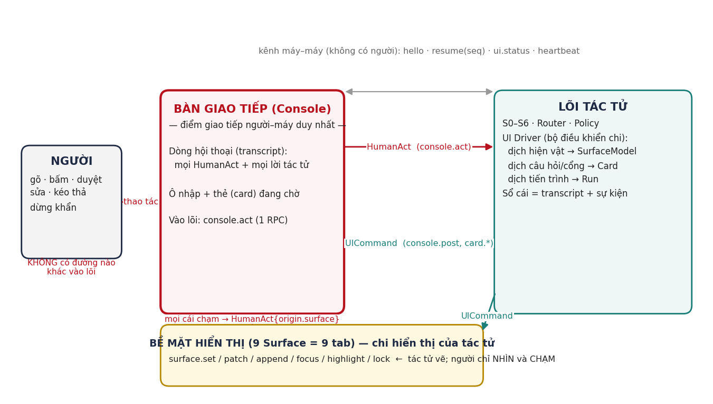
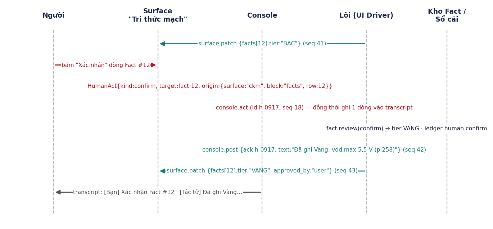

**EIDE — GIAO THỨC ĐIỀU KHIỂN GIAO DIỆN**

**Giao diện là chi của tác tử; người và máy chỉ gặp nhau ở một nơi**

*Mã tài liệu EIDE-UIP-34 · v1.0 · 24/09/2026*

|                        |                                                                                                                               |
|------------------------|-------------------------------------------------------------------------------------------------------------------------------|
| **Mã tài liệu**        | EIDE-UIP-34 (UI Protocol)                                                                                                     |
| **Tên tài liệu**       | Giao thức điều khiển giao diện của tác tử — UI-as-Actuator Protocol (UAP) v1                                                  |
| **Phiên bản**          | v1.0 — áp dụng cho EIDE v1.4                                                                                                  |
| **Ngày**               | 24/09/2026                                                                                                                    |
| **Khung**              | Đề án tốt nghiệp Thạc sĩ ngành Kỹ thuật Điện tử — PTIT                                                                        |
| **Người hướng dẫn**    | TS. Nguyễn Trung Hiếu                                                                                                         |
| **Tác giả**            | Vũ Trí Công                                                                                                                   |
| **Tài liệu liên quan** | EIDE-AAD-33 §9 (cầu giao diện — tài liệu này thay thế và chi tiết hoá); EIDE-AGD-32 §7 (9 tab); EIDE-UXD-13 v2.0; EIDE-UXC-31 |
| **Đối tượng đọc**      | Người phát triển giao diện (Swift), người phát triển lõi (Python), người kiểm thử giao thức                                   |

***Lịch sử sửa đổi***

| **Phiên bản** | **Ngày**   | **Nội dung**                                                                                                                                                                                                                                         | **Người sửa** |
|---------------|------------|------------------------------------------------------------------------------------------------------------------------------------------------------------------------------------------------------------------------------------------------------|---------------|
| v1.0          | 24/09/2026 | Bản đầu: mô hình "giao diện là chi", 6 bất biến, phong bì thông điệp, HumanAct (11 loại), UICommand (14 lệnh), SurfaceModel và 12 loại khối, Card, Run, vòng đời phiên, thứ tự/idempotent/khôi phục, ánh xạ 9 tab, 5 luồng ví dụ, kiểm thử tuân thủ. | VTC           |

**1. Mô hình: giao diện là chi của tác tử**

Trong EIDE, giao diện không phải là "ứng dụng" có logic riêng nói chuyện với một "backend". Giao diện là chi (tay, chân, mắt, miệng) của tác tử: tác tử vẽ lên đó để nói với người, và cảm nhận qua đó khi người chạm vào. Hệ quả thiết kế: giao diện không có quyết định nào của riêng nó; mọi thứ nó hiển thị đều do lõi ra lệnh, và mọi thứ người làm trên nó đều được chuyển về lõi dưới một dạng duy nhất.

**1.1. Một vị trí giao tiếp người–máy: Bàn giao tiếp (Console)**

Người và máy chỉ gặp nhau ở **một nơi**: Bàn giao tiếp. Về mặt giao thức, đó là **một phương thức vào lõi duy nhất** (console.act) mang một loại thông điệp duy nhất (HumanAct), và **một dòng hội thoại duy nhất** (transcript) trong đó mọi hành động của người và mọi lời của tác tử đều xuất hiện theo thứ tự thời gian. Bấm "Duyệt" trên thẻ cổng, bấm "Xác nhận" một dòng Fact ở tab Tri thức mạch, lưu một tệp mã đã sửa tay, kéo thả một datasheet, bấm Dừng khẩn — tất cả đều là một HumanAct đi qua console.act và đều để lại một dòng "\[Bạn\] …" trong transcript. Không có nút nào "nói chuyện riêng" với lõi.

Chín tab là các Bề mặt hiển thị (Surface): tác tử vẽ lên đó; người nhìn và chạm; cái chạm được gói thành HumanAct có ghi rõ xuất xứ (surface, block, row). Bề mặt là mắt và tay của tác tử, không phải cửa giao tiếp thứ hai.

*Hình 1. Tô-pô giao thức: một cửa vào lõi (console.act), một dòng hội thoại, chín bề mặt do tác tử điều khiển*

**1.2. Sáu bất biến của giao thức**

| **Mã** | **Bất biến**                                                                                                                                                                                               | **Kiểm bằng**                                                   |
|--------|------------------------------------------------------------------------------------------------------------------------------------------------------------------------------------------------------------|-----------------------------------------------------------------|
| I1     | Một cửa vào: lõi chỉ nhận thao tác của người qua console.act với thông điệp HumanAct. Mọi RPC khác từ giao diện là máy–máy (hello, resume, ui.status, heartbeat) và không mang ý chí của người.            | Lõi từ chối (E_PROTO_CHANNEL) mọi RPC khác có payload hành động |
| I2     | Một dòng hội thoại: mỗi HumanAct sinh đúng một mục transcript "\[Bạn\] …" và mỗi phản hồi của tác tử sinh mục "\[Tác tử\] …"; transcript là hình chiếu của sổ cái, không phải bản sao do giao diện tự ghi. | Phát lại (replay) sổ cái tái tạo đúng transcript                |
| I3     | Giao diện không quyết: giao diện không suy ra nội dung thẻ, không tự điền giá trị, không tự đổi trạng thái hiện vật; nó chỉ render SurfaceModel và Card do lõi gửi.                                        | Chạy lõi không giao diện (--kich-ban) cho cùng hành vi          |
| I4     | Lõi không biết giao diện: lõi chỉ thấy HumanAct (ý chí + xuất xứ), không thấy sự kiện chuột/phím, không thấy cây view.                                                                                     | Lược đồ HumanAct không có trường UI-cụ-thể                      |
| I5     | Có thứ tự, không trùng, khôi phục được: mỗi chiều có seq tăng dần; mọi thông điệp có id; nhận lặp không gây tác dụng lặp; mất kết nối → resume(seq) phát lại phần thiếu.                                   | Kiểm thử ngắt kết nối + gửi lặp                                 |
| I6     | Cổng là thẻ riêng: quyết định cổng (G-OPS, G-QUAL…) chỉ được chấp nhận từ HumanAct kind=decide có gate_id khớp thẻ đang chờ; không chấp nhận từ text tự do, không gộp với câu hỏi làm rõ.                  | Gửi "có" bằng text → lõi hỏi lại bằng thẻ                       |

**2. Vận chuyển và phong bì thông điệp**

**2.1. Vận chuyển**

| **Khía cạnh**         | **Quy định**                                                                                                                                     |
|-----------------------|--------------------------------------------------------------------------------------------------------------------------------------------------|
| Cặp tiến trình        | Giao diện (Swift) khởi chạy lõi (Python) làm tiến trình con; hoặc kết nối tới lõi đang chạy qua WebSocket localhost (chế độ phát triển/kiểm thử) |
| Khung                 | JSON-RPC 2.0; trên stdio dùng tiền tố Content-Length: N\r\n\r\n (như LSP); trên WebSocket mỗi frame một thông điệp                               |
| Chiều giao diện → lõi | JSON-RPC request: console.act, hello, resume, ui.status, ping                                                                                    |
| Chiều lõi → giao diện | JSON-RPC notification: ui.command (mang một UICommand) — lõi không chờ trả lời; xác nhận nhận (ack) đi qua ui.status                             |
| Mã hoá                | UTF-8, JSON không có NaN/Infinity; số đo kèm đơn vị dạng chuỗi riêng (value + unit)                                                              |
| Kích thước            | Một thông điệp ≤ 1 MB; nội dung lớn (log, VCD, ảnh) gửi bằng tham chiếu artefact_ref và giao diện đọc qua tệp/blob URL cục bộ                    |
| Heartbeat             | ping/pong 5 s; 3 lần không đáp → giao diện hiện trạng thái "lõi không phản hồi" và cho phép kill/restart                                         |

**2.2. Phong bì chung**

> Envelope {
>
> v: "uap/1", // phiên bản giao thức
>
> id: "h-000917" \| "c-004211", // h- giao diện sinh, c- lõi sinh; duy nhất trong phiên
>
> seq: 18, // tăng dần theo CHIỀU (giao diện→lõi và lõi→giao diện đếm riêng)
>
> ts: "2026-09-24T15:20:31.412+07:00",
>
> session: "s-7f3a", // từ hello_ack
>
> run_id: "run-0042" \| null, // lượt đang gắn (nếu có)
>
> kind: "HumanAct" \| "UICommand" \| "Status",
>
> payload: { ... } }

Quy tắc: giao diện không bao giờ gửi seq lùi; lõi bỏ qua (và ack) thông điệp có id đã thấy; thông điệp có seq nhảy cóc → lõi trả E_PROTO_GAP kèm seq mong đợi, giao diện gửi lại từ đó.

**3. HumanAct — thứ duy nhất người gửi vào lõi**

HumanAct mô tả ý chí của người ở mức ý nghĩa ("xác nhận Fact \#12", "duyệt cổng g-31", "lưu tệp này với nội dung mới"), không ở mức thao tác ("click tại 412,88"). Mọi HumanAct có xuất xứ (origin) để lõi biết người đang nhìn gì khi hành động — đây là dữ liệu cho DST (theo dõi trạng thái hội thoại), không phải để giao diện điều khiển lõi.

> HumanAct {
>
> kind: "say"\|"choose"\|"decide"\|"confirm"\|"edit"\|"upload"\|"stop"\|"undo"\|"resume"\|"attend"\|"set",
>
> text: string \| null, // câu người gõ (say) hoặc nhãn hiển thị của hành động (các kind khác)
>
> target: { type, id, version? } \| null, // fact:12, gate:g-31, card:k-9, file:src/main.c, run:run-0042
>
> data: object \| null, // theo kind (xem bảng)
>
> origin: { surface: "console"\|"req"\|"docs"\|"ckm"\|"design"\|"tools"\|"code"\|"sim"\|"target"\|"ledger",
>
> block?: string, row?: number, selection?: {from,to} } }

| **kind** | **Ý nghĩa**                                                      | **target**            | **data**                                                    | **Dòng transcript sinh ra**                                   |
|----------|------------------------------------------------------------------|-----------------------|-------------------------------------------------------------|---------------------------------------------------------------|
| say      | Người gõ tự do vào ô nhập                                        | null                  | {attachments?: \[artefact_ref\]}                            | \[Bạn\] \<text\>                                              |
| choose   | Chọn mục trong thẻ làm rõ / đề nghị / kế hoạch                   | card:k-9              | {answers: {key: value}} (nhiều mục một lần)                 | \[Bạn\] Trả lời: datasheet = Tìm trên mạng; cảm biến = TMP102 |
| decide   | Quyết định cổng                                                  | gate:g-31             | {decision: "approve"\|"reject"\|"trust", note?}             | \[Bạn\] DUYỆT cổng G-OPS: xoá toàn bộ Flash (g-31)            |
| confirm  | Xác nhận/từ chối/sửa một dữ kiện hoặc nguồn                      | fact:12 \| doc:cand-3 | {action: "confirm"\|"reject"\|"edit", value?, unit?, note?} | \[Bạn\] Xác nhận Fact \#12 vdd.max = 5,5 V                    |
| edit     | Người sửa trực tiếp một hiện vật (mã, yêu cầu, tiêu chí) rồi lưu | file:src/main.c@v7    | {content_ref \| patch (unified diff), base_version}         | \[Bạn\] Lưu src/main.c (+12 −3)                               |
| upload   | Kéo thả / chọn tệp                                               | null                  | {files: \[{name, size, artefact_ref, sha256}\]}             | \[Bạn\] Nạp 2 tệp: ds_v1.pdf, ds_v2.pdf                       |
| stop     | Dừng khẩn                                                        | run:run-0042          | {hard: bool}                                                | \[Bạn\] DỪNG run-0042                                         |
| undo     | Hoàn tác tới nút                                                 | run:run-0042          | {upto_node?: int}                                           | \[Bạn\] Hoàn tác run-0042 tới bước 6                          |
| resume   | Tiếp tục sau sự cố / mở lại dự án                                | run:… \| project:…    | {}                                                          | \[Bạn\] Tiếp tục run-0042                                     |
| attend   | Người chuyển tab / chọn hiện vật (chỉ để lõi biết focus)         | surface:ckm           | {artefact?: ref}                                            | (không sinh dòng — ghi sổ cái mức debug)                      |
| set      | Đổi thiết lập vận hành                                           | setting:autonomy      | {value}                                                     | \[Bạn\] Đặt mức tự chủ = A2                                   |

**3.1. Quy tắc chấp nhận ở lõi**

- Mọi HumanAct đi vào S0 trước (chặn xác định) rồi mới định tuyến: decide → Policy engine; choose → S3 (ghép vào gap); confirm → fact.review/doc.approve; edit → code.human_save (luôn tự duyệt, soft-lock + 3-way merge); upload → ingest; stop/undo/resume → Run; say → N0/DX/S1; set → Policy; attend → DST.

- decide chỉ hợp lệ khi gate_id đang ở trạng thái chờ và chưa hết hạn; sai → E_GATE_STALE, lõi phát lại thẻ cổng.

- choose với key không thuộc thẻ đang chờ → bỏ key lạ, ack phần hợp lệ, nêu rõ trong console.post.

- Một HumanAct không bao giờ được tách thành hai ý chí: "xoá flash rồi nạp" gõ bằng text (say) sẽ được S0 tách phần G-OPS ra thẻ cổng riêng — người phải decide riêng.

- Phản hồi cho mỗi HumanAct: ít nhất một UICommand console.post có ack = id của HumanAct (kể cả khi lõi chỉ nói "đã nhận, đang làm").

**4. UICommand — cách tác tử điều khiển chi của mình**

UICommand là mệnh lệnh mức ý nghĩa cho giao diện: "đăng lời này vào console", "đặt bề mặt X thành mô hình Y", "vá dòng 12 của bảng Fact", "đưa mắt người tới net SDA", "khoá tệp main.c vì tôi đang sửa". Giao diện thi hành đúng lệnh, không diễn giải thêm.

| **Lệnh**          | **Payload chính**                                                                          | **Ý nghĩa / ràng buộc**                                                                                                                          |
|-------------------|--------------------------------------------------------------------------------------------|--------------------------------------------------------------------------------------------------------------------------------------------------|
| console.post      | {ack?: id, role: "agent"\|"system", text (markdown), card?: Card, refs?: \[artefact_ref\]} | Đăng một mục vào transcript. Có card → thẻ hiển thị ngay dưới mục và là thẻ "đang chờ" nếu card.awaits = true                                    |
| console.stream    | {post_id, delta}                                                                           | Nối thêm văn bản vào mục đang phát (trả lời dài); kết thúc bằng console.post ack cùng post_id                                                    |
| card.resolve      | {card_id, by: HumanAct.id \| "expired" \| "superseded"}                                    | Đóng thẻ (ẩn nút, giữ nội dung); thẻ đã đóng không nhận choose/decide                                                                            |
| card.expire       | {card_id, reason}                                                                          | Thẻ hết hạn (ví dụ cổng quá 10 phút) — giao diện làm mờ và ghi "hết hạn"                                                                         |
| surface.set       | {surface, model: SurfaceModel}                                                             | Thay toàn bộ mô hình bề mặt; model.version tăng dần theo surface                                                                                 |
| surface.patch     | {surface, base_version, ops: \[JSON Patch\]}                                               | Vá mô hình; base_version phải bằng version hiện tại của giao diện, lệch → giao diện gửi ui.status{kind:"resync", surface} và lõi gửi surface.set |
| surface.append    | {surface, block, items: \[...\]}                                                           | Nối vào khối dạng dòng (log, timeline, ledger) — không cần base_version                                                                          |
| surface.focus     | {surface, block?, row?, anchor?}                                                           | Chuyển tab và cuộn tới vị trí; dùng khi tác tử muốn người nhìn đúng chỗ ("xem net SDA thiếu kéo lên")                                            |
| surface.highlight | {surface, targets: \[{block,row\|anchor}\], style: "info"\|"warn"\|"error", ttl_s}         | Tô sáng tạm thời                                                                                                                                 |
| surface.lock      | {surface, block, holder: "agent:run-0042", reason}                                         | Soft-lock khối/tệp tác tử đang sửa; người sửa tiếp vẫn được nhưng giao diện cảnh báo và HumanAct edit mang cờ lock_broken                        |
| surface.unlock    | {surface, block}                                                                           | —                                                                                                                                                |
| run.update        | {run_id, phase, nodes: \[{i, cap, status, progress?, message?}\], cost, undo_upto, eta_s}  | Cập nhật thẻ Run (một thẻ duy nhất cho lượt đang chạy)                                                                                           |
| notice            | {level: "info"\|"warn"\|"error", text, ttl_s, sticky?}                                     | Thông báo ngắn không phải hội thoại (ví dụ "đã lưu", "mất mạng — đang chờ")                                                                      |
| ui.set            | {key, value}                                                                               | Thiết lập giao diện do lõi quyết: chat_size, theme?, autonomy_badge, project_status_bar                                                          |

**4.1. Điều khiển sự chú ý (attention)**

Tác tử là bên dẫn: khi nó cần người nhìn vào đâu, nó gửi surface.focus/highlight rồi mới console.post. Ngược lại, giao diện không tự nhảy tab theo sự kiện — người chuyển tab bằng tay thì gửi HumanAct attend để tác tử biết. Quy tắc lịch sự: không quá một surface.focus cho mỗi console.post; đang có thẻ cổng chờ thì không focus đi nơi khác.

**5. SurfaceModel — mô hình bề mặt hiển thị**

Mỗi tab là một bề mặt có mô hình khai báo. Giao diện render mô hình bằng bộ khối (block) chuẩn; lõi không biết widget cụ thể, giao diện không biết ý nghĩa nghiệp vụ. Mọi khối có thể khai báo các hành động cho phép (affordances) — đó là danh sách HumanAct mà giao diện được sinh ra từ khối ấy, do lõi quyết.

> SurfaceModel { surface, version, title, status?: {badge, text}, blocks: \[Block\] }
>
> Block { id, type, title?, data, affordances: \[ { kind: HumanAct.kind, label, target_template, requires_note? } \],
>
> source_refs?: \[artefact_ref\], tier_column?: string }

| **type** | **data**                                                                    | **Dùng ở**                                        | **Affordance điển hình**                                         |
|----------|-----------------------------------------------------------------------------|---------------------------------------------------|------------------------------------------------------------------|
| markdown | {md}                                                                        | Mọi tab (tóm tắt, giải thích)                     | —                                                                |
| kv       | {rows: \[{k, v, unit?, source_ref?, tier?}\]}                               | Thanh trạng thái, hộ chiếu                        | confirm (theo dòng)                                              |
| table    | {columns: \[{key, label, type}\], rows: \[{...}\], row_key}                 | Fact, BOM, ERC, so sánh phương án, ứng viên nguồn | confirm, choose (chọn phương án)                                 |
| graph    | {nodes: \[{id, label, type}\], edges: \[{from, to, label?}\], layout_hint}  | CKM, sơ đồ khối, module graph                     | attend (chọn nút → focus ngữ cảnh)                               |
| pinout   | {chip, pins: \[{n, name, af\[\], net?, conflict?}\]}                        | Tri thức mạch, Thiết kế                           | confirm                                                          |
| code     | {path, language, content_ref, version, decorations: \[{line, kind, text}\]} | Mã nguồn                                          | edit (lưu), attend                                               |
| diff     | {path, unified, reason, base_version, new_version}                          | Mã nguồn (thay đổi của tác tử), Yêu cầu (v1→v2)   | undo (một thay đổi)                                              |
| log      | {stream: \[{ts, level, text}\], follow: bool}                               | Mô phỏng, Mạch thật, Công cụ                      | stop                                                             |
| timeline | {items: \[{ts, actor, kind, text, refs}\]}                                  | Nhật ký lượt chạy                                 | undo, resume                                                     |
| image    | {artefact_ref, alt, annotations?}                                           | Sơ đồ, ảnh chụp mô phỏng                          | —                                                                |
| form     | {fields: \[{key, label, type, value?, unit?, choices?}\]}                   | Tiêu chí mô phỏng, tham số tính toán              | choose (gửi cả form như answers)                                 |
| citation | {doc_id, page, quote, bbox?}                                                | Kèm mọi con số                                    | (mở trang nguồn — hành động cục bộ của giao diện, không gửi lõi) |

Quy ước tầng dữ liệu: bảng có tier_column → giao diện tô Vàng/Bạc/Đồng theo AGD-32 §7.1 và chỉ hiện nút "Xác nhận" ở dòng Bạc khi affordance confirm có mặt. "Mở trang nguồn" (citation) là hành động cục bộ của giao diện — không phải giao tiếp người–máy, không đi qua console.

**6. Card — thẻ hỏi, thẻ đề nghị, thẻ kế hoạch, thẻ cổng**

> Card { card_id, kind: "clarify"\|"proposal"\|"plan"\|"gate"\|"report"\|"criteria",
>
> title, awaits: bool, expires_at?: ts,
>
> items: \[ { key, question, input: "single"\|"multi"\|"text"\|"number"\|"file",
>
> choices?: \[ {label, value, prefilled?: bool, why?} \], required: bool, default?, unit? } \],
>
> consequences?: \[string\], // chỉ kind=gate
>
> gate?: { gate_id, code: "G-OPS", rule, risk: "R4" },
>
> plan?: { nodes: \[...\], cost_est, assumptions\[\] },
>
> actions: \[ { label, act: { kind, target, data_template } } \] }

| **kind** | **Nguồn ở lõi**                | **items**                                             | **actions**                                                                | **Quy tắc**                                          |
|----------|--------------------------------|-------------------------------------------------------|----------------------------------------------------------------------------|------------------------------------------------------|
| clarify  | S3                             | Nhiều mục; bắt buộc đánh dấu; mục tuỳ chọn có default | Gửi (choose với answers), Bỏ qua (choose với answers rỗng → dùng giả định) | MỘT thẻ cho cả cụm; tối đa 2 thẻ/lượt                |
| proposal | passport.propose, tool manager | 1 mục có 2–4 lựa chọn điền sẵn                        | choose                                                                     | Chạy tiếp các nút không phụ thuộc trong khi thẻ chờ  |
| plan     | S4 (is_big / \> 7 nút)         | 0 mục; có plan                                        | Duyệt (decide gate G-SCOPE), Sửa phạm vi (say), Huỷ                        | Chờ gật trước khi chạy                               |
| gate     | Policy engine                  | Đúng 1 mục, không default, không prefilled            | Duyệt / Từ chối / Tin (chỉ R0–R2)                                          | Thẻ RIÊNG, không bao giờ gộp; hết hạn 10 phút với R4 |
| criteria | sim.define_criteria            | form các assert                                       | Xác nhận (choose), Sửa (edit)                                              | Đổi sau khi xác nhận → thẻ gate G-QUAL               |
| report   | S6                             | 0 mục                                                 | Mở tab (attend), Hoàn tác (undo)                                           | Không awaits                                         |

**7. Vòng đời phiên, thứ tự và khôi phục**

**7.1. Bắt tay**

> → hello { ui: {name:"EIDE.app", version:"1.4.0", platform:"macos"}, protocol: "uap/1",
>
> surfaces: \["console","req","docs","ckm","design","tools","code","sim","target","ledger"\],
>
> blocks: \["markdown","kv","table","graph","pinout","code","diff","log","timeline","image","form","citation"\],
>
> locale: "vi-VN", last_seq_seen: 0 }
>
> ← hello_ack { session: "s-7f3a", protocol: "uap/1", core: {version}, project: {...} \| null,
>
> replay_from: 0 } // rồi lõi gửi surface.set cho mọi bề mặt và console.post lịch sử (nếu mở lại dự án)

Lõi chỉ dùng loại khối giao diện khai báo; thiếu loại → lõi thay bằng markdown tương đương (giảm cấp, không lỗi). Giao diện không khai báo bề mặt nào → lõi vẫn chạy chỉ với console (chế độ kiểm thử).

**7.2. Thứ tự và không trùng**

- Hai bộ đếm seq độc lập theo chiều. Lõi thi hành HumanAct theo đúng seq; giao diện áp UICommand theo đúng seq (surface.patch phụ thuộc base_version nên lệch thứ tự → resync).

- Idempotent: lõi giữ tập id HumanAct đã xử lý trong phiên; nhận lại → trả ack cũ. Giao diện giữ tập id UICommand đã áp → bỏ qua lặp.

- Mỗi HumanAct được ghi sổ cái TRƯỚC khi xử lý (write-ahead) để không mất ý chí của người khi lõi hỏng giữa chừng.

**7.3. Mất kết nối và khôi phục**

> → resume { session: "s-7f3a", last_seq_seen: 4210 }
>
> ← (lõi phát lại mọi UICommand có seq \> 4210; nếu quá 500 thông điệp → thay bằng surface.set toàn bộ + console.post "đã đồng bộ lại")
>
> ← hello_ack { ..., resumed: true }

Lõi chết → giao diện khởi chạy lại lõi, gửi hello với last_seq_seen; lõi dựng lại trạng thái từ store + sổ cái (Inventory, DST đã lưu, thẻ đang chờ) và phát lại. Thẻ cổng đang chờ được phát lại nguyên id — quyết định của người vẫn khớp.

**7.4. Kênh máy–máy: ui.status**

> ui.status { kind: "ack"\|"resync"\|"render_error"\|"blob_missing"\|"health", ref?: id, surface?, detail? }

ui.status không bao giờ mang hành động của người. render_error (giao diện không vẽ được khối) → lõi giảm cấp khối ấy thành markdown và ghi sổ; blob_missing → lõi gửi lại artefact_ref hợp lệ.

**8. Ánh xạ chín bề mặt**

| **surface** | **Tab**                  | **Khối chính**                                                                                    | **HumanAct cho phép từ đây**                                               |
|-------------|--------------------------|---------------------------------------------------------------------------------------------------|----------------------------------------------------------------------------|
| console     | Khu chat (Bàn giao tiếp) | transcript + ô nhập + thẻ chờ + thẻ Run                                                           | say, choose, decide, upload, stop, undo, resume, set                       |
| req         | Yêu cầu & Giải pháp      | markdown (đặc tả có phiên bản), table (phương án), diff (v1→v2), table (rủi ro), graph (truy vết) | choose (chọn phương án), edit (sửa yêu cầu), attend                        |
| docs        | Tài liệu & Nguồn         | table (ứng viên: nguồn, phiên bản, hash, nhãn), log (trích xuất), table (diff hai phiên bản)      | confirm (doc), upload, attend                                              |
| ckm         | Tri thức mạch            | graph (CKM), pinout, table (Fact có tier), table (kết quả so sánh), citation                      | confirm (fact), attend                                                     |
| design      | Thiết kế                 | image/graph (sơ đồ khối), code (netlist), table (BOM), table (ERC)                                | decide (G-DESIGN qua thẻ), confirm (nguồn đúng khi mã ≠ schematic), attend |
| tools       | Công cụ                  | kv (toolchain/ISA), log (cài đặt)                                                                 | decide (G-TOOL qua thẻ), attend                                            |
| code        | Mã nguồn                 | code (editor), diff (thay đổi của tác tử), kv (build), log                                        | edit (lưu), undo (một diff), attend                                        |
| sim         | Mô phỏng                 | form (tiêu chí), log, image (VCD/ảnh), kv (kết luận)                                              | choose (xác nhận tiêu chí), stop, attend                                   |
| target      | Mạch thật                | kv (dò board, ID chip), log (UART/RTT), table (thanh ghi), kv (nạp/verify)                        | decide (G-OPS qua thẻ), stop, attend                                       |
| ledger      | Nhật ký lượt chạy        | timeline, kv (chi phí, giả định, cổng)                                                            | undo, resume, attend                                                       |

Lưu ý: cột cuối liệt kê HumanAct có thể sinh từ bề mặt đó, nhưng chúng vẫn đi qua console.act và vẫn xuất hiện trong transcript — bề mặt chỉ là nơi tay người chạm, không phải cửa thứ hai.

**9. Luồng ví dụ**

**9.1. Xác nhận một Fact từ tab Tri thức mạch**

*Hình 2. Một cái bấm trên bề mặt trở thành HumanAct đi qua Console, để lại dấu trong transcript, và quay lại thành surface.patch*

**9.2. Cổng G-OPS từ câu gõ tự do**

> → HumanAct{say, text:"nạp bản vừa build rồi bật RDP mức 2"} (h-0931, seq 22)
>
> ← console.post{ack:h-0931, text:"Đang nạp firmware.elf (run-0042)…"} (c-4302)
>
> ← console.post{card:{kind:"gate", gate:{gate_id:"g-31", code:"G-OPS", risk:"R4"},
>
> consequences:\["Bật RDP mức 2: chip KHÔNG BAO GIỜ đọc/gỡ lỗi lại được, kể cả bằng bộ nạp"\],
>
> items:\[{key:"g-31", question:"Bật RDP mức 2 trên STM32F103C8T6?", input:"single", required:true}\],
>
> actions:\[Duyệt→decide approve, Từ chối→decide reject\]}, awaits:true, expires_at:+10m} (c-4303)
>
> ← run.update{run-0042, nodes:\[{1,target.flash,done},{2,target.verify,done},{3,target.set_rdp,waiting_gate}\]}
>
> → HumanAct{say, text:"ok làm đi"} (h-0932)
>
> ← console.post{ack:h-0932, text:"Với thao tác không đảo ngược tôi cần anh bấm Duyệt trên thẻ g-31."} // I6
>
> → HumanAct{decide, target:gate:g-31, data:{decision:"approve"}, origin:{surface:"console"}} (h-0933)
>
> ← card.resolve{g-31 card, by:h-0933} · ledger gate.decision · run.update{3 running→done}
>
> ← console.post{ack:h-0933, text:"Đã bật RDP mức 2. Không hoàn tác được. Ghi sổ \#…"}

**9.3. Người sửa mã tay trong lúc tác tử đang sửa cùng tệp**

> ← surface.lock{code, block:"file:src/drv_i2c.c", holder:"agent:run-0042", reason:"đang sửa timeout"}
>
> → HumanAct{edit, target:file:src/drv_i2c.c@v7, data:{patch:"…", base_version:7, lock_broken:true}} (h-0940)
>
> ← console.post{ack:h-0940, text:"Đã lưu bản của anh (v8). Tôi sẽ gộp thay đổi của tôi lên v8 (3-way)."}
>
> ← surface.patch{code, base_version:31, ops:\[replace file version→8, add diff agent→v9\]}
>
> ← notice{info, "Gộp xong: v9 = bản của anh + timeout của tôi; không xung đột"}

**9.4. Kéo thả hai datasheet vào tab Tài liệu**

> → HumanAct{upload, data:{files:\[{ds_v1.pdf, sha…},{ds_v2.pdf, sha…}\]}, origin:{surface:"docs"}} (h-0950)
>
> ← console.post{ack:h-0950, text:"Nhận 2 tệp. Đang phân loại và trích xuất…"} · run.update{run-0043…}
>
> ← surface.append{docs, block:"ingest_log", items:\[…\]} · surface.set{ckm, model v12 (Fact BẠC mới)}
>
> ← console.post{card:{kind:"clarify", items:\[{key:"doc.use_version", question:"Hai bản khác 7 chỗ. Dùng bản nào?",
>
> choices:\[{"v2 (mới hơn, có errata)", prefilled:true},{"v1"}\], required:true}\]}}

**9.5. Dừng khẩn và tiếp tục**

> → HumanAct{stop, target:run:run-0043, data:{hard:false}} // nút đỏ ở thẻ Run — vẫn là HumanAct qua console.act
>
> ← console.post{ack, text:"Đã dừng sau nút 4/9 (đang nạp thì chờ verify xong mới dừng). Trạng thái đã lưu."}
>
> ← run.update{run-0043, phase:"S5", status:"stopped", undo_upto:3}
>
> → HumanAct{resume, target:run:run-0043} → ← run.update{…running từ nút 5}

**10. Lỗi giao thức**

| **Mã**             | **Khi**                                          | **Phía nhận làm gì**                                         |
|--------------------|--------------------------------------------------|--------------------------------------------------------------|
| E_PROTO_VERSION    | hello với protocol không hỗ trợ                  | Lõi trả danh sách hỗ trợ; giao diện báo người cập nhật       |
| E_PROTO_CHANNEL    | Hành động của người đến qua RPC khác console.act | Lõi từ chối, ghi sổ; giao diện coi là lỗi lập trình (assert) |
| E_PROTO_GAP        | seq nhảy cóc                                     | Gửi lại từ seq mong đợi                                      |
| E_PROTO_DUP        | id đã xử lý                                      | Trả ack cũ (không lỗi với người)                             |
| E_GATE_STALE       | decide cho gate không chờ / hết hạn              | Lõi phát lại thẻ cổng mới                                    |
| E_CARD_CLOSED      | choose cho thẻ đã resolve                        | Lõi nói "thẻ đã đóng" và, nếu cần, hỏi lại                   |
| E_VERSION_CONFLICT | edit với base_version cũ                         | Lõi 3-way merge; không gộp được → thẻ clarify với hai bản    |
| E_BLOB_MISSING     | artefact_ref không đọc được                      | Gửi lại ref / nội dung inline nếu nhỏ                        |

**11. Kiểm thử tuân thủ giao thức**

Bộ kiểm chạy bằng một giao diện giả (headless UI) nói UAP với lõi thật, và bằng một lõi giả nói UAP với giao diện thật. Mỗi ca ghi tên bất biến mà nó canh.

| **Mã** | **Ca**                                                 | **Mong đợi**                                                                             | **Bất biến** |
|--------|--------------------------------------------------------|------------------------------------------------------------------------------------------|--------------|
| UP01   | Gửi hành động qua RPC lạ (ví dụ fact.review trực tiếp) | E_PROTO_CHANNEL; không có tác dụng                                                       | I1           |
| UP02   | Bấm Xác nhận Fact ở tab ckm                            | Có HumanAct confirm qua console.act; transcript có dòng \[Bạn\]; surface.patch tier VÀNG | I1, I2       |
| UP03   | Phát lại sổ cái của một phiên 50 lượt                  | Transcript tái tạo giống 100 %                                                           | I2           |
| UP04   | Giao diện tự đổi tier trên bảng không qua lõi          | Không thể (không có API); kiểm bằng review mã giao diện                                  | I3           |
| UP05   | Lõi chạy --kich-ban không giao diện với cùng HumanAct  | Cùng chuỗi, cùng thẻ, cùng hiện vật                                                      | I3           |
| UP06   | Gửi cùng HumanAct hai lần (id trùng)                   | Một tác dụng, hai ack giống nhau                                                         | I5           |
| UP07   | Ngắt kết nối giữa lượt, resume(last_seq)               | Không mất thông điệp; thẻ chờ giữ nguyên id                                              | I5           |
| UP08   | Gõ "có" khi thẻ G-OPS đang chờ                         | Lõi không thực hiện; nhắc bấm Duyệt trên thẻ                                             | I6           |
| UP09   | decide với gate_id cũ                                  | E_GATE_STALE; thẻ mới                                                                    | I6           |
| UP10   | Giao diện không khai báo khối graph                    | Lõi gửi markdown thay thế; không lỗi                                                     | Giảm cấp     |
| UP11   | surface.patch với base_version lệch                    | ui.status resync → surface.set                                                           | I5           |
| UP12   | Hai surface.focus trong một console.post               | Lõi bị kiểm CI từ chối (lint giao thức)                                                  | §4.1         |

**12. Việc tiếp theo**

1.  Viết uap.schema.json (Envelope, HumanAct, UICommand, SurfaceModel/Block, Card, ui.status) và bộ lint giao thức chạy trong CI cho cả hai phía.

2.  Thay §9 của EIDE-AAD-33 bằng tham chiếu tới tài liệu này; cập nhật UXC-31 (checklist giao diện) với 12 ca UP01–UP12.

3.  Hiện thực headless UI (Python) để chạy bộ kịch bản 76 TC qua đúng đường HumanAct thay vì gọi thẳng lõi — khi đó kết quả đo phản ánh cả giao thức.
